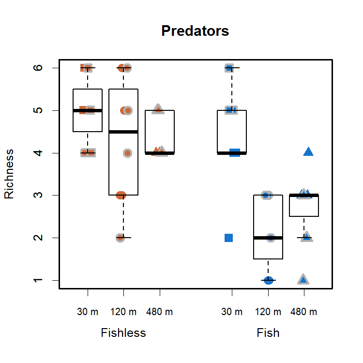

Alpha Diversity Analyses
================
Rodolfo Pelinson
16/10/2020

These are the analyses of alpha diversity for the whole communities and
separately to predatory and non-predatory insects. These results are not
shown in the main paper.

If you haven’t, install the package:

``` r
install.packages("devtools")
devtools::install_github("RodolfoPelinson/Pelinson.et.al.2020B")
```

These are the packages you will need to run this code:

``` r
library(Pelinson.et.al.2020B)
library(lme4) # Version 1.1-23
library(emmeans) # Version 1.4.8
library(car) # Version 3.0-7
```

### Whole Community

First, lets load the necessary data:

``` r
data(com_SS2_SS3_richness,
     isolation_SS2_SS3,
     fish_SS2_SS3,
     SS_SS2_SS3,
     ID_SS2_SS3,
     All)
```

Now, lets check what probability distribution should we choose using the
most complex model we have:

``` r
mix_model_G <- lmer(com_SS2_SS3_richness~fish_SS2_SS3*isolation_SS2_SS3*SS_SS2_SS3 + (1|ID_SS2_SS3), REML = F, control = lmerControl(optimizer = "bobyqa"))
mix_model_P <- glmer(com_SS2_SS3_richness~fish_SS2_SS3*isolation_SS2_SS3*SS_SS2_SS3 + (1|ID_SS2_SS3), family = "poisson", control = glmerControl(optimizer = "bobyqa"))
mix_model_NB <- glmer.nb(com_SS2_SS3_richness~fish_SS2_SS3*isolation_SS2_SS3*SS_SS2_SS3 + (1|ID_SS2_SS3), control = glmerControl(optimizer = "bobyqa"))

plot(mix_model_G)
```

<!-- -->

``` r
plot(mix_model_P)
```

<!-- -->

``` r
plot(mix_model_NB)
```

<!-- -->

``` r
AIC(mix_model_G,mix_model_P,mix_model_NB)
```

    ##              df      AIC
    ## mix_model_G  14 190.7859
    ## mix_model_P  13 222.2224
    ## mix_model_NB 14 224.2226

Analysing the data:

``` r
mix_model_richness_NB <- lmer(com_SS2_SS3_richness~fish_SS2_SS3*isolation_SS2_SS3*SS_SS2_SS3 + (1|ID_SS2_SS3), control = lmerControl(optimizer = "bobyqa"))
round(Anova(mix_model_richness_NB, test.statistic = "Chisq"),3)
```

    ## Analysis of Deviance Table (Type II Wald chisquare tests)
    ## 
    ## Response: com_SS2_SS3_richness
    ##                                            Chisq Df Pr(>Chisq)    
    ## fish_SS2_SS3                              12.736  1     <2e-16 ***
    ## isolation_SS2_SS3                          0.393  2      0.821    
    ## SS_SS2_SS3                                 0.319  1      0.572    
    ## fish_SS2_SS3:isolation_SS2_SS3             2.902  2      0.234    
    ## fish_SS2_SS3:SS_SS2_SS3                    0.012  1      0.913    
    ## isolation_SS2_SS3:SS_SS2_SS3               4.609  2      0.100 .  
    ## fish_SS2_SS3:isolation_SS2_SS3:SS_SS2_SS3  4.213  2      0.122    
    ## ---
    ## Signif. codes:  0 '***' 0.001 '**' 0.01 '*' 0.05 '.' 0.1 ' ' 1

It seems like there is only an effect of the presence of fish on species
richness.

Lets plot it:

``` r
boxplot(com_SS2_SS3_richness~fish_SS2_SS3, outline = F, ylab = "Richness", xlab = "", at = c(1,2), lwd = 1.5, col = "transparent", xaxt="n")
mylevels <- levels(All)
levelProportions <- summary(All)/length(com_SS2_SS3_richness)
col <- c(rep("sienna3",3), rep("dodgerblue3",3), rep("grey70",6))
bg <- c(rep("sienna3",3), rep("dodgerblue3",3),rep("sienna3",3), rep("dodgerblue3",3))
pch <- c(15,16,17,15,16,17,22,21,24,22,21,24)
for(i in 1:length(mylevels)){
  
  x<- c(1,1,1,2,2,2,1,1,1,2,2,2)[i]
  thislevel <- mylevels[i]
  thisvalues <- com_SS2_SS3_richness[All==thislevel]
  
  # take the x-axis indices and add a jitter, proportional to the N in each level
  myjitter <- jitter(rep(x, length(thisvalues)), amount=levelProportions[i]/0.3)
  points(myjitter, thisvalues, pch=pch[i], col=col[i], bg = bg[i] , cex = 1.5, lwd = 3) 
  
}
boxplot(com_SS2_SS3_richness~fish_SS2_SS3, add = T, col = "transparent", outline = F,at = c(1,2), lwd = 1.5, xaxt="n")
axis(1,labels = c("Fishless","Fish"), cex.axis = 1.5, at =c(1,2))

box(lwd = 2.5)
```

<!-- -->

### Only Predatory Insects Community

First, lets load the necessary data:

``` r
data(com_SS2_SS3_predators_richness)
```

Analysing the data:

``` r
mix_model_predators_NB <- lmer(com_SS2_SS3_predators_richness~fish_SS2_SS3*isolation_SS2_SS3*SS_SS2_SS3 + (1|ID_SS2_SS3), control = lmerControl(optimizer = "bobyqa"))
round(Anova(mix_model_predators_NB, test.statistic = "Chisq"),3)
```

    ## Analysis of Deviance Table (Type II Wald chisquare tests)
    ## 
    ## Response: com_SS2_SS3_predators_richness
    ##                                            Chisq Df Pr(>Chisq)    
    ## fish_SS2_SS3                              20.258  1     <2e-16 ***
    ## isolation_SS2_SS3                         13.628  2      0.001 ***
    ## SS_SS2_SS3                                 0.601  1      0.438    
    ## fish_SS2_SS3:isolation_SS2_SS3             3.361  2      0.186    
    ## fish_SS2_SS3:SS_SS2_SS3                    1.415  1      0.234    
    ## isolation_SS2_SS3:SS_SS2_SS3               3.296  2      0.192    
    ## fish_SS2_SS3:isolation_SS2_SS3:SS_SS2_SS3 11.199  2      0.004 ** 
    ## ---
    ## Signif. codes:  0 '***' 0.001 '**' 0.01 '*' 0.05 '.' 0.1 ' ' 1

Now pairwise differences:

``` r
emmeans(mix_model_predators_NB, list(pairwise ~ isolation_SS2_SS3), adjust = "sidak")
```

    ## NOTE: Results may be misleading due to involvement in interactions

    ## $`emmeans of isolation_SS2_SS3`
    ##  isolation_SS2_SS3 emmean    SE   df lower.CL upper.CL
    ##  30                  4.72 0.287 16.9     3.96     5.48
    ##  120                 3.21 0.287 16.9     2.45     3.97
    ##  480                 3.53 0.295 18.1     2.75     4.30
    ## 
    ## Results are averaged over the levels of: fish_SS2_SS3, SS_SS2_SS3 
    ## Degrees-of-freedom method: kenward-roger 
    ## Confidence level used: 0.95 
    ## Conf-level adjustment: sidak method for 3 estimates 
    ## 
    ## $`pairwise differences of isolation_SS2_SS3`
    ##  contrast  estimate    SE   df t.ratio p.value
    ##  30 - 120     1.513 0.406 16.9  3.729  0.0050 
    ##  30 - 480     1.193 0.412 17.5  2.899  0.0290 
    ##  120 - 480   -0.319 0.412 17.5 -0.775  0.8323 
    ## 
    ## Results are averaged over the levels of: fish_SS2_SS3, SS_SS2_SS3 
    ## Degrees-of-freedom method: kenward-roger 
    ## P value adjustment: sidak method for 3 tests

``` r
emmeans(mix_model_predators_NB, list(pairwise ~ isolation_SS2_SS3|fish_SS2_SS3|SS_SS2_SS3), adjust = "sidak")
```

    ## $`emmeans of isolation_SS2_SS3 | fish_SS2_SS3, SS_SS2_SS3`
    ## fish_SS2_SS3 = absent, SS_SS2_SS3 = 2:
    ##  isolation_SS2_SS3 emmean    SE   df lower.CL upper.CL
    ##  30                  5.25 0.484 29.4    4.025     6.48
    ##  120                 4.25 0.484 29.4    3.025     5.48
    ##  480                 4.25 0.484 29.4    3.025     5.48
    ## 
    ## fish_SS2_SS3 = present, SS_SS2_SS3 = 2:
    ##  isolation_SS2_SS3 emmean    SE   df lower.CL upper.CL
    ##  30                  3.50 0.484 29.4    2.275     4.73
    ##  120                 1.75 0.484 29.4    0.525     2.98
    ##  480                 3.25 0.484 29.4    2.025     4.48
    ## 
    ## fish_SS2_SS3 = absent, SS_SS2_SS3 = 3:
    ##  isolation_SS2_SS3 emmean    SE   df lower.CL upper.CL
    ##  30                  4.75 0.484 29.4    3.525     5.98
    ##  120                 4.25 0.484 29.4    3.025     5.48
    ##  480                 4.64 0.560 31.4    3.228     6.05
    ## 
    ## fish_SS2_SS3 = present, SS_SS2_SS3 = 3:
    ##  isolation_SS2_SS3 emmean    SE   df lower.CL upper.CL
    ##  30                  5.39 0.560 31.4    3.975     6.80
    ##  120                 2.59 0.560 31.4    1.175     4.00
    ##  480                 1.97 0.560 31.4    0.562     3.38
    ## 
    ## Degrees-of-freedom method: kenward-roger 
    ## Confidence level used: 0.95 
    ## Conf-level adjustment: sidak method for 3 estimates 
    ## 
    ## $`pairwise differences of isolation_SS2_SS3 | fish_SS2_SS3, SS_SS2_SS3`
    ## fish_SS2_SS3 = absent, SS_SS2_SS3 = 2:
    ##  contrast  estimate    SE   df t.ratio p.value
    ##  30 - 120     1.000 0.685 29.4  1.461  0.3960 
    ##  30 - 480     1.000 0.685 29.4  1.461  0.3960 
    ##  120 - 480    0.000 0.685 29.4  0.000  1.0000 
    ## 
    ## fish_SS2_SS3 = present, SS_SS2_SS3 = 2:
    ##  contrast  estimate    SE   df t.ratio p.value
    ##  30 - 120     1.750 0.685 29.4  2.556  0.0472 
    ##  30 - 480     0.250 0.685 29.4  0.365  0.9775 
    ##  120 - 480   -1.500 0.685 29.4 -2.191  0.1056 
    ## 
    ## fish_SS2_SS3 = absent, SS_SS2_SS3 = 3:
    ##  contrast  estimate    SE   df t.ratio p.value
    ##  30 - 120     0.500 0.685 29.4  0.730  0.8519 
    ##  30 - 480     0.110 0.740 30.7  0.149  0.9984 
    ##  120 - 480   -0.390 0.740 30.7 -0.527  0.9369 
    ## 
    ## fish_SS2_SS3 = present, SS_SS2_SS3 = 3:
    ##  contrast  estimate    SE   df t.ratio p.value
    ##  30 - 120     2.800 0.792 31.4  3.537  0.0038 
    ##  30 - 480     3.413 0.792 31.4  4.312  0.0004 
    ##  120 - 480    0.613 0.792 31.4  0.775  0.8284 
    ## 
    ## Degrees-of-freedom method: kenward-roger 
    ## P value adjustment: sidak method for 3 tests

It seems like there is an effect of fish and isolation on predatory
insect richness. Also, the effect of fish stronger in low isolation
treatments in the second survey, and stronger in high isolation
treatments in the third survey.

Lets plot it:

``` r
boxplot(com_SS2_SS3_predators_richness~isolation_SS2_SS3*fish_SS2_SS3, outline = F, ylab = "Richness", xlab = "", at = c(1,2,3,5,6,7), lwd = 1.5, col = "transparent", xaxt="n", main = "Predators")
mylevels <- levels(All)
levelProportions <- summary(All)/length(com_SS2_SS3_predators_richness)
col <- c(rep("sienna3",3), rep("dodgerblue3",3), rep("grey70",6))
bg <- c(rep("sienna3",3), rep("dodgerblue3",3),rep("sienna3",3), rep("dodgerblue3",3))
pch <- c(15,16,17,15,16,17,22,21,24,22,21,24)
for(i in 1:length(mylevels)){

  x<- c(1,2,3,5,6,7,1,2,3,5,6,7)[i]
  thislevel <- mylevels[i]
  thisvalues <- com_SS2_SS3_predators_richness[All==thislevel]

  # take the x-axis indices and add a jitter, proportional to the N in each level
  myjitter <- jitter(rep(x, length(thisvalues)), amount=levelProportions[i]/0.8)
  points(myjitter, thisvalues, pch=pch[i], col=col[i], bg = bg[i] , cex = 1.5, lwd = 3)

}
boxplot(com_SS2_SS3_predators_richness~isolation_SS2_SS3*fish_SS2_SS3, add = T, outline = F,at = c(1,2,3,5,6,7), lwd = 1.5, col = "transparent", xaxt="n")
axis(1,labels = c("30 m","120 m", "480 m","30 m","120 m", "480 m"), cex.axis = 0.8, at =c(1,2,3,5,6,7))
axis(1,labels = c("Fishless","Fish"), cex.axis = 1, at =c(2,6), line = 1.5, tick = F )
box(lwd = 2.5)
```

<!-- -->

### Only Non-Predatory Insects Community

First, lets load the necessary data:

``` r
data(com_SS2_SS3_non_predators_richness)
```

Analysing the data:

``` r
mix_model_non_predators <- lmer(com_SS2_SS3_non_predators_richness~fish_SS2_SS3*isolation_SS2_SS3*SS_SS2_SS3 + (1|ID_SS2_SS3), control = lmerControl(optimizer = "bobyqa"))
round(Anova(mix_model_non_predators, test.statistic = "Chisq"),3)
```

    ## Analysis of Deviance Table (Type II Wald chisquare tests)
    ## 
    ## Response: com_SS2_SS3_non_predators_richness
    ##                                           Chisq Df Pr(>Chisq)  
    ## fish_SS2_SS3                              0.975  1      0.323  
    ## isolation_SS2_SS3                         5.542  2      0.063 .
    ## SS_SS2_SS3                                0.044  1      0.834  
    ## fish_SS2_SS3:isolation_SS2_SS3            0.757  2      0.685  
    ## fish_SS2_SS3:SS_SS2_SS3                   0.238  1      0.625  
    ## isolation_SS2_SS3:SS_SS2_SS3              6.574  2      0.037 *
    ## fish_SS2_SS3:isolation_SS2_SS3:SS_SS2_SS3 4.893  2      0.087 .
    ## ---
    ## Signif. codes:  0 '***' 0.001 '**' 0.01 '*' 0.05 '.' 0.1 ' ' 1

Now pairwise differences:

``` r
emmeans(mix_model_non_predators, list(pairwise ~ isolation_SS2_SS3|SS_SS2_SS3), adjust = "sidak")
```

    ## NOTE: Results may be misleading due to involvement in interactions

    ## $`emmeans of isolation_SS2_SS3 | SS_SS2_SS3`
    ## SS_SS2_SS3 = 2:
    ##  isolation_SS2_SS3 emmean    SE df lower.CL upper.CL
    ##  30                  7.00 0.549 32     5.62     8.38
    ##  120                 6.75 0.549 32     5.37     8.13
    ##  480                 7.38 0.549 32     5.99     8.76
    ## 
    ## SS_SS2_SS3 = 3:
    ##  isolation_SS2_SS3 emmean    SE df lower.CL upper.CL
    ##  30                  5.58 0.599 32     4.07     7.09
    ##  120                 8.08 0.599 32     6.57     9.59
    ##  480                 7.67 0.646 32     6.04     9.29
    ## 
    ## Results are averaged over the levels of: fish_SS2_SS3 
    ## Degrees-of-freedom method: kenward-roger 
    ## Confidence level used: 0.95 
    ## Conf-level adjustment: sidak method for 3 estimates 
    ## 
    ## $`pairwise differences of isolation_SS2_SS3 | SS_SS2_SS3`
    ## SS_SS2_SS3 = 2:
    ##  contrast  estimate    SE df t.ratio p.value
    ##  30 - 120     0.250 0.777 32  0.322  0.9843 
    ##  30 - 480    -0.375 0.777 32 -0.483  0.9504 
    ##  120 - 480   -0.625 0.777 32 -0.805  0.8119 
    ## 
    ## SS_SS2_SS3 = 3:
    ##  contrast  estimate    SE df t.ratio p.value
    ##  30 - 120    -2.500 0.848 32 -2.949  0.0176 
    ##  30 - 480    -2.083 0.881 32 -2.365  0.0710 
    ##  120 - 480    0.417 0.881 32  0.473  0.9531 
    ## 
    ## Results are averaged over the levels of: fish_SS2_SS3 
    ## Degrees-of-freedom method: kenward-roger 
    ## P value adjustment: sidak method for 3 tests

It seems like there is an increase in richness from the low to
intermediate isolation, but not to high isolation. However, it only
happened in the last survey.

Lets plot it:

``` r
boxplot(com_SS2_SS3_non_predators_richness~isolation_SS2_SS3*SS_SS2_SS3, outline = F, ylab = "Richness", xlab = "", at = c(1,2,3,5,6,7), lwd = 1.5, col = "transparent", xaxt="n", main = "Non Predators")
mylevels <- levels(All)
levelProportions <- summary(All)/length(com_SS2_SS3_non_predators_richness)
col <- c(rep("sienna3",3), rep("dodgerblue3",3), rep("grey70",6))
bg <- c(rep("sienna3",3), rep("dodgerblue3",3),rep("sienna3",3), rep("dodgerblue3",3))
pch <- c(15,16,17,15,16,17,22,21,24,22,21,24)
for(i in 1:length(mylevels)){
  
  x<- c(1,2,3,1,2,3,5,6,7,5,6,7)[i]
  thislevel <- mylevels[i]
  thisvalues <- com_SS2_SS3_non_predators_richness[All==thislevel]
  
  # take the x-axis indices and add a jitter, proportional to the N in each level
  myjitter <- jitter(rep(x, length(thisvalues)), amount=levelProportions[i]/0.3)
  points(myjitter, thisvalues, pch=pch[i], col=col[i], bg = bg[i] , cex = 1.5, lwd = 3) 
  
}
boxplot(com_SS2_SS3_non_predators_richness~isolation_SS2_SS3*SS_SS2_SS3, add = T, col = "transparent", outline = F,at = c(1,2,3,5,6,7), lwd = 1.5,  xaxt="n") 
axis(1,labels = c("30 m","120 m", "480 m","30 m","120 m", "480 m"), cex.axis = 0.8, at =c(1,2,3,5,6,7))
axis(1,labels = c("Second","Third"), cex.axis = 1, at =c(2,6), line = 1.5, tick = F )
box(lwd = 2.5)
```

<!-- -->
