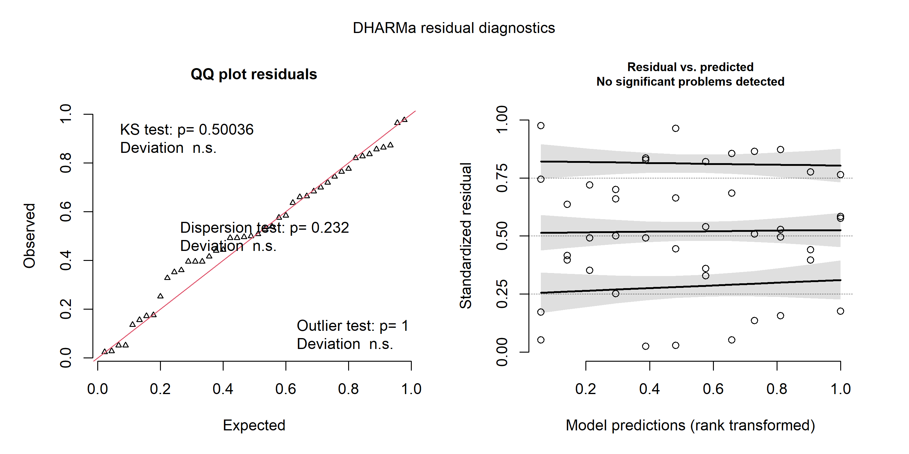
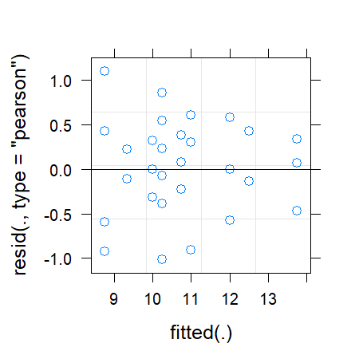
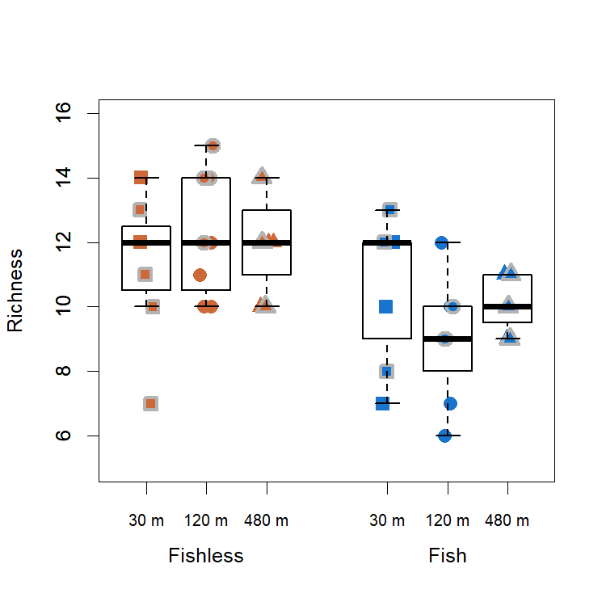
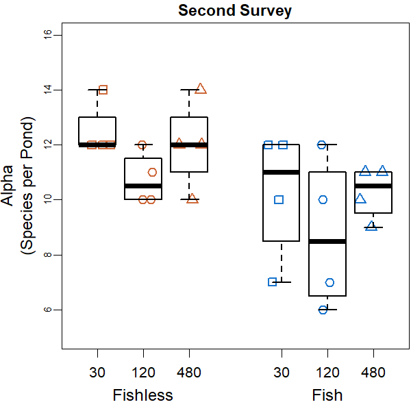

Alpha Diversity Analyses
================
Rodolfo Pelinson
16/10/2020

These are the analyses of alpha diversity for the whole communities and
separately to predatory and non-predatory insects. These results are not
shown in the main paper.

These are the packages you will need to run this code:

``` r
library(lme4) # Version 1.1-23
library(emmeans) # Version 1.4.8
library(car) # Version 3.0-7
library(DHARMa) # Version 0.3.3.0
```

### Whole Community

First, lets load the necessary data:

``` r
data(com_SS2_SS3_richness,
     isolation_SS2_SS3,
     fish_SS2_SS3,
     SS_SS2_SS3,
     ID_SS2_SS3,
     All)
```

Now, lets check what probability distribution should we choose using the
most complex model we have:

``` r
mix_model_G <- lmer(com_SS2_SS3_richness~fish_SS2_SS3*isolation_SS2_SS3*SS_SS2_SS3 +
                      (1|ID_SS2_SS3))
```

    ## boundary (singular) fit: see ?isSingular

``` r
mix_model_P <- glmer(com_SS2_SS3_richness~fish_SS2_SS3*isolation_SS2_SS3*SS_SS2_SS3 +
                       (1|ID_SS2_SS3), family = "poisson")
```

    ## boundary (singular) fit: see ?isSingular

``` r
mix_model_NB <- glmer.nb(com_SS2_SS3_richness~fish_SS2_SS3*isolation_SS2_SS3*SS_SS2_SS3 +
                           (1|ID_SS2_SS3))
```

    ## Warning in theta.ml(Y, mu, weights = object@resp$weights, limit = limit, :
    ## iteration limit reached

    ## Warning in glmer.nb(com_SS2_SS3_richness ~ fish_SS2_SS3 * isolation_SS2_SS3 * :
    ## no 'data = *' in glmer.nb() call ... Not much is guaranteed

    ## boundary (singular) fit: see ?isSingular

``` r
resid_model_G <- simulateResiduals(mix_model_G)
plot(resid_model_G)
```



``` r
resid_model_P <- simulateResiduals(mix_model_P)
plot(resid_model_P)
```



``` r
resid_model_NB <- simulateResiduals(mix_model_NB)
plot(resid_model_NB)
```


``` r
AIC(mix_model_G,mix_model_P,mix_model_NB)
```

    ##              df      AIC
    ## mix_model_G  14 172.0651
    ## mix_model_P  13 222.2224
    ## mix_model_NB 14 224.2226

Analysing the data:

``` r
mix_model_richness_NB <- lmer(com_SS2_SS3_richness~fish_SS2_SS3*isolation_SS2_SS3*
                                SS_SS2_SS3 + (1|ID_SS2_SS3))
round(Anova(mix_model_richness_NB, test.statistic = "Chisq"),3)
```

    ## Analysis of Deviance Table (Type II Wald chisquare tests)
    ## 
    ## Response: com_SS2_SS3_richness
    ##                                            Chisq Df Pr(>Chisq)    
    ## fish_SS2_SS3                              12.736  1     <2e-16 ***
    ## isolation_SS2_SS3                          0.393  2      0.821    
    ## SS_SS2_SS3                                 0.319  1      0.572    
    ## fish_SS2_SS3:isolation_SS2_SS3             2.902  2      0.234    
    ## fish_SS2_SS3:SS_SS2_SS3                    0.012  1      0.913    
    ## isolation_SS2_SS3:SS_SS2_SS3               4.609  2      0.100 .  
    ## fish_SS2_SS3:isolation_SS2_SS3:SS_SS2_SS3  4.213  2      0.122    
    ## ---
    ## Signif. codes:  0 '***' 0.001 '**' 0.01 '*' 0.05 '.' 0.1 ' ' 1

It seems like there is only an effect of the presence of fish on species
richness.

Lets plot it:

``` r
boxplot(com_SS2_SS3_richness~isolation_SS2_SS3*fish_SS2_SS3,
        outline = F, ylab = "Richness", xlab = "",
        at = c(1,2,3,5,6,7),ylim = c(5,16), lwd = 1.5, col = "transparent", xaxt="n")
mylevels <- levels(All)
levelProportions <- summary(All)/length(com_SS2_SS3_richness)
col <- c(rep("sienna3",3), rep("dodgerblue3",3), rep("grey70",6))
bg <- c(rep("sienna3",3), rep("dodgerblue3",3),rep("sienna3",3), rep("dodgerblue3",3))
pch <- c(15,16,17,15,16,17,22,21,24,22,21,24)
for(i in 1:length(mylevels)){
  
  x<- c(1,2,3,5,6,7,1,2,3,5,6,7)[i]
  thislevel <- mylevels[i]
  thisvalues <- com_SS2_SS3_richness[All==thislevel]
  
  # take the x-axis indices and add a jitter, proportional to the N in each level
  myjitter <- jitter(rep(x, length(thisvalues)), amount=levelProportions[i]/0.8)
  points(myjitter, thisvalues, pch=pch[i], col=col[i], bg = bg[i] , cex = 1.5, lwd = 3) 
  
}
boxplot(com_SS2_SS3_richness~isolation_SS2_SS3*fish_SS2_SS3,
        add = T, col = "transparent", outline = F,at = c(1,2,3,5,6,7),
        lwd = 1.5, xaxt="n")
axis(1,labels = c("30 m","120 m", "480 m","30 m","120 m", "480 m"), cex.axis = 0.8,
     at =c(1,2,3,5,6,7))
axis(1,labels = c("Fishless","Fish"), cex.axis = 1, at =c(2,6), line = 1.5, tick = F )
```



Ploting two surveys separetely

``` r
par(mfrow = c(1,2))
boxplot(com_SS2_SS3_richness[SS_SS2_SS3 == "2"]~isolation_SS2*fish_SS2,
        outline = F, ylab = "Richness", xlab = "",
        at = c(1,2,3,5,6,7),ylim = c(5,16), lwd = 1.5, col = "transparent", xaxt="n", main = "Second Survey")
mylevels <- levels(fish_isolation_SS2)
levelProportions <- summary(fish_isolation_SS2)/length(com_SS2_SS3_richness[SS_SS2_SS3 == "2"])
col <- rep(c("sienna3", "dodgerblue3"),3)
bg <- rep(c("sienna3", "dodgerblue3"),3)
pch <- c(15,15,16,16,17,17) #o outro é 22,21,24
for(i in 1:length(mylevels)){
  
  x<- c(1,5,2,6,3,7)[i]
  thislevel <- mylevels[i]
  thisvalues <- com_SS2_SS3_richness[SS_SS2_SS3 == "2"][fish_isolation_SS2==thislevel]
  
  # take the x-axis indices and add a jitter, proportional to the N in each level
  myjitter <- jitter(rep(x, length(thisvalues)), amount=levelProportions[i]/0.8)
  points(myjitter, thisvalues, pch=pch[i], col=col[i], bg = bg[i] , cex = 1.5, lwd = 3) 
  
}
boxplot(com_SS2_SS3_richness[SS_SS2_SS3 == "2"]~isolation_SS2*fish_SS2,
        add = T, col = "transparent", outline = F,at = c(1,2,3,5,6,7),
        lwd = 1.5, xaxt="n")
axis(1,labels = c("30 m","120 m", "480 m","30 m","120 m", "480 m"), cex.axis = 0.8,
     at =c(1,2,3,5,6,7))
axis(1,labels = c("Fishless","Fish"), cex.axis = 1, at =c(2,6), line = 1.5, tick = F )
#box(lwd = 2.5)


boxplot(com_SS2_SS3_richness[SS_SS2_SS3 == "3"]~isolation_SS3*fish_SS3,
        outline = F, ylab = "Richness", xlab = "",
        at = c(1,2,3,5,6,7),ylim = c(5,16), lwd = 1.5, col = "transparent", xaxt="n", main = "Third Survey")
mylevels <- levels(fish_isolation_SS3)
levelProportions <- summary(fish_isolation_SS3)/length(com_SS2_SS3_richness[SS_SS2_SS3 == "2"])
col <- rep(c("grey70", "grey70"),3)
bg <- rep(c("sienna3", "dodgerblue3"),3)
pch <- c(22,22,21,21,24,24) #o outro é 22,21,24
for(i in 1:length(mylevels)){
  
  x<- c(1,5,2,6,3,7)[i]
  thislevel <- mylevels[i]
  thisvalues <- com_SS2_SS3_richness[SS_SS2_SS3 == "3"][fish_isolation_SS3==thislevel]
  
  # take the x-axis indices and add a jitter, proportional to the N in each level
  myjitter <- jitter(rep(x, length(thisvalues)), amount=levelProportions[i]/0.8)
  points(myjitter, thisvalues, pch=pch[i], col=col[i], bg = bg[i] , cex = 1.5, lwd = 3) 
  
}
boxplot(com_SS2_SS3_richness[SS_SS2_SS3 == "3"]~isolation_SS3*fish_SS3,
        add = T, col = "transparent", outline = F,at = c(1,2,3,5,6,7),
        lwd = 1.5, xaxt="n")
axis(1,labels = c("30 m","120 m", "480 m","30 m","120 m", "480 m"), cex.axis = 0.8,
     at =c(1,2,3,5,6,7))
axis(1,labels = c("Fishless","Fish"), cex.axis = 1, at =c(2,6), line = 1.5, tick = F )
```



``` r
#box(lwd = 2.5)
```
