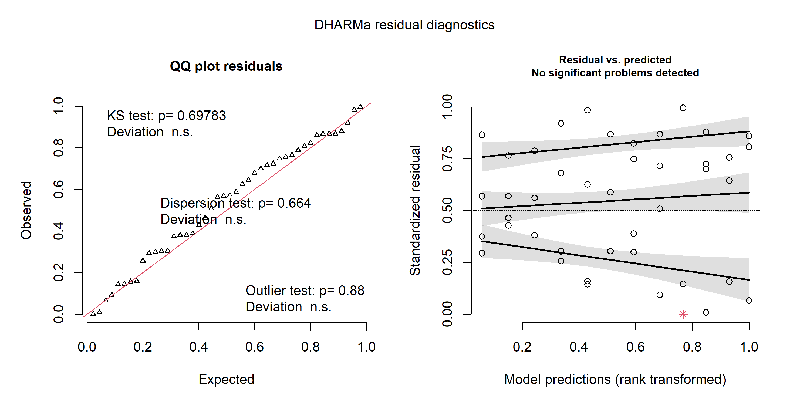
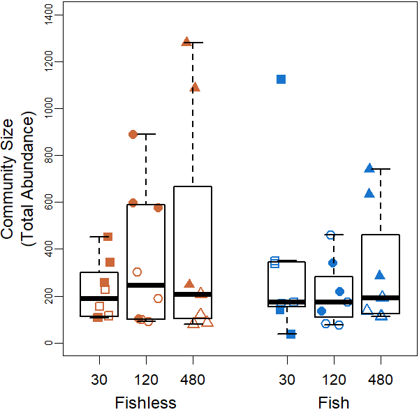
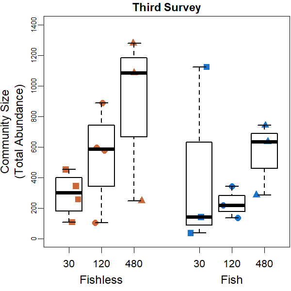
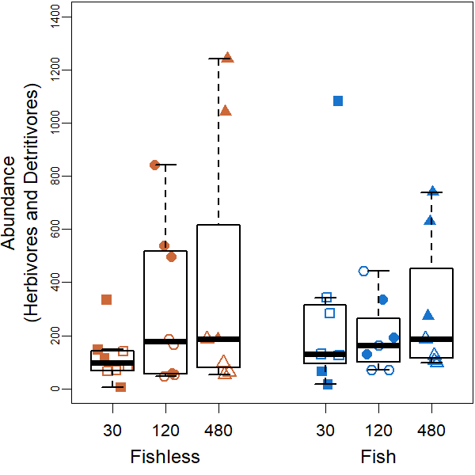
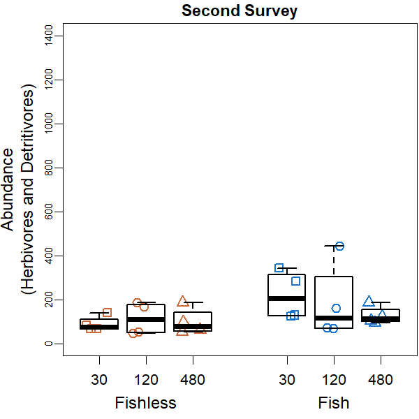
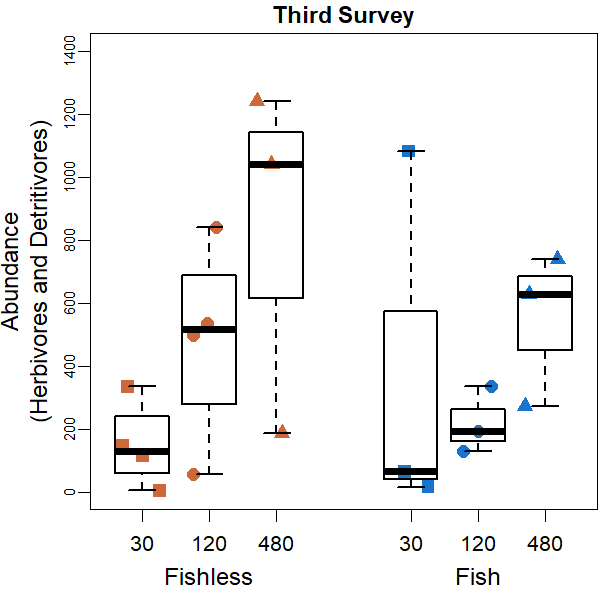
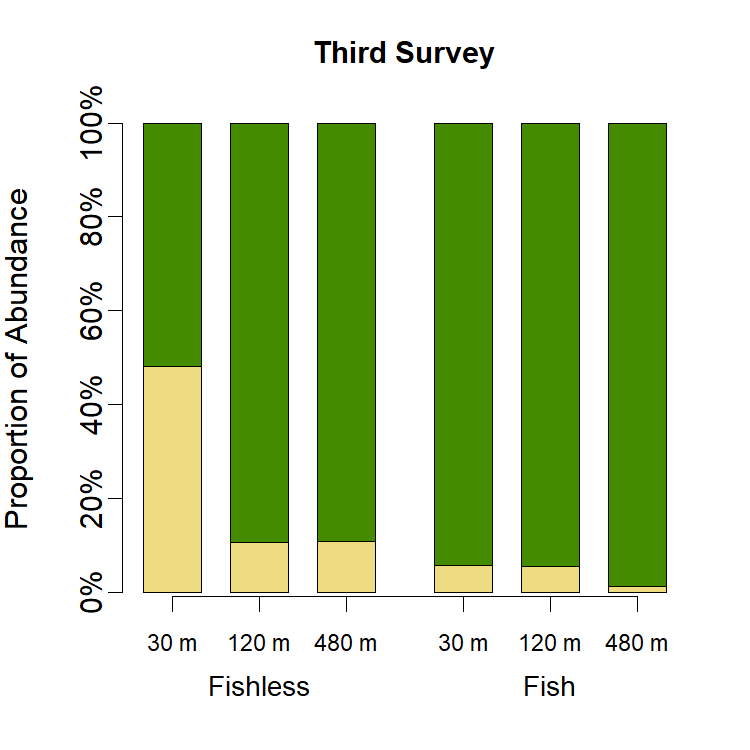

Community Size Analyses
================
Rodolfo Pelinson
16/10/2020

These are the analyses of community size for the whole communities
(results shown in the main papaer) and separetely to predatory and
non-predatory insects.

These are the packages you will need to run this code:

``` r
library(PredatorIsolationStochasticity)
library(lme4) # Version 1.1-23
library(emmeans) # Version 1.4.8
library(car) # Version 3.0-7
library(DHARMa) # Version 0.3.3.0
```

### Whole Community

First, lets check what probability distribution should we choose using
the most complex model we have:

``` r
mix_model_G <- lmer(com_SS2_SS3_abundance~fish_SS2_SS3*isolation_SS2_SS3*SS_SS2_SS3 + 
                      (1|ID_SS2_SS3), REML = F)
mix_model_P <- glmer(com_SS2_SS3_abundance~fish_SS2_SS3*isolation_SS2_SS3*SS_SS2_SS3 + 
                       (1|ID_SS2_SS3), family = "poisson")
mix_model_NB <- glmer.nb(com_SS2_SS3_abundance~fish_SS2_SS3*isolation_SS2_SS3*
                           SS_SS2_SS3 + (1|ID_SS2_SS3))
```

    ## Warning in glmer.nb(com_SS2_SS3_abundance ~ fish_SS2_SS3 * isolation_SS2_SS3 * :
    ## no 'data = *' in glmer.nb() call ... Not much is guaranteed

``` r
resid_model_G <- simulateResiduals(mix_model_G)
plot(resid_model_G)
```


``` r
resid_model_P <- simulateResiduals(mix_model_P)
plot(resid_model_P)
```


``` r
resid_model_NB <- simulateResiduals(mix_model_NB)
plot(resid_model_NB)
```



``` r
AIC(mix_model_G,mix_model_P,mix_model_NB)
```

    ##              df       AIC
    ## mix_model_G  14  623.8594
    ## mix_model_P  13 1313.5127
    ## mix_model_NB 14  580.8158

Looking at AIC values and the spread of residuals, it seems like
negative binomial is the best option here.

So we can go further analysing the data:

``` r
mix_model_NB <- glmer.nb(com_SS2_SS3_abundance~fish_SS2_SS3*isolation_SS2_SS3*
                           SS_SS2_SS3 + (1|ID_SS2_SS3))
```

    ## Warning in glmer.nb(com_SS2_SS3_abundance ~ fish_SS2_SS3 * isolation_SS2_SS3 * :
    ## no 'data = *' in glmer.nb() call ... Not much is guaranteed

``` r
round(Anova(mix_model_NB, test.statistic = "Chisq"),3)
```

    ## Analysis of Deviance Table (Type II Wald chisquare tests)
    ## 
    ## Response: com_SS2_SS3_abundance
    ##                                            Chisq Df Pr(>Chisq)    
    ## fish_SS2_SS3                               0.013  1      0.909    
    ## isolation_SS2_SS3                          0.323  2      0.851    
    ## SS_SS2_SS3                                37.225  1     <2e-16 ***
    ## fish_SS2_SS3:isolation_SS2_SS3             1.609  2      0.447    
    ## fish_SS2_SS3:SS_SS2_SS3                    4.340  1      0.037 *  
    ## isolation_SS2_SS3:SS_SS2_SS3              12.689  2      0.002 ** 
    ## fish_SS2_SS3:isolation_SS2_SS3:SS_SS2_SS3  0.597  2      0.742    
    ## ---
    ## Signif. codes:  0 '***' 0.001 '**' 0.01 '*' 0.05 '.' 0.1 ' ' 1

Now pairwise differences:

``` r
emmeans(mix_model_NB, list(pairwise ~ fish_SS2_SS3|SS_SS2_SS3),
        adjust = "sidak")
```

    ## NOTE: Results may be misleading due to involvement in interactions

    ## $`emmeans of fish_SS2_SS3 | SS_SS2_SS3`
    ## SS_SS2_SS3 = 2:
    ##  fish_SS2_SS3 emmean    SE  df asymp.LCL asymp.UCL
    ##  absent         4.94 0.172 Inf      4.56      5.33
    ##  present        5.18 0.173 Inf      4.80      5.57
    ## 
    ## SS_SS2_SS3 = 3:
    ##  fish_SS2_SS3 emmean    SE  df asymp.LCL asymp.UCL
    ##  absent         6.14 0.183 Inf      5.73      6.55
    ##  present        5.77 0.202 Inf      5.32      6.22
    ## 
    ## Results are averaged over the levels of: isolation_SS2_SS3 
    ## Results are given on the log (not the response) scale. 
    ## Confidence level used: 0.95 
    ## Conf-level adjustment: sidak method for 2 estimates 
    ## 
    ## $`pairwise differences of fish_SS2_SS3 | SS_SS2_SS3`
    ## SS_SS2_SS3 = 2:
    ##  contrast         estimate    SE  df z.ratio p.value
    ##  absent - present   -0.238 0.244 Inf -0.978  0.3281 
    ## 
    ## SS_SS2_SS3 = 3:
    ##  contrast         estimate    SE  df z.ratio p.value
    ##  absent - present    0.367 0.268 Inf  1.368  0.1712 
    ## 
    ## Results are averaged over the levels of: isolation_SS2_SS3 
    ## Results are given on the log (not the response) scale.

``` r
emmeans(mix_model_NB, list(pairwise ~ isolation_SS2_SS3|SS_SS2_SS3),
        adjust = "sidak")
```

    ## NOTE: Results may be misleading due to involvement in interactions

    ## $`emmeans of isolation_SS2_SS3 | SS_SS2_SS3`
    ## SS_SS2_SS3 = 2:
    ##  isolation_SS2_SS3 emmean    SE  df asymp.LCL asymp.UCL
    ##  30                  5.25 0.210 Inf      4.75      5.76
    ##  120                 5.09 0.213 Inf      4.59      5.60
    ##  480                 4.84 0.211 Inf      4.34      5.34
    ## 
    ## SS_SS2_SS3 = 3:
    ##  isolation_SS2_SS3 emmean    SE  df asymp.LCL asymp.UCL
    ##  30                  5.65 0.238 Inf      5.08      6.22
    ##  120                 5.75 0.228 Inf      5.20      6.29
    ##  480                 6.47 0.239 Inf      5.90      7.04
    ## 
    ## Results are averaged over the levels of: fish_SS2_SS3 
    ## Results are given on the log (not the response) scale. 
    ## Confidence level used: 0.95 
    ## Conf-level adjustment: sidak method for 3 estimates 
    ## 
    ## $`pairwise differences of isolation_SS2_SS3 | SS_SS2_SS3`
    ## SS_SS2_SS3 = 2:
    ##  contrast  estimate    SE  df z.ratio p.value
    ##  30 - 120     0.159 0.300 Inf  0.531  0.9337 
    ##  30 - 480     0.414 0.298 Inf  1.391  0.4164 
    ##  120 - 480    0.255 0.299 Inf  0.851  0.7786 
    ## 
    ## SS_SS2_SS3 = 3:
    ##  contrast  estimate    SE  df z.ratio p.value
    ##  30 - 120    -0.101 0.325 Inf -0.312  0.9853 
    ##  30 - 480    -0.822 0.335 Inf -2.457  0.0415 
    ##  120 - 480   -0.721 0.329 Inf -2.193  0.0825 
    ## 
    ## Results are averaged over the levels of: fish_SS2_SS3 
    ## Results are given on the log (not the response) scale. 
    ## P value adjustment: sidak method for 3 tests

It seems that community size grows with time. But it grows larger in
fishless ponds, and in higher isolation treatments.

Lets plot it:

Ploting two surveys together

``` r
par(cex = 0.75, mar = c(4,4,0.1,0.1))

boxplot(com_SS2_SS3_abundance~isolation_SS2_SS3*fish_SS2_SS3,
        outline = F, ylab = "", xlab = "",
        at = c(1,2,3,5,6,7),ylim = c(0,1400), lwd = 1.5, col = "transparent", xaxt="n", gap.axis = -100, yaxt="n")
mylevels <- levels(All)
#levelProportions <- summary(All)/length(com_SS2_SS3_abundance)
col <- c(rep("sienna3",3), rep("dodgerblue3",3),rep("sienna3",3), rep("dodgerblue3",3))
bg <- c(rep("transparent",3), rep("transparent",3),rep("sienna3",3), rep("dodgerblue3",3))
pch <- c(22,21,24,22,21,24,15,16,17,15,16,17)
for(i in 1:length(mylevels)){

  x<- c(1,2,3,5,6,7,1,2,3,5,6,7)[i]
  thislevel <- mylevels[i]
  thisvalues <- com_SS2_SS3_abundance[All==thislevel]

  # take the x-axis indices and add a jitter, proportional to the N in each level
  myjitter <- jitter(rep(x, length(thisvalues)), amount=0.3)
  points(myjitter, thisvalues, pch=pch[i], col=col[i], bg = bg[i] , cex = 1.5, lwd = 1.5)

}
boxplot(com_SS2_SS3_abundance~isolation_SS2_SS3*fish_SS2_SS3,
        add = T, col = "transparent", outline = F,at = c(1,2,3,5,6,7),
        lwd = 1.5, xaxt="n", yaxt="n")


axis(1,labels = c("30","120", "480","30","120", "480"), cex.axis = 1.1,
     at =c(1,2,3,5,6,7), gap.axis = -10)
axis(1,labels = c("Fishless","Fish"), cex.axis = 1.3, at =c(2,6), line = 1.5, tick = F )
axis(2, cex.axis = 0.8, gap.axis = 0, line = -0.5, tick = FALSE)
axis(2, cex.axis = 0.8, gap.axis = 0, line = 0, tick = TRUE, labels = FALSE)

title(ylab = "Community Size", cex.lab = 1.3, line = 3)
title(ylab = "(Total Abundance)", cex.lab = 1.3, line = 1.75)
```



Ploting two surveys separetely

``` r
par(cex = 0.75, mar = c(4,4,1.5,0.1))

boxplot(com_SS2_SS3_abundance[SS_SS2_SS3 == "2"]~isolation_SS2*fish_SS2,
        outline = F, ylab = "", xlab = "",
        at = c(1,2,3,5,6,7),ylim = c(0,1400), lwd = 1.5, col = "transparent", xaxt="n", yaxt="n")
mylevels <- levels(fish_isolation_SS2)
#levelProportions <- summary(fish_isolation_SS2)/length(com_SS2_SS3_abundance[SS_SS2_SS3 == "2"])
col <- rep(c("sienna3", "dodgerblue3"),3)
bg <- rep(c("transparent", "transparent"),3)
pch <- c(22,22,21,21,24,24) #o outro é 22,21,24
for(i in 1:length(mylevels)){

  x<- c(1,5,2,6,3,7)[i]
  thislevel <- mylevels[i]
  thisvalues <- com_SS2_SS3_abundance[SS_SS2_SS3 == "2"][fish_isolation_SS2==thislevel]

  # take the x-axis indices and add a jitter, proportional to the N in each level
  myjitter <- jitter(rep(x, length(thisvalues)), amount=0.3)
  points(myjitter, thisvalues, pch=pch[i], col=col[i], bg = bg[i] , cex = 1.5, lwd = 1.5)

}
boxplot(com_SS2_SS3_abundance[SS_SS2_SS3 == "2"]~isolation_SS2*fish_SS2,
        add = T, col = "transparent", outline = F,at = c(1,2,3,5,6,7),
        lwd = 1.5, xaxt="n", yaxt="n")

axis(1,labels = c("30","120", "480","30","120", "480"), cex.axis = 1.1,
     at =c(1,2,3,5,6,7), gap.axis = -10)
axis(1,labels = c("Fishless","Fish"), cex.axis = 1.3, at =c(2,6), line = 1.5, tick = F )
axis(2, cex.axis = 0.8, gap.axis = 0, line = -0.5, tick = FALSE)
axis(2, cex.axis = 0.8, gap.axis = 0, line = 0, tick = TRUE, labels = FALSE)

title(ylab = "Community Size", cex.lab = 1.3, line = 3)
title(ylab = "(Total Abundance)", cex.lab = 1.3, line = 1.75)
title(main = "Second Survey", cex.lab = 1.3, line = 0.5)
```


``` r
par(cex = 0.75, mar = c(4,4,1.5,0.1))

boxplot(com_SS2_SS3_abundance[SS_SS2_SS3 == "3"]~isolation_SS3*fish_SS3,
        outline = F, ylab = "", xlab = "",
        at = c(1,2,3,5,6,7),ylim = c(0,1400), lwd = 1.5, col = "transparent", xaxt="n", yaxt="n")
mylevels <- levels(fish_isolation_SS3)
#levelProportions <- summary(fish_isolation_SS3)/length(com_SS2_SS3_abundance[SS_SS2_SS3 == "2"])
col <- rep(c("sienna3", "dodgerblue3"),3)
bg <- rep(c("sienna3", "dodgerblue3"),3)
pch <- c(15,15,16,16,17,17) #o outro é 22,21,24
for(i in 1:length(mylevels)){

  x<- c(1,5,2,6,3,7)[i]
  thislevel <- mylevels[i]
  thisvalues <- com_SS2_SS3_abundance[SS_SS2_SS3 == "3"][fish_isolation_SS3==thislevel]

  # take the x-axis indices and add a jitter, proportional to the N in each level
  myjitter <- jitter(rep(x, length(thisvalues)), amount=0.3)
  points(myjitter, thisvalues, pch=pch[i], col=col[i], bg = bg[i] , cex = 1.5, lwd = 1.5)

}
boxplot(com_SS2_SS3_abundance[SS_SS2_SS3 == "3"]~isolation_SS3*fish_SS3,
        add = T, col = "transparent", outline = F,at = c(1,2,3,5,6,7),
        lwd = 1.5, xaxt="n", yaxt="n")

axis(1,labels = c("30","120", "480","30","120", "480"), cex.axis = 1.1,
     at =c(1,2,3,5,6,7), gap.axis = -10)
axis(1,labels = c("Fishless","Fish"), cex.axis = 1.3, at =c(2,6), line = 1.5, tick = F )
axis(2, cex.axis = 0.8, gap.axis = 0, line = -0.5, tick = FALSE)
axis(2, cex.axis = 0.8, gap.axis = 0, line = 0, tick = TRUE, labels = FALSE)

title(ylab = "Community Size", cex.lab = 1.3, line = 3)
title(ylab = "(Total Abundance)", cex.lab = 1.3, line = 1.75)
title(main = "Third Survey", cex.lab = 1.3, line = 0.5)
```



### Only Predatory Insects Community

First, lets load the necessary data:

``` r
data(com_SS2_SS3_predators_abundance)
```

Analysing the data:

``` r
mix_model_predators_NB <- glmer.nb(com_SS2_SS3_predators_abundance~fish_SS2_SS3*
                                     isolation_SS2_SS3*SS_SS2_SS3 + (1|ID_SS2_SS3),
                                   control = glmerControl(optimizer = "bobyqa"))
```

    ## Warning in glmer.nb(com_SS2_SS3_predators_abundance ~ fish_SS2_SS3 *
    ## isolation_SS2_SS3 * : no 'data = *' in glmer.nb() call ... Not much is
    ## guaranteed

``` r
round(Anova(mix_model_predators_NB, test.statistic = "Chisq"),3)
```

    ## Analysis of Deviance Table (Type II Wald chisquare tests)
    ## 
    ## Response: com_SS2_SS3_predators_abundance
    ##                                            Chisq Df Pr(>Chisq)    
    ## fish_SS2_SS3                              62.925  1     <2e-16 ***
    ## isolation_SS2_SS3                         50.169  2     <2e-16 ***
    ## SS_SS2_SS3                                 9.412  1      0.002 ** 
    ## fish_SS2_SS3:isolation_SS2_SS3             4.946  2      0.084 .  
    ## fish_SS2_SS3:SS_SS2_SS3                    6.294  1      0.012 *  
    ## isolation_SS2_SS3:SS_SS2_SS3               5.145  2      0.076 .  
    ## fish_SS2_SS3:isolation_SS2_SS3:SS_SS2_SS3  4.124  2      0.127    
    ## ---
    ## Signif. codes:  0 '***' 0.001 '**' 0.01 '*' 0.05 '.' 0.1 ' ' 1

Now pairwise differences:

``` r
emmeans(mix_model_predators_NB, list(pairwise ~ isolation_SS2_SS3), adjust = "sidak")
```

    ## NOTE: Results may be misleading due to involvement in interactions

    ## $`emmeans of isolation_SS2_SS3`
    ##  isolation_SS2_SS3 emmean    SE  df asymp.LCL asymp.UCL
    ##  30                  4.10 0.119 Inf      3.86      4.33
    ##  120                 3.24 0.130 Inf      2.99      3.50
    ##  480                 2.79 0.140 Inf      2.52      3.07
    ## 
    ## Results are averaged over the levels of: fish_SS2_SS3, SS_SS2_SS3 
    ## Results are given on the log (not the response) scale. 
    ## Confidence level used: 0.95 
    ## 
    ## $`pairwise differences of isolation_SS2_SS3`
    ##  1         estimate    SE  df z.ratio p.value
    ##  30 - 120     0.852 0.176 Inf   4.853  <.0001
    ##  30 - 480     1.302 0.183 Inf   7.100  <.0001
    ##  120 - 480    0.449 0.190 Inf   2.367  0.0528
    ## 
    ## Results are averaged over the levels of: fish_SS2_SS3, SS_SS2_SS3 
    ## Results are given on the log (not the response) scale. 
    ## P value adjustment: sidak method for 3 tests

``` r
emmeans(mix_model_predators_NB, list(pairwise ~ fish_SS2_SS3|SS_SS2_SS3), adjust = "sidak")
```

    ## NOTE: Results may be misleading due to involvement in interactions

    ## $`emmeans of fish_SS2_SS3 | SS_SS2_SS3`
    ## SS_SS2_SS3 = 2:
    ##  fish_SS2_SS3 emmean    SE  df asymp.LCL asymp.UCL
    ##  absent         3.73 0.118 Inf      3.50      3.96
    ##  present        2.79 0.133 Inf      2.53      3.05
    ## 
    ## SS_SS2_SS3 = 3:
    ##  fish_SS2_SS3 emmean    SE  df asymp.LCL asymp.UCL
    ##  absent         4.27 0.120 Inf      4.04      4.51
    ##  present        2.71 0.159 Inf      2.40      3.03
    ## 
    ## Results are averaged over the levels of: isolation_SS2_SS3 
    ## Results are given on the log (not the response) scale. 
    ## Confidence level used: 0.95 
    ## 
    ## $`pairwise differences of fish_SS2_SS3 | SS_SS2_SS3`
    ## SS_SS2_SS3 = 2:
    ##  2                estimate    SE  df z.ratio p.value
    ##  absent - present    0.943 0.177 Inf   5.314  <.0001
    ## 
    ## SS_SS2_SS3 = 3:
    ##  2                estimate    SE  df z.ratio p.value
    ##  absent - present    1.561 0.199 Inf   7.851  <.0001
    ## 
    ## Results are averaged over the levels of: isolation_SS2_SS3 
    ## Results are given on the log (not the response) scale.

It seems that when we only consider predatory insects, community size is
affected by time (survey) presence of fish (which have a stronger effect
in the third survey) and isolation.

Lets plot it:

Ploting two surveys together

``` r
par(cex = 0.75, mar = c(4,4,0.1,0.1))

boxplot(com_SS2_SS3_predators_abundance~isolation_SS2_SS3*fish_SS2_SS3,
        outline = F, ylab = "", xlab = "",
        at = c(1,2,3,5,6,7),ylim = c(0,250), lwd = 1.5, col = "transparent", xaxt="n", gap.axis = -100, yaxt="n")
mylevels <- levels(All)
#levelProportions <- summary(All)/length(com_SS2_SS3_predators_abundance)
col <- c(rep("sienna3",3), rep("dodgerblue3",3),rep("sienna3",3), rep("dodgerblue3",3))
bg <- c(rep("transparent",3), rep("transparent",3),rep("sienna3",3), rep("dodgerblue3",3))
pch <- c(22,21,24,22,21,24,15,16,17,15,16,17)
for(i in 1:length(mylevels)){

  x<- c(1,2,3,5,6,7,1,2,3,5,6,7)[i]
  thislevel <- mylevels[i]
  thisvalues <- com_SS2_SS3_predators_abundance[All==thislevel]

  # take the x-axis indices and add a jitter, proportional to the N in each level
  myjitter <- jitter(rep(x, length(thisvalues)), amount=0.3)
  points(myjitter, thisvalues, pch=pch[i], col=col[i], bg = bg[i] , cex = 1.5, lwd = 1.5)

}
boxplot(com_SS2_SS3_predators_abundance~isolation_SS2_SS3*fish_SS2_SS3,
        add = T, col = "transparent", outline = F,at = c(1,2,3,5,6,7),
        lwd = 1.5, xaxt="n", yaxt="n")

axis(1,labels = c("30","120", "480","30","120", "480"), cex.axis = 1.1,
     at =c(1,2,3,5,6,7), gap.axis = -10)
axis(1,labels = c("Fishless","Fish"), cex.axis = 1.3, at =c(2,6), line = 1.5, tick = F )
axis(2, cex.axis = 0.8, gap.axis = 0, line = -0.5, tick = FALSE)
axis(2, cex.axis = 0.8, gap.axis = 0, line = 0, tick = TRUE, labels = FALSE)

title(ylab = "Abundance (Predators)", cex.lab = 1.3, line = 2)
```


Ploting two surveys sseparetely

``` r
par(cex = 0.75, mar = c(4,4,1.5,0.1))

boxplot(com_SS2_SS3_predators_abundance[SS_SS2_SS3 == "2"]~isolation_SS2*fish_SS2,
        outline = F, ylab = "", xlab = "",
        at = c(1,2,3,5,6,7),ylim = c(0,250), lwd = 1.5, col = "transparent", xaxt="n", yaxt="n")
mylevels <- levels(fish_isolation_SS2)
#levelProportions <- summary(fish_isolation_SS2)/length(com_SS2_SS3_predators_abundance[SS_SS2_SS3 == "2"])
col <- rep(c("sienna3", "dodgerblue3"),3)
bg <- rep(c("transparent", "transparent"),3)
pch <- c(22,22,21,21,24,24) #o outro é 22,21,24
for(i in 1:length(mylevels)){

  x<- c(1,5,2,6,3,7)[i]
  thislevel <- mylevels[i]
  thisvalues <- com_SS2_SS3_predators_abundance[SS_SS2_SS3 == "2"][fish_isolation_SS2==thislevel]

  # take the x-axis indices and add a jitter, proportional to the N in each level
  myjitter <- jitter(rep(x, length(thisvalues)), amount=0.3)
  points(myjitter, thisvalues, pch=pch[i], col=col[i], bg = bg[i] , cex = 1.5, lwd = 1.5)

}
boxplot(com_SS2_SS3_predators_abundance[SS_SS2_SS3 == "2"]~isolation_SS2*fish_SS2,
        add = T, col = "transparent", outline = F,at = c(1,2,3,5,6,7),
        lwd = 1.5, xaxt="n", yaxt="n")

axis(1,labels = c("30","120", "480","30","120", "480"), cex.axis = 1.1,
     at =c(1,2,3,5,6,7), gap.axis = -10)
axis(1,labels = c("Fishless","Fish"), cex.axis = 1.3, at =c(2,6), line = 1.5, tick = F )
axis(2, cex.axis = 0.8, gap.axis = 0, line = -0.5, tick = FALSE)
axis(2, cex.axis = 0.8, gap.axis = 0, line = 0, tick = TRUE, labels = FALSE)

title(ylab = "Abundance (Predators)", cex.lab = 1.3, line = 2)
title(main = "Second Survey", cex.lab = 1.3, line = 0.5)
```


``` r
par(cex = 0.75, mar = c(4,4,1.5,0.1))

boxplot(com_SS2_SS3_predators_abundance[SS_SS2_SS3 == "3"]~isolation_SS3*fish_SS3,
        outline = F, ylab = "", xlab = "",
        at = c(1,2,3,5,6,7),ylim = c(0,250), lwd = 1.5, col = "transparent", xaxt="n", yaxt="n")
mylevels <- levels(fish_isolation_SS3)
#levelProportions <- summary(fish_isolation_SS3)/length(com_SS2_SS3_predators_abundance[SS_SS2_SS3 == "2"])
col <- rep(c("sienna3", "dodgerblue3"),3)
bg <- rep(c("sienna3", "dodgerblue3"),3)
pch <- c(15,15,16,16,17,17) #o outro é 22,21,24
for(i in 1:length(mylevels)){

  x<- c(1,5,2,6,3,7)[i]
  thislevel <- mylevels[i]
  thisvalues <- com_SS2_SS3_predators_abundance[SS_SS2_SS3 == "3"][fish_isolation_SS3==thislevel]

  # take the x-axis indices and add a jitter, proportional to the N in each level
  myjitter <- jitter(rep(x, length(thisvalues)), amount=0.3)
  points(myjitter, thisvalues, pch=pch[i], col=col[i], bg = bg[i] , cex = 1.5, lwd = 1.5)

}

axis(1,labels = c("30","120", "480","30","120", "480"), cex.axis = 1.1,
     at =c(1,2,3,5,6,7), gap.axis = -10)
axis(1,labels = c("Fishless","Fish"), cex.axis = 1.3, at =c(2,6), line = 1.5, tick = F )
axis(2, cex.axis = 0.8, gap.axis = 0, line = -0.5, tick = FALSE)
axis(2, cex.axis = 0.8, gap.axis = 0, line = 0, tick = TRUE, labels = FALSE)

title(ylab = "Abundance (Predators)", cex.lab = 1.3, line = 2)
title(main = "Third Survey", cex.lab = 1.3, line = 0.5)
```


### Only Non-Predatory Insects (Herbivores and Detritivores) Community

First, lets load the necessary data:

``` r
data(com_SS2_SS3_non_predators_abundance)
```

Analysing the data:

``` r
mix_model_non_predators_NB <- glmer.nb(com_SS2_SS3_non_predators_abundance~fish_SS2_SS3*
                                         isolation_SS2_SS3*SS_SS2_SS3 + (1|ID_SS2_SS3),
                                       control = glmerControl(optimizer = "bobyqa"))
```

    ## Warning in glmer.nb(com_SS2_SS3_non_predators_abundance ~ fish_SS2_SS3 * : no
    ## 'data = *' in glmer.nb() call ... Not much is guaranteed

``` r
round(Anova(mix_model_non_predators_NB, test.statistic = "Chisq"),3)
```

    ## Analysis of Deviance Table (Type II Wald chisquare tests)
    ## 
    ## Response: com_SS2_SS3_non_predators_abundance
    ##                                            Chisq Df Pr(>Chisq)    
    ## fish_SS2_SS3                               0.823  1      0.364    
    ## isolation_SS2_SS3                          1.831  2      0.400    
    ## SS_SS2_SS3                                22.131  1     <2e-16 ***
    ## fish_SS2_SS3:isolation_SS2_SS3             2.242  2      0.326    
    ## fish_SS2_SS3:SS_SS2_SS3                    2.524  1      0.112    
    ## isolation_SS2_SS3:SS_SS2_SS3               7.413  2      0.025 *  
    ## fish_SS2_SS3:isolation_SS2_SS3:SS_SS2_SS3  1.218  2      0.544    
    ## ---
    ## Signif. codes:  0 '***' 0.001 '**' 0.01 '*' 0.05 '.' 0.1 ' ' 1

Now pairwise differences:

``` r
emmeans(mix_model_non_predators_NB, list(pairwise ~ SS_SS2_SS3|isolation_SS2_SS3),
        adjust = "sidak")
```

    ## NOTE: Results may be misleading due to involvement in interactions

    ## $`emmeans of SS_SS2_SS3 | isolation_SS2_SS3`
    ## isolation_SS2_SS3 = 30:
    ##  SS_SS2_SS3 emmean    SE  df asymp.LCL asymp.UCL
    ##  2            4.91 0.263 Inf      4.39      5.43
    ##  3            5.30 0.353 Inf      4.60      5.99
    ## 
    ## isolation_SS2_SS3 = 120:
    ##  SS_SS2_SS3 emmean    SE  df asymp.LCL asymp.UCL
    ##  2            4.89 0.276 Inf      4.35      5.44
    ##  3            5.71 0.292 Inf      5.13      6.28
    ## 
    ## isolation_SS2_SS3 = 480:
    ##  SS_SS2_SS3 emmean    SE  df asymp.LCL asymp.UCL
    ##  2            4.70 0.265 Inf      4.18      5.21
    ##  3            6.46 0.306 Inf      5.86      7.06
    ## 
    ## Results are averaged over the levels of: fish_SS2_SS3 
    ## Results are given on the log (not the response) scale. 
    ## Confidence level used: 0.95 
    ## 
    ## $`pairwise differences of SS_SS2_SS3 | isolation_SS2_SS3`
    ## isolation_SS2_SS3 = 30:
    ##  2     estimate    SE  df z.ratio p.value
    ##  2 - 3   -0.385 0.405 Inf  -0.949  0.3424
    ## 
    ## isolation_SS2_SS3 = 120:
    ##  2     estimate    SE  df z.ratio p.value
    ##  2 - 3   -0.813 0.355 Inf  -2.291  0.0220
    ## 
    ## isolation_SS2_SS3 = 480:
    ##  2     estimate    SE  df z.ratio p.value
    ##  2 - 3   -1.766 0.372 Inf  -4.751  <.0001
    ## 
    ## Results are averaged over the levels of: fish_SS2_SS3 
    ## Results are given on the log (not the response) scale.

It seems that we have similar patterns to when we consider the whole
community.

Lets plot it:

Ploting two surveys together

``` r
par(cex = 0.75, mar = c(4,4,0.1,0.1))

boxplot(com_SS2_SS3_non_predators_abundance~isolation_SS2_SS3*fish_SS2_SS3,
        outline = F, ylab = "", xlab = "",
        at = c(1,2,3,5,6,7),ylim = c(0,1400), lwd = 1.5, col = "transparent", xaxt="n", gap.axis = -100, yaxt="n")
mylevels <- levels(All)
#levelProportions <- summary(All)/length(com_SS2_SS3_non_predators_abundance)
col <- c(rep("sienna3",3), rep("dodgerblue3",3),rep("sienna3",3), rep("dodgerblue3",3))
bg <- c(rep("transparent",3), rep("transparent",3),rep("sienna3",3), rep("dodgerblue3",3))
pch <- c(22,21,24,22,21,24,15,16,17,15,16,17)
for(i in 1:length(mylevels)){

  x<- c(1,2,3,5,6,7,1,2,3,5,6,7)[i]
  thislevel <- mylevels[i]
  thisvalues <- com_SS2_SS3_non_predators_abundance[All==thislevel]

  # take the x-axis indices and add a jitter, proportional to the N in each level
  myjitter <- jitter(rep(x, length(thisvalues)), amount=0.3)
  points(myjitter, thisvalues, pch=pch[i], col=col[i], bg = bg[i] , cex = 1.5, lwd = 1.5)

}
boxplot(com_SS2_SS3_non_predators_abundance~isolation_SS2_SS3*fish_SS2_SS3,
        add = T, col = "transparent", outline = F,at = c(1,2,3,5,6,7),
        lwd = 1.5, xaxt="n", yaxt="n")

axis(1,labels = c("30","120", "480","30","120", "480"), cex.axis = 1.1,
     at =c(1,2,3,5,6,7), gap.axis = -10)
axis(1,labels = c("Fishless","Fish"), cex.axis = 1.3, at =c(2,6), line = 1.5, tick = F )
axis(2, cex.axis = 0.8, gap.axis = 0, line = -0.5, tick = FALSE)
axis(2, cex.axis = 0.8, gap.axis = 0, line = 0, tick = TRUE, labels = FALSE)

title(ylab = "Abundance", cex.lab = 1.3, line = 3)
title(ylab = "(Herbivores and Detritivores)", cex.lab = 1.3, line = 1.75)
```



Ploting two surveys sseparetely

``` r
par(cex = 0.75, mar = c(4,4,1.5,0.1))

boxplot(com_SS2_SS3_non_predators_abundance[SS_SS2_SS3 == "2"]~isolation_SS2*fish_SS2,
        outline = F, ylab = "", xlab = "",
        at = c(1,2,3,5,6,7),ylim = c(0,1400), lwd = 1.5, col = "transparent", xaxt="n",  yaxt="n")
mylevels <- levels(fish_isolation_SS2)
#levelProportions <- summary(fish_isolation_SS2)/length(com_SS2_SS3_non_predators_abundance[SS_SS2_SS3 == "2"])
col <- rep(c("sienna3", "dodgerblue3"),3)
bg <- rep(c("transparent", "transparent"),3)
pch <- c(22,22,21,21,24,24) #o outro é 22,21,24
for(i in 1:length(mylevels)){

  x<- c(1,5,2,6,3,7)[i]
  thislevel <- mylevels[i]
  thisvalues <- com_SS2_SS3_non_predators_abundance[SS_SS2_SS3 == "2"][fish_isolation_SS2==thislevel]

  # take the x-axis indices and add a jitter, proportional to the N in each level
  myjitter <- jitter(rep(x, length(thisvalues)), amount=0.3)
  points(myjitter, thisvalues, pch=pch[i], col=col[i], bg = bg[i] , cex = 1.5, lwd = 1.5)

}
boxplot(com_SS2_SS3_non_predators_abundance[SS_SS2_SS3 == "2"]~isolation_SS2*fish_SS2,
        add = T, col = "transparent", outline = F,at = c(1,2,3,5,6,7),
        lwd = 1.5, xaxt="n", yaxt="n")

axis(1,labels = c("30","120", "480","30","120", "480"), cex.axis = 1.1,
     at =c(1,2,3,5,6,7), gap.axis = -10)
axis(1,labels = c("Fishless","Fish"), cex.axis = 1.3, at =c(2,6), line = 1.5, tick = F )
axis(2, cex.axis = 0.8, gap.axis = 0, line = -0.5, tick = FALSE)
axis(2, cex.axis = 0.8, gap.axis = 0, line = 0, tick = TRUE, labels = FALSE)

title(ylab = "Abundance", cex.lab = 1.3, line = 3)
title(ylab = "(Herbivores and Detritivores)", cex.lab = 1.3, line = 1.75)

title(main = "Second Survey", cex.lab = 1.3, line = 0.5)
```



``` r
par(cex = 0.75, mar = c(4,4,1.5,0.1))

boxplot(com_SS2_SS3_non_predators_abundance[SS_SS2_SS3 == "3"]~isolation_SS3*fish_SS3,
        outline = F, ylab = "", xlab = "",
        at = c(1,2,3,5,6,7),ylim = c(0,1400), lwd = 1.5, col = "transparent", xaxt="n", yaxt="n")
mylevels <- levels(fish_isolation_SS3)
#levelProportions <- summary(fish_isolation_SS3)/length(com_SS2_SS3_non_predators_abundance[SS_SS2_SS3 == "2"])
col <- rep(c("sienna3", "dodgerblue3"),3)
bg <- rep(c("sienna3", "dodgerblue3"),3)
pch <- c(15,15,16,16,17,17) #o outro é 22,21,24
for(i in 1:length(mylevels)){

  x<- c(1,5,2,6,3,7)[i]
  thislevel <- mylevels[i]
  thisvalues <- com_SS2_SS3_non_predators_abundance[SS_SS2_SS3 == "3"][fish_isolation_SS3==thislevel]

  # take the x-axis indices and add a jitter, proportional to the N in each level
  myjitter <- jitter(rep(x, length(thisvalues)), amount=0.3)
  points(myjitter, thisvalues, pch=pch[i], col=col[i], bg = bg[i] , cex = 1.5, lwd = 1.5)

}
boxplot(com_SS2_SS3_non_predators_abundance[SS_SS2_SS3 == "3"]~isolation_SS3*fish_SS3,
        add = T, col = "transparent", outline = F,at = c(1,2,3,5,6,7),
        lwd = 1.5, xaxt="n", yaxt="n")

axis(1,labels = c("30","120", "480","30","120", "480"), cex.axis = 1.1,
     at =c(1,2,3,5,6,7), gap.axis = -10)
axis(1,labels = c("Fishless","Fish"), cex.axis = 1.3, at =c(2,6), line = 1.5, tick = F )
axis(2, cex.axis = 0.8, gap.axis = 0, line = -0.5, tick = FALSE)
axis(2, cex.axis = 0.8, gap.axis = 0, line = 0, tick = TRUE, labels = FALSE)

title(ylab = "Abundance", cex.lab = 1.3, line = 3)
title(ylab = "(Herbivores and Detritivores)", cex.lab = 1.3, line = 1.75)

title(main = "Third Survey", cex.lab = 1.3, line = 0.5)
```



 

#### Herbivores and Detritivores VS Predators

Because we saw that community size increases with isolation, and we know
from previous work that herbivores and detritivores are positively
affected by isolation, we checked if herbivores and detritivores are
indeed responsible for this increase.

First for the second Survey

``` r
#Second Survey
non_pred_barplot_SS2 <- tapply(com_SS2_SS3_non_predators_abundance[SS_SS2_SS3 == "2"], interaction(fish_SS2, isolation_SS2), sum)
non_pred_SS2 <- tapply(com_SS2_SS3_predators_abundance[SS_SS2_SS3 == "2"], interaction(isolation_SS2,fish_SS2), sum)

matrix_barplot_SS2 <- matrix(c(non_pred_SS2,non_pred_barplot_SS2), byrow = TRUE, ncol = 6, nrow = 2)

total_barplot_SS2 <- colSums(matrix_barplot_SS2)

percentage_barplot_SS2 <- matrix_barplot_SS2
percentage_barplot_SS2[1,] <- percentage_barplot_SS2[1,]/total_barplot_SS2
percentage_barplot_SS2[2,] <- percentage_barplot_SS2[2,]/total_barplot_SS2


barplot(percentage_barplot_SS2, space = c(0,0.5,0.5,1,0.5,0.5), xaxt="n", yaxt="n", col = c("lightgoldenrod2", "chartreuse4"))
axis(1,at = c(0.5,2,3.5,5.5,7,8.5), labels =rep(c("30 m","120 m","480 m"),2), tick = T, cex.axis = 0.9, gap.axis = 0)
axis(1,labels = c("Fishless","Fish"), cex.axis = 1.1, at =c(2,7), line = 1.5, tick = F )
axis(2, cex.axis = 1.2, gap.axis = 0, line = -0.5, tick = FALSE, at = c(0.0,0.2,0.4,0.6,0.8,1), labels = c("0%","20%","40%","60%","80%","100%"))
axis(2, cex.axis = 1.2, gap.axis = 0, line = 0, tick = TRUE, labels = FALSE, at = c(0.0,0.2,0.4,0.6,0.8,1))
title(ylab = "Proportion of Abundance", cex.lab = 1.25, line = 3)
title(main = "Second Survey", cex.lab = 1.25, line = 2)
```


Third Survey

``` r
#Third Survey
non_pred_barplot_SS3 <- tapply(com_SS2_SS3_non_predators_abundance[SS_SS2_SS3 == "3"], interaction(fish_SS3, isolation_SS3), sum)
non_pred_SS3 <- tapply(com_SS2_SS3_predators_abundance[SS_SS2_SS3 == "3"], interaction(fish_SS3, isolation_SS3), sum)

matrix_barplot_SS3 <- matrix(c(non_pred_SS3,non_pred_barplot_SS3), byrow = TRUE, ncol = 6, nrow = 2)

total_barplot_SS3 <- colSums(matrix_barplot_SS3)

percentage_barplot_SS3 <- matrix_barplot_SS3
percentage_barplot_SS3[1,] <- percentage_barplot_SS3[1,]/total_barplot_SS3
percentage_barplot_SS3[2,] <- percentage_barplot_SS3[2,]/total_barplot_SS3


barplot(percentage_barplot_SS3, space = c(0,0.5,0.5,1,0.5,0.5), xaxt="n", yaxt="n", col = c("lightgoldenrod2", "chartreuse4"))
axis(1,at = c(0.5,2,3.5,5.5,7,8.5), labels =rep(c("30 m","120 m","480 m"),2), tick = T, cex.axis = 0.9, gap.axis = 0)
axis(1,labels = c("Fishless","Fish"), cex.axis = 1.1, at =c(2,7), line = 1.5, tick = F )
axis(2, cex.axis = 1.2, gap.axis = 0, line = -0.5, tick = FALSE, at = c(0.0,0.2,0.4,0.6,0.8,1), labels = c("0%","20%","40%","60%","80%","100%"))
axis(2, cex.axis = 1.2, gap.axis = 0, line = 0, tick = TRUE, labels = FALSE, at = c(0.0,0.2,0.4,0.6,0.8,1))
title(ylab = "Proportion of Abundance", cex.lab = 1.25, line = 3)
title(main = "Third Survey", cex.lab = 1.25, line = 2)
```



It seems that herbivores and detritivores are indeed responsible for the
patterns observed in community size. More importantly, this effect is
stronger in more isolated ponds.
