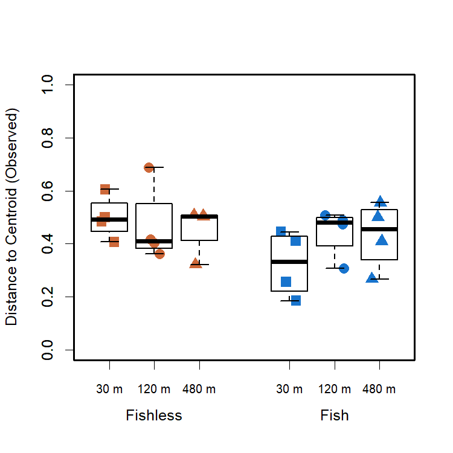
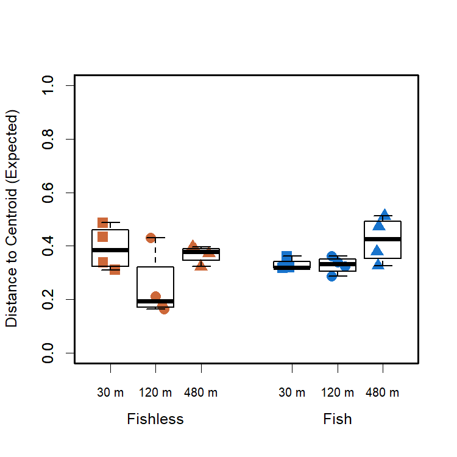
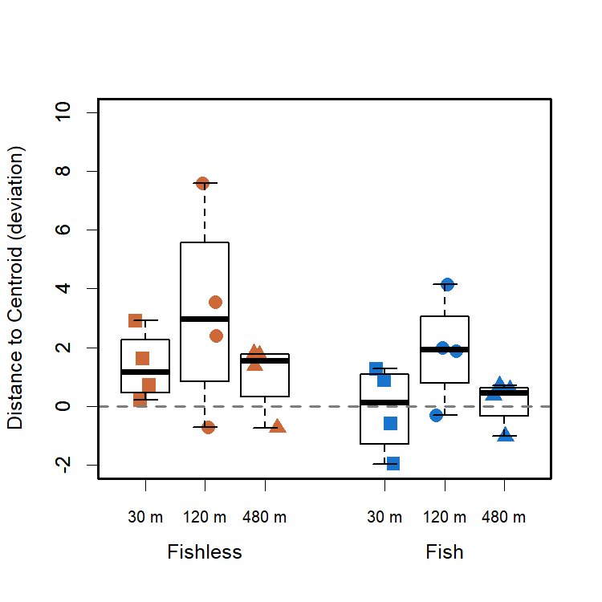

Community Variability - First Survey
================
Rodolfo Pelinson
20/10/2020

This is the same community variability analyses presented in the main
paper, but considering only the first survey.

If you haven’t, install the package:

``` r
install.packages("devtools")
devtools::install_github("RodolfoPelinson/Pelinson.et.al.2020B")
```

These are the packages you will need to run this code:

``` r
library(Pelinson.et.al.2020B)
library(lme4) # Version 1.1-23
library(car) # Version 3.0-7
library(emmeans) # Version 1.4.8
```

### Whole community for the First Surveys.

First loading data

``` r
data(com_SS1, All, fish_SS1, isolation_SS1, fish_isolation_SS1)
```

Computing observed and expected distances to centroid, and
beta-deviation.

``` r
beta_deviation_SS1 <- beta_deviation(com_SS1, strata = fish_isolation_SS1, times = 10000,
                                      transform = NULL, dist = "bray", fixedmar="both",
                                      shuffle = "both", method = "quasiswap", seed = 2, group = fish_isolation_SS1) 
```

#### Observed Community Variability

Running ANOVA table for observed distances to group centroids, or
observed beta-diversity/community variability in each treatment.

``` r
fit_observed_SS1 <- lm(beta_deviation_SS1$observed_distances~fish_SS1*isolation_SS1)
round(Anova(fit_observed_SS1, test.statistic = "F"),3)
```

    ## Anova Table (Type II tests)
    ## 
    ## Response: beta_deviation_SS1$observed_distances
    ##                        Sum Sq Df F value Pr(>F)
    ## fish_SS1                0.034  1   2.611  0.124
    ## isolation_SS1           0.009  2   0.338  0.717
    ## fish_SS1:isolation_SS1  0.031  2   1.190  0.327
    ## Residuals               0.231 18

No effect of treatments.

Plotting it:

``` r
fish_isolation_SS1 <- factor(fish_isolation_SS1, levels = c("030 absent","120 absent", "480 absent","030 present","120 present", "480 present"))

boxplot(beta_deviation_SS1$observed_distances~isolation_SS1*fish_SS1, outline = F, ylab = "Distance to Centroid (Observed)", xlab = "", at = c(1,2,3,5,6,7),ylim = c(0,1), lwd = 1.5, col = "transparent", xaxt="n")
mylevels <- levels(fish_isolation_SS1)
levelProportions <- summary(fish_isolation_SS1)/length(beta_deviation_SS1$observed_distances)
col <- c(rep("sienna3",3), rep("dodgerblue3",3))
#bg <- c(rep("sienna3",3), rep("dodgerblue3",3),rep("sienna3",3), rep("dodgerblue3",3))
pch <- c(15,16,17,15,16,17)
for(i in 1:length(mylevels)){
  
  x<- c(1,2,3,5,6,7)[i]
  thislevel <- mylevels[i]
  thisvalues <- beta_deviation_SS1$observed_distances[fish_isolation_SS1==thislevel]
  
  # take the x-axis indices and add a jitter, proportional to the N in each level
  myjitter <- jitter(rep(x, length(thisvalues)), amount=levelProportions[i]/0.8)
  points(myjitter, thisvalues, pch=pch[i], col=col[i], cex = 1.5, lwd = 3) 
  
}
boxplot(beta_deviation_SS1$observed_distances~isolation_SS1*fish_SS1, add = T, col = "transparent", outline = F,at = c(1,2,3,5,6,7), lwd = 1.5, xaxt="n")
axis(1,labels = c("30 m","120 m", "480 m","30 m","120 m", "480 m"), cex.axis = 0.8, at =c(1,2,3,5,6,7))
axis(1,labels = c("Fishless","Fish"), cex.axis = 1, at =c(2,6), line = 1.5, tick = F )
box(lwd = 2.5)
```

<!-- -->

#### Expected Community Variability

Running ANOVA table for observed distances to group centroids, or
observed beta-diversity/community variability in each treatment.

``` r
fit_expected_SS1 <- lm(beta_deviation_SS1$expected_distances~fish_SS1*isolation_SS1)
round(Anova(fit_expected_SS1, test.statistic = "F"),3)
```

    ## Anova Table (Type II tests)
    ## 
    ## Response: beta_deviation_SS1$expected_distances
    ##                        Sum Sq Df F value Pr(>F)  
    ## fish_SS1                0.004  1   0.663  0.426  
    ## isolation_SS1           0.049  2   4.572  0.025 *
    ## fish_SS1:isolation_SS1  0.024  2   2.193  0.140  
    ## Residuals               0.097 18                 
    ## ---
    ## Signif. codes:  0 '***' 0.001 '**' 0.01 '*' 0.05 '.' 0.1 ' ' 1

``` r
emmeans(fit_expected_SS1, list(pairwise ~ isolation_SS1), adjust = "tukey")
```

    ## NOTE: Results may be misleading due to involvement in interactions

    ## $`emmeans of isolation_SS1`
    ##  isolation_SS1 emmean     SE df lower.CL upper.CL
    ##  030            0.361 0.0259 18    0.293    0.429
    ##  120            0.287 0.0259 18    0.219    0.355
    ##  480            0.395 0.0259 18    0.327    0.464
    ## 
    ## Results are averaged over the levels of: fish_SS1 
    ## Confidence level used: 0.95 
    ## Conf-level adjustment: sidak method for 3 estimates 
    ## 
    ## $`pairwise differences of isolation_SS1`
    ##  contrast  estimate     SE df t.ratio p.value
    ##  030 - 120   0.0740 0.0367 18  2.018  0.1365 
    ##  030 - 480  -0.0345 0.0367 18 -0.941  0.6221 
    ##  120 - 480  -0.1085 0.0367 18 -2.959  0.0218 
    ## 
    ## Results are averaged over the levels of: fish_SS1 
    ## P value adjustment: tukey method for comparing a family of 3 estimates

There is an increase in expected distance to centroid from intermediate
to high isolation.

Plotting it:

``` r
fish_isolation_SS1 <- factor(fish_isolation_SS1, levels = c("030 absent","120 absent", "480 absent","030 present","120 present", "480 present"))

boxplot(beta_deviation_SS1$expected_distances~isolation_SS1*fish_SS1, outline = F, ylab = "Distance to Centroid (Expected)", xlab = "", at = c(1,2,3,5,6,7),ylim = c(0,1), lwd = 1.5, col = "transparent", xaxt="n")
mylevels <- levels(fish_isolation_SS1)
levelProportions <- summary(fish_isolation_SS1)/length(beta_deviation_SS1$expected_distances)
col <- c(rep("sienna3",3), rep("dodgerblue3",3))
#bg <- c(rep("sienna3",3), rep("dodgerblue3",3),rep("sienna3",3), rep("dodgerblue3",3))
pch <- c(15,16,17,15,16,17)
for(i in 1:length(mylevels)){
  
  x<- c(1,2,3,5,6,7)[i]
  thislevel <- mylevels[i]
  thisvalues <- beta_deviation_SS1$expected_distances[fish_isolation_SS1==thislevel]
  
  # take the x-axis indices and add a jitter, proportional to the N in each level
  myjitter <- jitter(rep(x, length(thisvalues)), amount=levelProportions[i]/0.8)
  points(myjitter, thisvalues, pch=pch[i], col=col[i], cex = 1.5, lwd = 3) 
  
}
boxplot(beta_deviation_SS1$expected_distances~isolation_SS1*fish_SS1, add = T, col = "transparent", outline = F,at = c(1,2,3,5,6,7), lwd = 1.5, xaxt="n")
axis(1,labels = c("30 m","120 m", "480 m","30 m","120 m", "480 m"), cex.axis = 0.8, at =c(1,2,3,5,6,7))
axis(1,labels = c("Fishless","Fish"), cex.axis = 1, at =c(2,6), line = 1.5, tick = F )
box(lwd = 2.5)
```

<!-- -->

#### Beta-Deviation

Running ANOVA table for observed distances to group centroids, or
observed beta-diversity/community variability in each treatment.

``` r
fit_deviation_SS1 <- lm(beta_deviation_SS1$deviation_distances~fish_SS1*isolation_SS1)
round(Anova(fit_deviation_SS1, test.statistic = "F"),3)
```

    ## Anova Table (Type II tests)
    ## 
    ## Response: beta_deviation_SS1$deviation_distances
    ##                        Sum Sq Df F value Pr(>F)  
    ## fish_SS1                8.784  1   2.535  0.129  
    ## isolation_SS1          20.422  2   2.946  0.078 .
    ## fish_SS1:isolation_SS1  0.344  2   0.050  0.952  
    ## Residuals              62.381 18                 
    ## ---
    ## Signif. codes:  0 '***' 0.001 '**' 0.01 '*' 0.05 '.' 0.1 ' ' 1

No significant effect of treatments.

Plotting it:

``` r
boxplot(beta_deviation_SS1$deviation_distances~isolation_SS1*fish_SS1, outline = F, ylab = "Distance to Centroid (deviation)", xlab = "", at = c(1,2,3,5,6,7),ylim = c(-2,10), lwd = 1.5, col = "transparent", xaxt="n")
mylevels <- levels(fish_isolation_SS1)
levelProportions <- summary(fish_isolation_SS1)/length(beta_deviation_SS1$deviation_distances)
col <- c(rep("sienna3",3), rep("dodgerblue3",3))
#bg <- c(rep("sienna3",3), rep("dodgerblue3",3),rep("sienna3",3), rep("dodgerblue3",3))
pch <- c(15,16,17,15,16,17)
for(i in 1:length(mylevels)){
  
  x<- c(1,2,3,5,6,7)[i]
  thislevel <- mylevels[i]
  thisvalues <- beta_deviation_SS1$deviation_distances[fish_isolation_SS1==thislevel]
  
  # take the x-axis indices and add a jitter, proportional to the N in each level
  myjitter <- jitter(rep(x, length(thisvalues)), amount=levelProportions[i]/0.8)
  points(myjitter, thisvalues, pch=pch[i], col=col[i], cex = 1.5, lwd = 3) 
  
}
boxplot(beta_deviation_SS1$deviation_distances~isolation_SS1*fish_SS1, add = T, col = "transparent", outline = F,at = c(1,2,3,5,6,7), lwd = 1.5, xaxt="n")
axis(1,labels = c("30 m","120 m", "480 m","30 m","120 m", "480 m"), cex.axis = 0.8, at =c(1,2,3,5,6,7))
axis(1,labels = c("Fishless","Fish"), cex.axis = 1, at =c(2,6), line = 1.5, tick = F )
abline(h = 0, lty = 2, lwd = 2, col = "grey50")
box(lwd = 2.5)
```

<!-- -->
