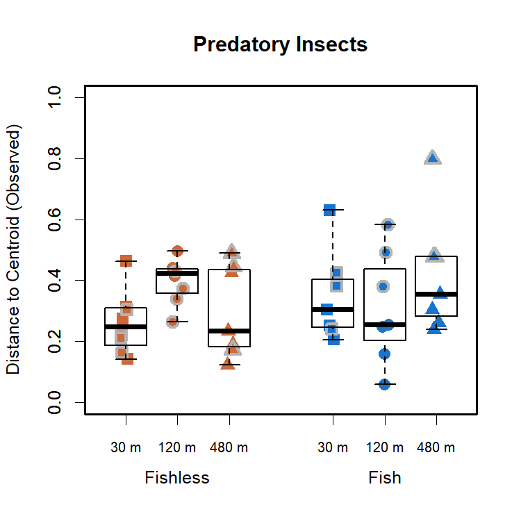
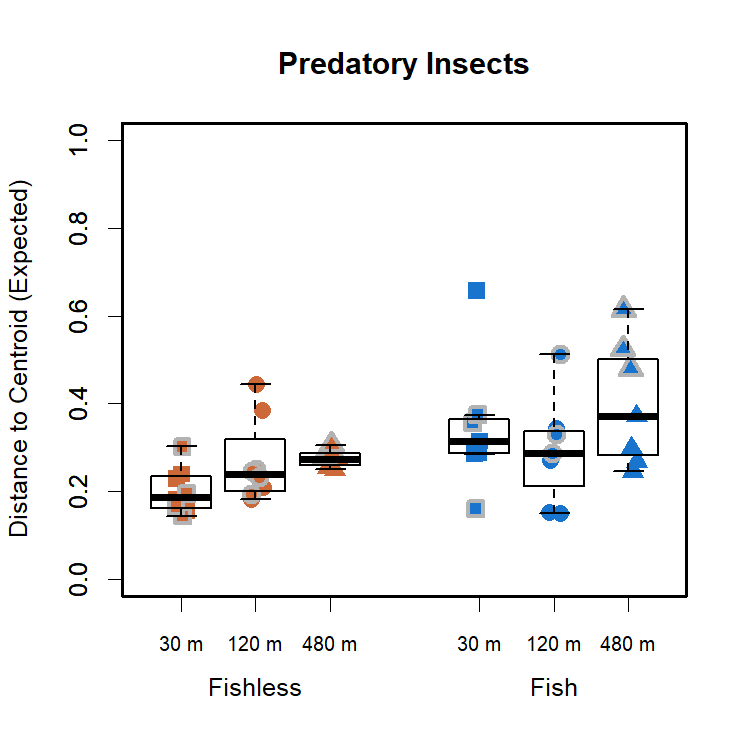
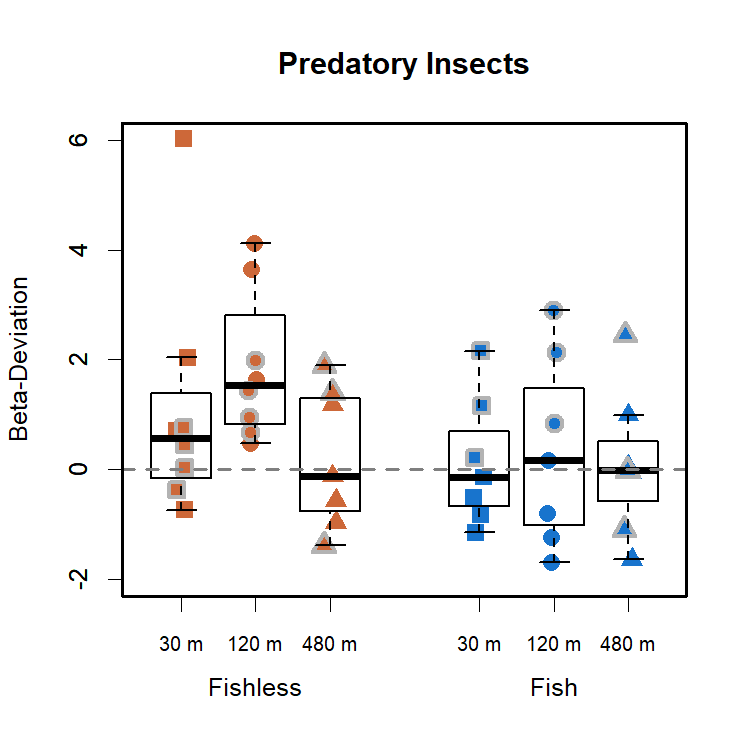
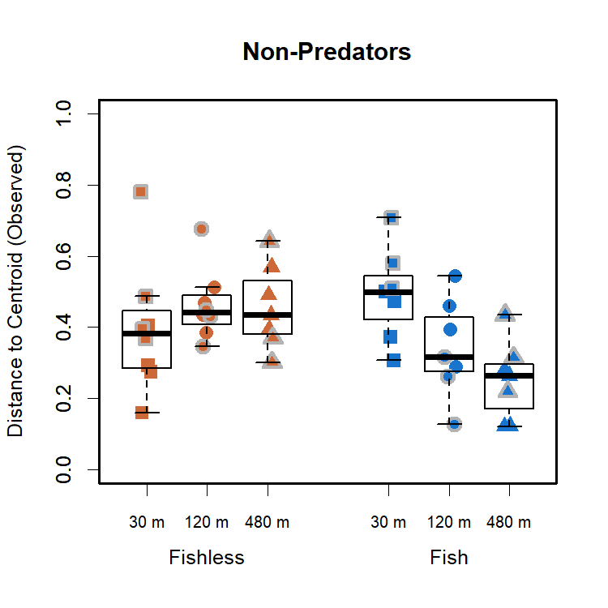
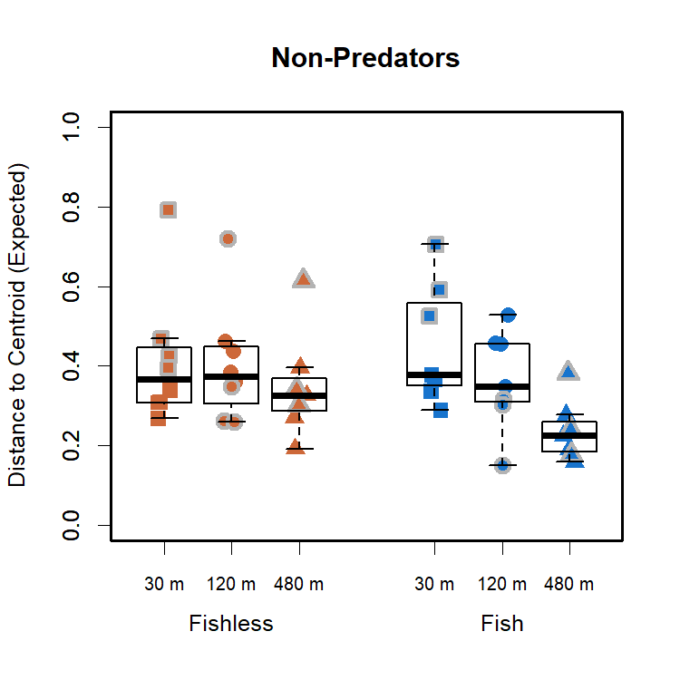
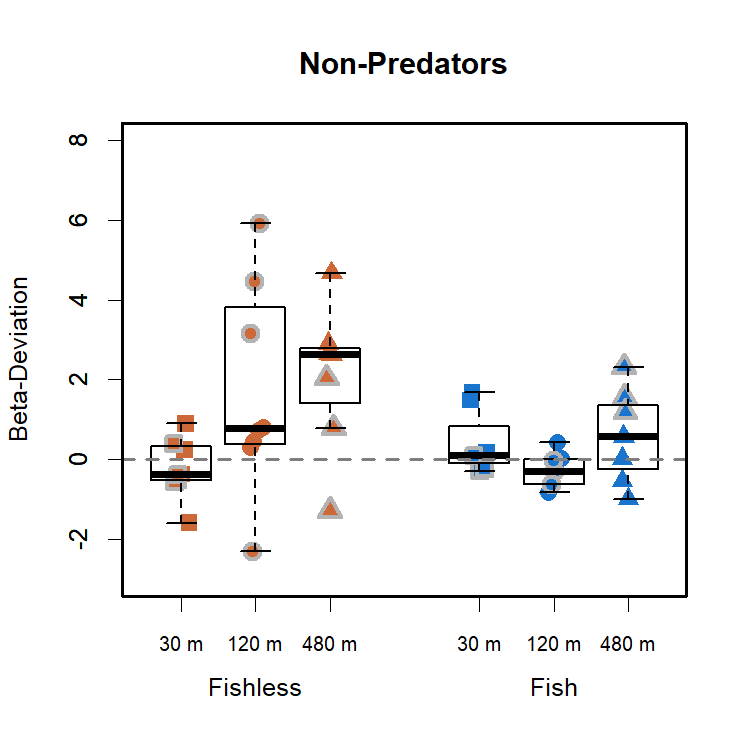

Community Variability - Predatory and Non-Predatory Insects
================
Rodolfo Pelinson
20/10/2020

``` r
install.packages("devtools")
devtools::install_github("RodolfoPelinson/Pelinson.et.al.2020B")
```

``` r
library(Pelinson.et.al.2020B)
```

``` r
library(lme4)
library(car)
library(emmeans)
library(vegan)
```

## Community Variability

### Considering only Predatory insects for the last two surveys.

First loading data

``` r
data(com_SS2_SS3_predators, All, fish_SS2_SS3, isolation_SS2_SS3, SS_SS2_SS3, ID_SS2_SS3, fish_isolation_SS2_SS3)
```

    ## Warning in data(com_SS2_SS3_predators, All, fish_SS2_SS3, isolation_SS2_SS3, :
    ## data set 'fish_isolation_SS2_SS3' not found

Computing observed and expected distances to centroid, and
beta-deviation.

``` r
beta_deviation_SS2_SS3_predators <- beta_deviation(com_SS2_SS3_predators, strata = All, times = 10000,
                                      transform = NULL, dist = "bray", fixedmar="both",
                                      shuffle = "both", method = "quasiswap", seed = 2, group = All) 
```

#### Observed Community Variability

Running ANOVA table for observed distances to group centroids, or
observed beta-diversity/community variability in each treatment.

``` r
fit_observed_SS2_SS3 <- lmer(beta_deviation_SS2_SS3_predators$observed_distances~fish_SS2_SS3*isolation_SS2_SS3*SS_SS2_SS3 + (1|ID_SS2_SS3))
round(Anova(fit_observed_SS2_SS3, test.statistic = "F"),3)
```

    ## Analysis of Deviance Table (Type II Wald F tests with Kenward-Roger df)
    ## 
    ## Response: beta_deviation_SS2_SS3_predators$observed_distances
    ##                                               F Df Df.res Pr(>F)   
    ## fish_SS2_SS3                              1.102  1 16.626  0.309   
    ## isolation_SS2_SS3                         1.016  2 16.546  0.383   
    ## SS_SS2_SS3                                5.302  1 16.421  0.035 * 
    ## fish_SS2_SS3:isolation_SS2_SS3            3.197  2 16.651  0.067 . 
    ## fish_SS2_SS3:SS_SS2_SS3                   8.896  1 16.574  0.009 **
    ## isolation_SS2_SS3:SS_SS2_SS3              3.684  2 16.483  0.048 * 
    ## fish_SS2_SS3:isolation_SS2_SS3:SS_SS2_SS3 1.828  2 16.604  0.192   
    ## ---
    ## Signif. codes:  0 '***' 0.001 '**' 0.01 '*' 0.05 '.' 0.1 ' ' 1

``` r
emmeans(fit_observed_SS2_SS3, list(pairwise ~ fish_SS2_SS3|SS_SS2_SS3), adjust = "tukey")
```

    ## $`emmeans of fish_SS2_SS3 | SS_SS2_SS3`
    ## SS_SS2_SS3 = 2:
    ##  fish_SS2_SS3 emmean     SE df lower.CL upper.CL
    ##  absent        0.329 0.0339 32    0.249    0.409
    ##  present       0.273 0.0339 32    0.193    0.352
    ## 
    ## SS_SS2_SS3 = 3:
    ##  fish_SS2_SS3 emmean     SE df lower.CL upper.CL
    ##  absent        0.315 0.0360 32    0.231    0.400
    ##  present       0.473 0.0399 32    0.379    0.566
    ## 
    ## Results are averaged over the levels of: isolation_SS2_SS3 
    ## Degrees-of-freedom method: kenward-roger 
    ## Confidence level used: 0.95 
    ## Conf-level adjustment: sidak method for 2 estimates 
    ## 
    ## $`pairwise differences of fish_SS2_SS3 | SS_SS2_SS3`
    ## SS_SS2_SS3 = 2:
    ##  contrast         estimate     SE df t.ratio p.value
    ##  absent - present   0.0562 0.0480 32  1.171  0.2501 
    ## 
    ## SS_SS2_SS3 = 3:
    ##  contrast         estimate     SE df t.ratio p.value
    ##  absent - present  -0.1573 0.0538 32 -2.927  0.0063 
    ## 
    ## Results are averaged over the levels of: isolation_SS2_SS3 
    ## Degrees-of-freedom method: kenward-roger

``` r
emmeans(fit_observed_SS2_SS3, list(pairwise ~ isolation_SS2_SS3|SS_SS2_SS3), adjust = "tukey")
```

    ## $`emmeans of isolation_SS2_SS3 | SS_SS2_SS3`
    ## SS_SS2_SS3 = 2:
    ##  isolation_SS2_SS3 emmean     SE df lower.CL upper.CL
    ##  30                 0.323 0.0416 32    0.218    0.428
    ##  120                0.313 0.0416 32    0.208    0.418
    ##  480                0.266 0.0416 32    0.162    0.371
    ## 
    ## SS_SS2_SS3 = 3:
    ##  isolation_SS2_SS3 emmean     SE df lower.CL upper.CL
    ##  30                 0.287 0.0454 32    0.172    0.401
    ##  120                0.419 0.0454 32    0.305    0.533
    ##  480                0.477 0.0489 32    0.353    0.600
    ## 
    ## Results are averaged over the levels of: fish_SS2_SS3 
    ## Degrees-of-freedom method: kenward-roger 
    ## Confidence level used: 0.95 
    ## Conf-level adjustment: sidak method for 3 estimates 
    ## 
    ## $`pairwise differences of isolation_SS2_SS3 | SS_SS2_SS3`
    ## SS_SS2_SS3 = 2:
    ##  contrast  estimate     SE df t.ratio p.value
    ##  30 - 120    0.0100 0.0588 32  0.171  0.9841 
    ##  30 - 480    0.0566 0.0588 32  0.962  0.6055 
    ##  120 - 480   0.0465 0.0588 32  0.792  0.7108 
    ## 
    ## SS_SS2_SS3 = 3:
    ##  contrast  estimate     SE df t.ratio p.value
    ##  30 - 120   -0.1324 0.0641 32 -2.064  0.1135 
    ##  30 - 480   -0.1900 0.0667 32 -2.850  0.0202 
    ##  120 - 480  -0.0576 0.0667 32 -0.863  0.6669 
    ## 
    ## Results are averaged over the levels of: fish_SS2_SS3 
    ## Degrees-of-freedom method: kenward-roger 
    ## P value adjustment: tukey method for comparing a family of 3 estimates

Distance to centroid for predators is greater in pods with fish and in
higher isolation treatments, but only for the last survey

Plotting it:

``` r
boxplot(beta_deviation_SS2_SS3_predators$observed_distances~isolation_SS2_SS3*fish_SS2_SS3, outline = F, ylab = "Distance to Centroid (Observed)", xlab = "", at = c(1,2,3,5,6,7),ylim = c(0,1), lwd = 1.5, col = "transparent", xaxt="n", main = "Predatory Insects")
mylevels <- levels(All)
levelProportions <- summary(All)/length(beta_deviation_SS2_SS3_predators$observed_distances)
col <- c(rep("sienna3",3), rep("dodgerblue3",3), rep("grey70",6))
bg <- c(rep("sienna3",3), rep("dodgerblue3",3),rep("sienna3",3), rep("dodgerblue3",3))
pch <- c(15,16,17,15,16,17,22,21,24,22,21,24)
for(i in 1:length(mylevels)){
  
  x<- c(1,2,3,5,6,7,1,2,3,5,6,7)[i]
  thislevel <- mylevels[i]
  thisvalues <- beta_deviation_SS2_SS3_predators$observed_distances[All==thislevel]
  
  # take the x-axis indices and add a jitter, proportional to the N in each level
  myjitter <- jitter(rep(x, length(thisvalues)), amount=levelProportions[i]/0.8)
  points(myjitter, thisvalues, pch=pch[i], col=col[i], bg = bg[i] , cex = 1.5, lwd = 3) 
  
}
boxplot(beta_deviation_SS2_SS3_predators$observed_distances~isolation_SS2_SS3*fish_SS2_SS3, add = T, col = "transparent", outline = F,at = c(1,2,3,5,6,7), lwd = 1.5, xaxt="n")
axis(1,labels = c("30 m","120 m", "480 m","30 m","120 m", "480 m"), cex.axis = 0.8, at =c(1,2,3,5,6,7))
axis(1,labels = c("Fishless","Fish"), cex.axis = 1, at =c(2,6), line = 1.5, tick = F )
box(lwd = 2.5)
```

<!-- -->

#### Expected Community Variability

Running ANOVA table for expected distances to group centroids, or
expected beta-diversity/community variability in each treatment.

``` r
fit_expected_SS2_SS3 <- lmer(beta_deviation_SS2_SS3_predators$expected_distances~fish_SS2_SS3*isolation_SS2_SS3*SS_SS2_SS3 + (1|ID_SS2_SS3), control = lmerControl(optimizer = "nlminbwrap"))
round(Anova(fit_expected_SS2_SS3, test.statistic = "F"),3)
```

    ## Analysis of Deviance Table (Type II Wald F tests with Kenward-Roger df)
    ## 
    ## Response: beta_deviation_SS2_SS3_predators$expected_distances
    ##                                                F Df Df.res Pr(>F)   
    ## fish_SS2_SS3                              12.006  1 16.626  0.003 **
    ## isolation_SS2_SS3                          1.874  2 16.546  0.185   
    ## SS_SS2_SS3                                 1.851  1 16.421  0.192   
    ## fish_SS2_SS3:isolation_SS2_SS3             1.779  2 16.651  0.199   
    ## fish_SS2_SS3:SS_SS2_SS3                    3.899  1 16.574  0.065 . 
    ## isolation_SS2_SS3:SS_SS2_SS3               3.149  2 16.483  0.069 . 
    ## fish_SS2_SS3:isolation_SS2_SS3:SS_SS2_SS3  3.298  2 16.604  0.062 . 
    ## ---
    ## Signif. codes:  0 '***' 0.001 '**' 0.01 '*' 0.05 '.' 0.1 ' ' 1

Patterns are similar to those observed for the observed distances to
centroid.

Plotting it:

``` r
boxplot(beta_deviation_SS2_SS3_predators$expected_distances~isolation_SS2_SS3*fish_SS2_SS3, outline = F, ylab = "Distance to Centroid (Expected)", xlab = "", at = c(1,2,3,5,6,7),ylim = c(0,1), lwd = 1.5, col = "transparent", xaxt="n", main = "Predatory Insects")
mylevels <- levels(All)
levelProportions <- summary(All)/length(beta_deviation_SS2_SS3_predators$expected_distances)
col <- c(rep("sienna3",3), rep("dodgerblue3",3), rep("grey70",6))
bg <- c(rep("sienna3",3), rep("dodgerblue3",3),rep("sienna3",3), rep("dodgerblue3",3))
pch <- c(15,16,17,15,16,17,22,21,24,22,21,24)
for(i in 1:length(mylevels)){
  
  x<- c(1,2,3,5,6,7,1,2,3,5,6,7)[i]
  thislevel <- mylevels[i]
  thisvalues <- beta_deviation_SS2_SS3_predators$expected_distances[All==thislevel]
  
  # take the x-axis indices and add a jitter, proportional to the N in each level
  myjitter <- jitter(rep(x, length(thisvalues)), amount=levelProportions[i]/0.8)
  points(myjitter, thisvalues, pch=pch[i], col=col[i], bg = bg[i] , cex = 1.5, lwd = 3) 
  
}
boxplot(beta_deviation_SS2_SS3_predators$expected_distances~isolation_SS2_SS3*fish_SS2_SS3, add = T, col = "transparent", outline = F,at = c(1,2,3,5,6,7), lwd = 1.5, xaxt="n")
axis(1,labels = c("30 m","120 m", "480 m","30 m","120 m", "480 m"), cex.axis = 0.8, at =c(1,2,3,5,6,7))
axis(1,labels = c("Fishless","Fish"), cex.axis = 1, at =c(2,6), line = 1.5, tick = F )
box(lwd = 2.5)
```

<!-- -->

#### Beta-Deviation

Running ANOVA table for the deviations of expected distances to group
centroids from observed distances.

``` r
fit_deviation_SS2_SS3 <- lmer(beta_deviation_SS2_SS3_predators$deviation_distances~fish_SS2_SS3*isolation_SS2_SS3*SS_SS2_SS3 + (1|ID_SS2_SS3), control = lmerControl(optimizer = "nlminbwrap"))
round(Anova(fit_deviation_SS2_SS3, test.statistic = "F"),3)
```

    ## Analysis of Deviance Table (Type II Wald F tests with Kenward-Roger df)
    ## 
    ## Response: beta_deviation_SS2_SS3_predators$deviation_distances
    ##                                               F Df Df.res Pr(>F)   
    ## fish_SS2_SS3                              4.476  1 16.626  0.050 * 
    ## isolation_SS2_SS3                         1.852  2 16.546  0.188   
    ## SS_SS2_SS3                                0.838  1 16.421  0.373   
    ## fish_SS2_SS3:isolation_SS2_SS3            1.067  2 16.651  0.367   
    ## fish_SS2_SS3:SS_SS2_SS3                   9.300  1 16.574  0.007 **
    ## isolation_SS2_SS3:SS_SS2_SS3              0.349  2 16.483  0.711   
    ## fish_SS2_SS3:isolation_SS2_SS3:SS_SS2_SS3 2.405  2 16.604  0.121   
    ## ---
    ## Signif. codes:  0 '***' 0.001 '**' 0.01 '*' 0.05 '.' 0.1 ' ' 1

``` r
emmeans(fit_deviation_SS2_SS3, list(pairwise ~ fish_SS2_SS3|isolation_SS2_SS3), adjust = "tukey")
```

    ## $`emmeans of fish_SS2_SS3 | isolation_SS2_SS3`
    ## isolation_SS2_SS3 = 30:
    ##  fish_SS2_SS3 emmean    SE   df lower.CL upper.CL
    ##  absent        1.113 0.490 14.9   -0.105     2.33
    ##  present       0.259 0.535 17.4   -1.049     1.57
    ## 
    ## isolation_SS2_SS3 = 120:
    ##  fish_SS2_SS3 emmean    SE   df lower.CL upper.CL
    ##  absent        1.869 0.490 14.9    0.651     3.09
    ##  present       0.538 0.535 17.4   -0.770     1.85
    ## 
    ## isolation_SS2_SS3 = 480:
    ##  fish_SS2_SS3 emmean    SE   df lower.CL upper.CL
    ##  absent        0.262 0.535 17.4   -1.046     1.57
    ##  present       0.143 0.535 17.4   -1.165     1.45
    ## 
    ## Results are averaged over the levels of: SS_SS2_SS3 
    ## Degrees-of-freedom method: kenward-roger 
    ## Confidence level used: 0.95 
    ## Conf-level adjustment: sidak method for 2 estimates 
    ## 
    ## $`pairwise differences of fish_SS2_SS3 | isolation_SS2_SS3`
    ## isolation_SS2_SS3 = 30:
    ##  contrast         estimate    SE   df t.ratio p.value
    ##  absent - present    0.854 0.725 16.2 1.177   0.2562 
    ## 
    ## isolation_SS2_SS3 = 120:
    ##  contrast         estimate    SE   df t.ratio p.value
    ##  absent - present    1.331 0.725 16.2 1.835   0.0849 
    ## 
    ## isolation_SS2_SS3 = 480:
    ##  contrast         estimate    SE   df t.ratio p.value
    ##  absent - present    0.119 0.756 17.4 0.157   0.8769 
    ## 
    ## Results are averaged over the levels of: SS_SS2_SS3 
    ## Degrees-of-freedom method: kenward-roger

Beta deviation seems to increase with isolation, but only in fishless
ponds.

Plotting it:

``` r
boxplot(beta_deviation_SS2_SS3_predators$deviation_distances~isolation_SS2_SS3*fish_SS2_SS3, outline = F, ylab = "Beta-Deviation", xlab = "", at = c(1,2,3,5,6,7),ylim = c(-2,6), lwd = 1.5, col = "transparent", xaxt="n", main = "Predatory Insects")
mylevels <- levels(All)
levelProportions <- summary(All)/length(beta_deviation_SS2_SS3_predators$deviation_distances)
col <- c(rep("sienna3",3), rep("dodgerblue3",3), rep("grey70",6))
bg <- c(rep("sienna3",3), rep("dodgerblue3",3),rep("sienna3",3), rep("dodgerblue3",3))
pch <- c(15,16,17,15,16,17,22,21,24,22,21,24)
for(i in 1:length(mylevels)){
  
  x<- c(1,2,3,5,6,7,1,2,3,5,6,7)[i]
  thislevel <- mylevels[i]
  thisvalues <- beta_deviation_SS2_SS3_predators$deviation_distances[All==thislevel]
  
  # take the x-axis indices and add a jitter, proportional to the N in each level
  myjitter <- jitter(rep(x, length(thisvalues)), amount=levelProportions[i]/0.8)
  points(myjitter, thisvalues, pch=pch[i], col=col[i], bg = bg[i] , cex = 1.5, lwd = 3) 
  
}
boxplot(beta_deviation_SS2_SS3_predators$deviation_distances~isolation_SS2_SS3*fish_SS2_SS3, add = T, col = "transparent", outline = F,at = c(1,2,3,5,6,7), lwd = 1.5, xaxt="n")
axis(1,labels = c("30 m","120 m", "480 m","30 m","120 m", "480 m"), cex.axis = 0.8, at =c(1,2,3,5,6,7))
axis(1,labels = c("Fishless","Fish"), cex.axis = 1, at =c(2,6), line = 1.5, tick = F )
abline(h = 0, lty = 2, lwd = 2, col = "grey50")
box(lwd = 2.5)
```

<!-- -->

### Considering only Non-Predatory insects for the last two surveys.

First loading data

``` r
data(com_SS2_SS3_non_predators)
```

Computing observed and expected distances to centroid, and
beta-deviation.

``` r
beta_deviation_SS2_SS3_non_predators <- beta_deviation(com_SS2_SS3_non_predators, strata = All, times = 10000,
                                      transform = NULL, dist = "bray", fixedmar="both",
                                      shuffle = "both", method = "quasiswap", seed = 2, group = All) 
```

#### Observed Community Variability

Running ANOVA table for observed distances to group centroids, or
observed beta-diversity/community variability in each treatment.

``` r
fit_observed_SS2_SS3 <- lmer(beta_deviation_SS2_SS3_non_predators$observed_distances~fish_SS2_SS3*isolation_SS2_SS3*SS_SS2_SS3 + (1|ID_SS2_SS3))
round(Anova(fit_observed_SS2_SS3, test.statistic = "F"),3)
```

    ## Analysis of Deviance Table (Type II Wald F tests with Kenward-Roger df)
    ## 
    ## Response: beta_deviation_SS2_SS3_non_predators$observed_distances
    ##                                               F Df Df.res Pr(>F)   
    ## fish_SS2_SS3                              3.826  1 16.805  0.067 . 
    ## isolation_SS2_SS3                         1.530  2 16.725  0.245   
    ## SS_SS2_SS3                                3.276  1 16.186  0.089 . 
    ## fish_SS2_SS3:isolation_SS2_SS3            6.841  2 16.828  0.007 **
    ## fish_SS2_SS3:SS_SS2_SS3                   0.297  1 16.347  0.593   
    ## isolation_SS2_SS3:SS_SS2_SS3              5.765  2 16.251  0.013 * 
    ## fish_SS2_SS3:isolation_SS2_SS3:SS_SS2_SS3 2.465  2 16.378  0.116   
    ## ---
    ## Signif. codes:  0 '***' 0.001 '**' 0.01 '*' 0.05 '.' 0.1 ' ' 1

``` r
emmeans(fit_observed_SS2_SS3, list(pairwise ~ isolation_SS2_SS3|fish_SS2_SS3|SS_SS2_SS3), adjust = "tukey")
```

    ## $`emmeans of isolation_SS2_SS3 | fish_SS2_SS3, SS_SS2_SS3`
    ## fish_SS2_SS3 = absent, SS_SS2_SS3 = 2:
    ##  isolation_SS2_SS3 emmean     SE   df lower.CL upper.CL
    ##  30                 0.283 0.0580 31.8   0.1368    0.429
    ##  120                0.450 0.0580 31.8   0.3038    0.596
    ##  480                0.472 0.0580 31.8   0.3257    0.618
    ## 
    ## fish_SS2_SS3 = present, SS_SS2_SS3 = 2:
    ##  isolation_SS2_SS3 emmean     SE   df lower.CL upper.CL
    ##  30                 0.413 0.0580 31.8   0.2663    0.559
    ##  120                0.422 0.0580 31.8   0.2756    0.568
    ##  480                0.197 0.0580 31.8   0.0503    0.343
    ## 
    ## fish_SS2_SS3 = absent, SS_SS2_SS3 = 3:
    ##  isolation_SS2_SS3 emmean     SE   df lower.CL upper.CL
    ##  30                 0.508 0.0580 31.8   0.3613    0.654
    ##  120                0.475 0.0580 31.8   0.3290    0.622
    ##  480                0.441 0.0681 32.0   0.2690    0.612
    ## 
    ## fish_SS2_SS3 = present, SS_SS2_SS3 = 3:
    ##  isolation_SS2_SS3 emmean     SE   df lower.CL upper.CL
    ##  30                 0.596 0.0681 32.0   0.4241    0.767
    ##  120                0.234 0.0681 32.0   0.0622    0.405
    ##  480                0.325 0.0681 32.0   0.1536    0.497
    ## 
    ## Degrees-of-freedom method: kenward-roger 
    ## Confidence level used: 0.95 
    ## Conf-level adjustment: sidak method for 3 estimates 
    ## 
    ## $`pairwise differences of isolation_SS2_SS3 | fish_SS2_SS3, SS_SS2_SS3`
    ## fish_SS2_SS3 = absent, SS_SS2_SS3 = 2:
    ##  contrast  estimate     SE   df t.ratio p.value
    ##  30 - 120   -0.1670 0.0821 31.8 -2.034  0.1205 
    ##  30 - 480   -0.1888 0.0821 31.8 -2.301  0.0702 
    ##  120 - 480  -0.0219 0.0821 31.8 -0.267  0.9616 
    ## 
    ## fish_SS2_SS3 = present, SS_SS2_SS3 = 2:
    ##  contrast  estimate     SE   df t.ratio p.value
    ##  30 - 120   -0.0093 0.0821 31.8 -0.113  0.9930 
    ##  30 - 480    0.2160 0.0821 31.8  2.632  0.0338 
    ##  120 - 480   0.2253 0.0821 31.8  2.745  0.0260 
    ## 
    ## fish_SS2_SS3 = absent, SS_SS2_SS3 = 3:
    ##  contrast  estimate     SE   df t.ratio p.value
    ##  30 - 120    0.0323 0.0821 31.8  0.393  0.9186 
    ##  30 - 480    0.0669 0.0895 31.9  0.748  0.7371 
    ##  120 - 480   0.0347 0.0895 31.9  0.387  0.9208 
    ## 
    ## fish_SS2_SS3 = present, SS_SS2_SS3 = 3:
    ##  contrast  estimate     SE   df t.ratio p.value
    ##  30 - 120    0.3619 0.0963 32.0  3.757  0.0019 
    ##  30 - 480    0.2705 0.0963 32.0  2.808  0.0223 
    ##  120 - 480  -0.0914 0.0963 32.0 -0.949  0.6140 
    ## 
    ## Degrees-of-freedom method: kenward-roger 
    ## P value adjustment: tukey method for comparing a family of 3 estimates

Similar to when we analysed the whole community, it seems that the
effect of isolation is dependent on the presence or absence of fish.
When fish is absent, there is no effect of isolation. When it is
present, there is a negative effect of isolation. This effect of
isolation is stronger from low and intermediate isolation to high
isolation in the second survey, and stronger from low to intermediate
and high isolation in the last survey.

Plotting it:

``` r
boxplot(beta_deviation_SS2_SS3_non_predators$observed_distances~isolation_SS2_SS3*fish_SS2_SS3, outline = F, ylab = "Distance to Centroid (Observed)", xlab = "", at = c(1,2,3,5,6,7),ylim = c(0,1), lwd = 1.5, col = "transparent", xaxt="n", main = "Non-Predators")
mylevels <- levels(All)
levelProportions <- summary(All)/length(beta_deviation_SS2_SS3_non_predators$observed_distances)
col <- c(rep("sienna3",3), rep("dodgerblue3",3), rep("grey70",6))
bg <- c(rep("sienna3",3), rep("dodgerblue3",3),rep("sienna3",3), rep("dodgerblue3",3))
pch <- c(15,16,17,15,16,17,22,21,24,22,21,24)
for(i in 1:length(mylevels)){
  
  x<- c(1,2,3,5,6,7,1,2,3,5,6,7)[i]
  thislevel <- mylevels[i]
  thisvalues <- beta_deviation_SS2_SS3_non_predators$observed_distances[All==thislevel]
  
  # take the x-axis indices and add a jitter, proportional to the N in each level
  myjitter <- jitter(rep(x, length(thisvalues)), amount=levelProportions[i]/0.8)
  points(myjitter, thisvalues, pch=pch[i], col=col[i], bg = bg[i] , cex = 1.5, lwd = 3) 
  
}
boxplot(beta_deviation_SS2_SS3_non_predators$observed_distances~isolation_SS2_SS3*fish_SS2_SS3, add = T, col = "transparent", outline = F,at = c(1,2,3,5,6,7), lwd = 1.5, xaxt="n")
axis(1,labels = c("30 m","120 m", "480 m","30 m","120 m", "480 m"), cex.axis = 0.8, at =c(1,2,3,5,6,7))
axis(1,labels = c("Fishless","Fish"), cex.axis = 1, at =c(2,6), line = 1.5, tick = F )
box(lwd = 2.5)
```

<!-- -->

#### Expected Community Variability

Running ANOVA table for expected distances to group centroids, or
expected beta-diversity/community variability in each treatment.

``` r
fit_expected_SS2_SS3 <- lmer(beta_deviation_SS2_SS3_non_predators$expected_distances~fish_SS2_SS3*isolation_SS2_SS3*SS_SS2_SS3 + (1|ID_SS2_SS3), control = lmerControl(optimizer = "nlminbwrap"))
round(Anova(fit_expected_SS2_SS3, test.statistic = "F"),3)
```

    ## Analysis of Deviance Table (Type II Wald F tests with Kenward-Roger df)
    ## 
    ## Response: beta_deviation_SS2_SS3_non_predators$expected_distances
    ##                                               F Df Df.res Pr(>F)   
    ## fish_SS2_SS3                              0.784  1 16.626  0.389   
    ## isolation_SS2_SS3                         5.078  2 16.546  0.019 * 
    ## SS_SS2_SS3                                4.884  1 16.421  0.042 * 
    ## fish_SS2_SS3:isolation_SS2_SS3            2.105  2 16.651  0.153   
    ## fish_SS2_SS3:SS_SS2_SS3                   0.862  1 16.574  0.367   
    ## isolation_SS2_SS3:SS_SS2_SS3              7.773  2 16.483  0.004 **
    ## fish_SS2_SS3:isolation_SS2_SS3:SS_SS2_SS3 0.907  2 16.604  0.423   
    ## ---
    ## Signif. codes:  0 '***' 0.001 '**' 0.01 '*' 0.05 '.' 0.1 ' ' 1

``` r
emmeans(fit_expected_SS2_SS3, list(pairwise ~ isolation_SS2_SS3|SS_SS2_SS3), adjust = "tukey")
```

    ## $`emmeans of isolation_SS2_SS3 | SS_SS2_SS3`
    ## SS_SS2_SS3 = 2:
    ##  isolation_SS2_SS3 emmean     SE df lower.CL upper.CL
    ##  30                 0.324 0.0405 32    0.222    0.426
    ##  120                0.429 0.0405 32    0.327    0.531
    ##  480                0.255 0.0405 32    0.153    0.356
    ## 
    ## SS_SS2_SS3 = 3:
    ##  isolation_SS2_SS3 emmean     SE df lower.CL upper.CL
    ##  30                 0.564 0.0441 32    0.453    0.675
    ##  120                0.327 0.0441 32    0.216    0.439
    ##  480                0.343 0.0475 32    0.223    0.463
    ## 
    ## Results are averaged over the levels of: fish_SS2_SS3 
    ## Degrees-of-freedom method: kenward-roger 
    ## Confidence level used: 0.95 
    ## Conf-level adjustment: sidak method for 3 estimates 
    ## 
    ## $`pairwise differences of isolation_SS2_SS3 | SS_SS2_SS3`
    ## SS_SS2_SS3 = 2:
    ##  contrast  estimate     SE df t.ratio p.value
    ##  30 - 120   -0.1052 0.0572 32 -1.839  0.1733 
    ##  30 - 480    0.0692 0.0572 32  1.210  0.4563 
    ##  120 - 480   0.1744 0.0572 32  3.048  0.0124 
    ## 
    ## SS_SS2_SS3 = 3:
    ##  contrast  estimate     SE df t.ratio p.value
    ##  30 - 120    0.2366 0.0624 32  3.790  0.0018 
    ##  30 - 480    0.2209 0.0649 32  3.405  0.0050 
    ##  120 - 480  -0.0157 0.0649 32 -0.242  0.9681 
    ## 
    ## Results are averaged over the levels of: fish_SS2_SS3 
    ## Degrees-of-freedom method: kenward-roger 
    ## P value adjustment: tukey method for comparing a family of 3 estimates

There is a decrease in the expected distance to centroid with isolation,
and this decrease is stronger in for the last survey\!

Plotting it:

``` r
boxplot(beta_deviation_SS2_SS3_non_predators$expected_distances~isolation_SS2_SS3*fish_SS2_SS3, outline = F, ylab = "Distance to Centroid (Expected)", xlab = "", at = c(1,2,3,5,6,7),ylim = c(0,1), lwd = 1.5, col = "transparent", xaxt="n", main = "Non-Predators")
mylevels <- levels(All)
levelProportions <- summary(All)/length(beta_deviation_SS2_SS3_non_predators$expected_distances)
col <- c(rep("sienna3",3), rep("dodgerblue3",3), rep("grey70",6))
bg <- c(rep("sienna3",3), rep("dodgerblue3",3),rep("sienna3",3), rep("dodgerblue3",3))
pch <- c(15,16,17,15,16,17,22,21,24,22,21,24)
for(i in 1:length(mylevels)){
  
  x<- c(1,2,3,5,6,7,1,2,3,5,6,7)[i]
  thislevel <- mylevels[i]
  thisvalues <- beta_deviation_SS2_SS3_non_predators$expected_distances[All==thislevel]
  
  # take the x-axis indices and add a jitter, proportional to the N in each level
  myjitter <- jitter(rep(x, length(thisvalues)), amount=levelProportions[i]/0.8)
  points(myjitter, thisvalues, pch=pch[i], col=col[i], bg = bg[i] , cex = 1.5, lwd = 3) 
  
}
boxplot(beta_deviation_SS2_SS3_non_predators$expected_distances~isolation_SS2_SS3*fish_SS2_SS3, add = T, col = "transparent", outline = F,at = c(1,2,3,5,6,7), lwd = 1.5, xaxt="n")
axis(1,labels = c("30 m","120 m", "480 m","30 m","120 m", "480 m"), cex.axis = 0.8, at =c(1,2,3,5,6,7))
axis(1,labels = c("Fishless","Fish"), cex.axis = 1, at =c(2,6), line = 1.5, tick = F )
box(lwd = 2.5)
```

<!-- -->

#### Beta-Deviation

Running ANOVA table for the deviations of expected distances to group
centroids from observed distances.

``` r
fit_deviation_SS2_SS3 <- lmer(beta_deviation_SS2_SS3_non_predators$deviation_distances~fish_SS2_SS3*isolation_SS2_SS3*SS_SS2_SS3 + (1|ID_SS2_SS3), control = lmerControl(optimizer = "nlminbwrap"))
round(Anova(fit_deviation_SS2_SS3, test.statistic = "F"),3)
```

    ## Analysis of Deviance Table (Type II Wald F tests with Kenward-Roger df)
    ## 
    ## Response: beta_deviation_SS2_SS3_non_predators$deviation_distances
    ##                                               F Df Df.res Pr(>F)   
    ## fish_SS2_SS3                              4.989  1 16.627  0.040 * 
    ## isolation_SS2_SS3                         3.319  2 16.547  0.061 . 
    ## SS_SS2_SS3                                0.083  1 16.420  0.777   
    ## fish_SS2_SS3:isolation_SS2_SS3            3.748  2 16.652  0.045 * 
    ## fish_SS2_SS3:SS_SS2_SS3                   0.181  1 16.573  0.676   
    ## isolation_SS2_SS3:SS_SS2_SS3              1.823  2 16.482  0.193   
    ## fish_SS2_SS3:isolation_SS2_SS3:SS_SS2_SS3 6.509  2 16.603  0.008 **
    ## ---
    ## Signif. codes:  0 '***' 0.001 '**' 0.01 '*' 0.05 '.' 0.1 ' ' 1

``` r
emmeans(fit_deviation_SS2_SS3, list(pairwise ~ isolation_SS2_SS3|fish_SS2_SS3|SS_SS2_SS3), adjust = "tukey")
```

    ## $`emmeans of isolation_SS2_SS3 | fish_SS2_SS3, SS_SS2_SS3`
    ## fish_SS2_SS3 = absent, SS_SS2_SS3 = 2:
    ##  isolation_SS2_SS3 emmean    SE df lower.CL upper.CL
    ##  30                -0.202 0.667 32   -1.882     1.48
    ##  120                0.580 0.667 32   -1.100     2.26
    ##  480                3.216 0.667 32    1.536     4.90
    ## 
    ## fish_SS2_SS3 = present, SS_SS2_SS3 = 2:
    ##  isolation_SS2_SS3 emmean    SE df lower.CL upper.CL
    ##  30                 0.856 0.667 32   -0.824     2.54
    ##  120               -0.253 0.667 32   -1.933     1.43
    ##  480               -0.230 0.667 32   -1.910     1.45
    ## 
    ## fish_SS2_SS3 = absent, SS_SS2_SS3 = 3:
    ##  isolation_SS2_SS3 emmean    SE df lower.CL upper.CL
    ##  30                -0.260 0.667 32   -1.940     1.42
    ##  120                2.812 0.667 32    1.132     4.49
    ##  480                0.517 0.784 32   -1.457     2.49
    ## 
    ## fish_SS2_SS3 = present, SS_SS2_SS3 = 3:
    ##  isolation_SS2_SS3 emmean    SE df lower.CL upper.CL
    ##  30                -0.143 0.784 32   -2.117     1.83
    ##  120               -0.309 0.784 32   -2.283     1.67
    ##  480                1.684 0.784 32   -0.290     3.66
    ## 
    ## Degrees-of-freedom method: kenward-roger 
    ## Confidence level used: 0.95 
    ## Conf-level adjustment: sidak method for 3 estimates 
    ## 
    ## $`pairwise differences of isolation_SS2_SS3 | fish_SS2_SS3, SS_SS2_SS3`
    ## fish_SS2_SS3 = absent, SS_SS2_SS3 = 2:
    ##  contrast  estimate    SE df t.ratio p.value
    ##  30 - 120   -0.7822 0.943 32 -0.829  0.6877 
    ##  30 - 480   -3.4182 0.943 32 -3.625  0.0028 
    ##  120 - 480  -2.6359 0.943 32 -2.795  0.0230 
    ## 
    ## fish_SS2_SS3 = present, SS_SS2_SS3 = 2:
    ##  contrast  estimate    SE df t.ratio p.value
    ##  30 - 120    1.1086 0.943 32  1.176  0.4761 
    ##  30 - 480    1.0863 0.943 32  1.152  0.4900 
    ##  120 - 480  -0.0222 0.943 32 -0.024  0.9997 
    ## 
    ## fish_SS2_SS3 = absent, SS_SS2_SS3 = 3:
    ##  contrast  estimate    SE df t.ratio p.value
    ##  30 - 120   -3.0721 0.943 32 -3.258  0.0073 
    ##  30 - 480   -0.7769 1.029 32 -0.755  0.7328 
    ##  120 - 480   2.2953 1.029 32  2.231  0.0812 
    ## 
    ## fish_SS2_SS3 = present, SS_SS2_SS3 = 3:
    ##  contrast  estimate    SE df t.ratio p.value
    ##  30 - 120    0.1661 1.108 32  0.150  0.9877 
    ##  30 - 480   -1.8266 1.108 32 -1.648  0.2406 
    ##  120 - 480  -1.9927 1.108 32 -1.798  0.1864 
    ## 
    ## Degrees-of-freedom method: kenward-roger 
    ## P value adjustment: tukey method for comparing a family of 3 estimates

Similarly to patterns for the whole community, there is an increase in
beta deviation with isolation, but only in fishless ponds. This effect
seems stronger in the second survey.

Plotting it:

``` r
boxplot(beta_deviation_SS2_SS3_non_predators$deviation_distances~isolation_SS2_SS3*fish_SS2_SS3, outline = F, ylab = "Beta-Deviation", xlab = "", at = c(1,2,3,5,6,7),ylim = c(-3,8), lwd = 1.5, col = "transparent", xaxt="n", main = "Non-Predators")
mylevels <- levels(All)
levelProportions <- summary(All)/length(beta_deviation_SS2_SS3_non_predators$deviation_distances)
col <- c(rep("sienna3",3), rep("dodgerblue3",3), rep("grey70",6))
bg <- c(rep("sienna3",3), rep("dodgerblue3",3),rep("sienna3",3), rep("dodgerblue3",3))
pch <- c(15,16,17,15,16,17,22,21,24,22,21,24)
for(i in 1:length(mylevels)){
  
  x<- c(1,2,3,5,6,7,1,2,3,5,6,7)[i]
  thislevel <- mylevels[i]
  thisvalues <- beta_deviation_SS2_SS3_non_predators$deviation_distances[All==thislevel]
  
  # take the x-axis indices and add a jitter, proportional to the N in each level
  myjitter <- jitter(rep(x, length(thisvalues)), amount=levelProportions[i]/0.8)
  points(myjitter, thisvalues, pch=pch[i], col=col[i], bg = bg[i] , cex = 1.5, lwd = 3) 
  
}
boxplot(beta_deviation_SS2_SS3_non_predators$deviation_distances~isolation_SS2_SS3*fish_SS2_SS3, add = T, col = "transparent", outline = F,at = c(1,2,3,5,6,7), lwd = 1.5, xaxt="n")
axis(1,labels = c("30 m","120 m", "480 m","30 m","120 m", "480 m"), cex.axis = 0.8, at =c(1,2,3,5,6,7))
axis(1,labels = c("Fishless","Fish"), cex.axis = 1, at =c(2,6), line = 1.5, tick = F )
abline(h = 0, lty = 2, lwd = 2, col = "grey50")
box(lwd = 2.5)
```

<!-- -->
