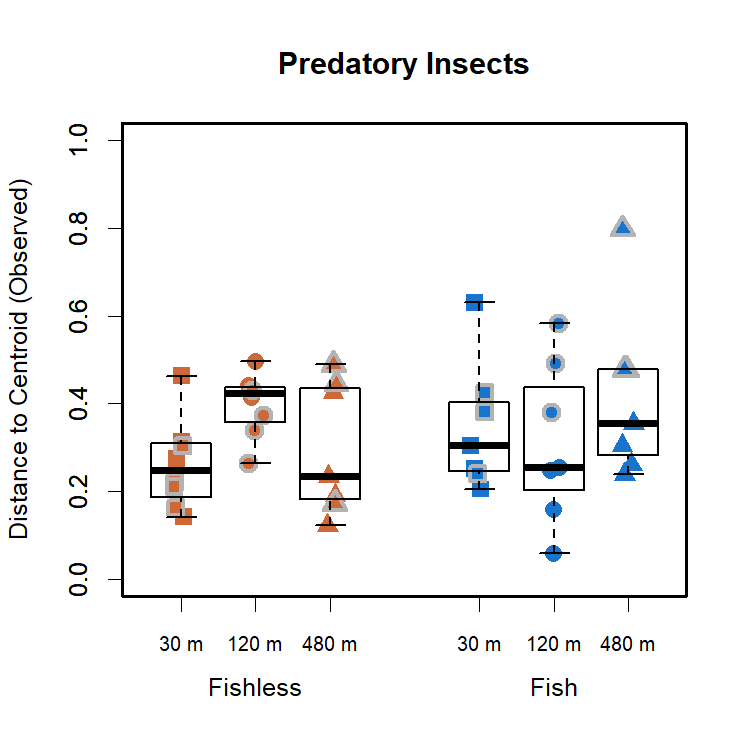
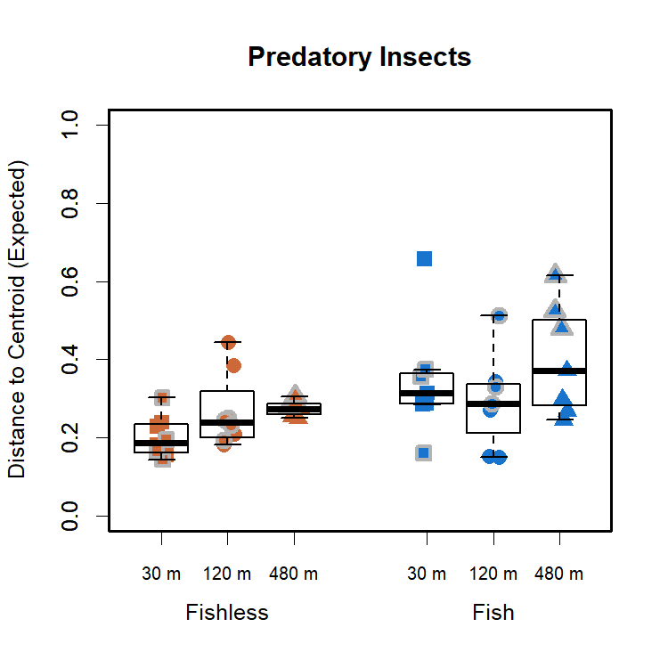
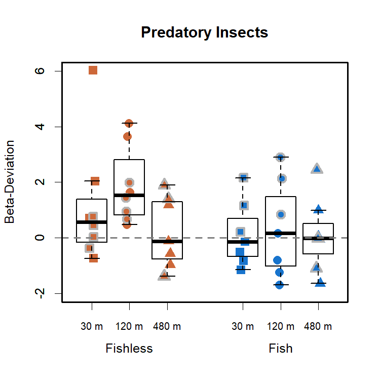
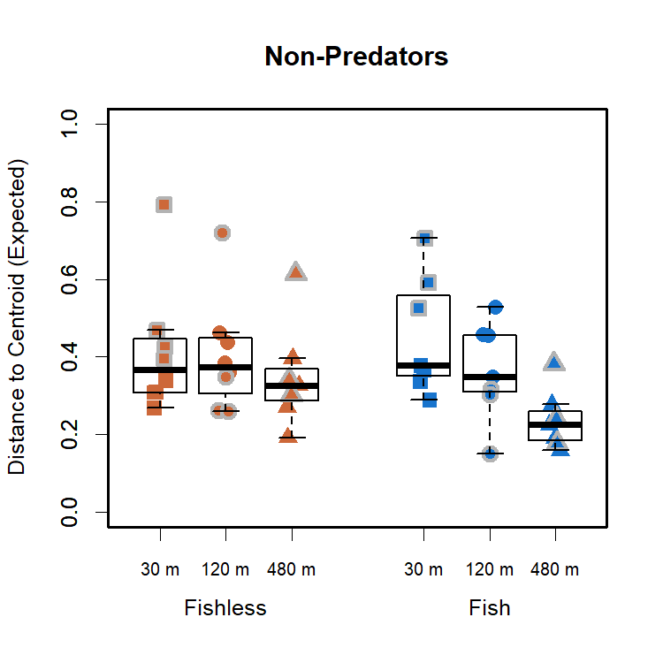
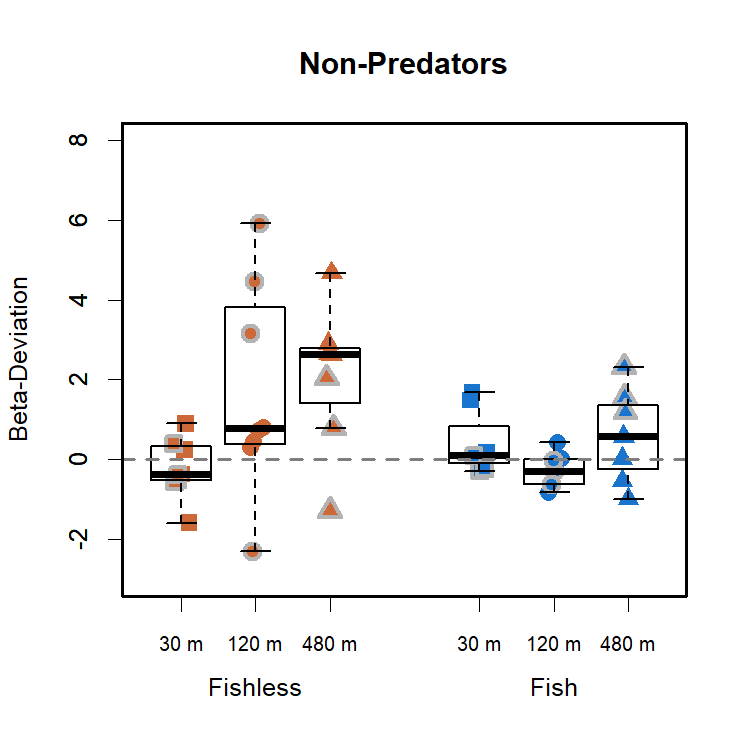

Community Variability - Predatory and Non-Predatory Insects
================
Rodolfo Pelinson
20/10/2020

This is the same community variability analyses presented in the main
paper, but separating the communities into predatory and non-predatory
insects.

If you haven’t, install the package:

``` r
install.packages("devtools")
devtools::install_github("RodolfoPelinson/Pelinson.et.al.2020B")
```

These are the packages you will need to run this code:

``` r
library(Pelinson.et.al.2020B)
library(lme4) # Version 1.1-23
library(car) # Version 3.0-7
library(emmeans) # Version 1.4.8
library(vegan) # Version 2.5-6
```

## Community Variability

### Considering only Predatory insects for the last two surveys.

First loading data

``` r
data(com_SS2_SS3_predators, All, fish_SS2_SS3, isolation_SS2_SS3, SS_SS2_SS3, ID_SS2_SS3, fish_isolation_SS2_SS3)
```

    ## Warning in data(com_SS2_SS3_predators, All, fish_SS2_SS3, isolation_SS2_SS3, :
    ## data set 'fish_isolation_SS2_SS3' not found

Computing observed and expected distances to centroid, and
beta-deviation.

``` r
beta_deviation_SS2_SS3_predators <- beta_deviation(com_SS2_SS3_predators, strata = All, times = 10000,
                                      transform = NULL, dist = "bray", fixedmar="both",
                                      shuffle = "both", method = "quasiswap", seed = 2, group = All) 
```

#### Observed Community Variability

Running ANOVA table for observed distances to group centroids, or
observed beta-diversity/community variability in each treatment.

``` r
fit_observed_SS2_SS3 <- lmer(beta_deviation_SS2_SS3_predators$observed_distances~fish_SS2_SS3*isolation_SS2_SS3*SS_SS2_SS3 + (1|ID_SS2_SS3))
round(Anova(fit_observed_SS2_SS3, test.statistic = "Chisq"),3)
```

    ## Analysis of Deviance Table (Type II Wald chisquare tests)
    ## 
    ## Response: beta_deviation_SS2_SS3_predators$observed_distances
    ##                                           Chisq Df Pr(>Chisq)   
    ## fish_SS2_SS3                              1.199  1      0.273   
    ## isolation_SS2_SS3                         2.129  2      0.345   
    ## SS_SS2_SS3                                5.533  1      0.019 * 
    ## fish_SS2_SS3:isolation_SS2_SS3            6.370  2      0.041 * 
    ## fish_SS2_SS3:SS_SS2_SS3                   9.009  1      0.003 **
    ## isolation_SS2_SS3:SS_SS2_SS3              7.528  2      0.023 * 
    ## fish_SS2_SS3:isolation_SS2_SS3:SS_SS2_SS3 3.697  2      0.157   
    ## ---
    ## Signif. codes:  0 '***' 0.001 '**' 0.01 '*' 0.05 '.' 0.1 ' ' 1

``` r
emmeans(fit_observed_SS2_SS3, list(pairwise ~ isolation_SS2_SS3|fish_SS2_SS3), adjust = "sidak")
```

    ## $`emmeans of isolation_SS2_SS3 | fish_SS2_SS3`
    ## fish_SS2_SS3 = absent:
    ##  isolation_SS2_SS3 emmean     SE   df lower.CL upper.CL
    ##  30                 0.261 0.0416 14.9    0.150    0.373
    ##  120                0.399 0.0416 14.9    0.287    0.511
    ##  480                0.306 0.0454 17.4    0.186    0.426
    ## 
    ## fish_SS2_SS3 = present:
    ##  isolation_SS2_SS3 emmean     SE   df lower.CL upper.CL
    ##  30                 0.348 0.0454 17.4    0.228    0.468
    ##  120                0.333 0.0454 17.4    0.213    0.453
    ##  480                0.437 0.0454 17.4    0.317    0.557
    ## 
    ## Results are averaged over the levels of: SS_SS2_SS3 
    ## Degrees-of-freedom method: kenward-roger 
    ## Confidence level used: 0.95 
    ## Conf-level adjustment: sidak method for 3 estimates 
    ## 
    ## $`pairwise differences of isolation_SS2_SS3 | fish_SS2_SS3`
    ## fish_SS2_SS3 = absent:
    ##  contrast  estimate     SE   df t.ratio p.value
    ##  30 - 120   -0.1378 0.0588 14.9 -2.344  0.0966 
    ##  30 - 480   -0.0447 0.0615 16.2 -0.726  0.8580 
    ##  120 - 480   0.0932 0.0615 16.2  1.514  0.3841 
    ## 
    ## fish_SS2_SS3 = present:
    ##  contrast  estimate     SE   df t.ratio p.value
    ##  30 - 120    0.0155 0.0641 17.4  0.241  0.9934 
    ##  30 - 480   -0.0887 0.0641 17.4 -1.383  0.4568 
    ##  120 - 480  -0.1042 0.0641 17.4 -1.624  0.3239 
    ## 
    ## Results are averaged over the levels of: SS_SS2_SS3 
    ## Degrees-of-freedom method: kenward-roger 
    ## P value adjustment: sidak method for 3 tests

``` r
emmeans(fit_observed_SS2_SS3, list(pairwise ~ fish_SS2_SS3|SS_SS2_SS3), adjust = "sidak")
```

    ## $`emmeans of fish_SS2_SS3 | SS_SS2_SS3`
    ## SS_SS2_SS3 = 2:
    ##  fish_SS2_SS3 emmean     SE df lower.CL upper.CL
    ##  absent        0.329 0.0339 32    0.249    0.409
    ##  present       0.273 0.0339 32    0.193    0.352
    ## 
    ## SS_SS2_SS3 = 3:
    ##  fish_SS2_SS3 emmean     SE df lower.CL upper.CL
    ##  absent        0.315 0.0360 32    0.231    0.400
    ##  present       0.473 0.0399 32    0.379    0.566
    ## 
    ## Results are averaged over the levels of: isolation_SS2_SS3 
    ## Degrees-of-freedom method: kenward-roger 
    ## Confidence level used: 0.95 
    ## Conf-level adjustment: sidak method for 2 estimates 
    ## 
    ## $`pairwise differences of fish_SS2_SS3 | SS_SS2_SS3`
    ## SS_SS2_SS3 = 2:
    ##  contrast         estimate     SE df t.ratio p.value
    ##  absent - present   0.0562 0.0480 32  1.171  0.2501 
    ## 
    ## SS_SS2_SS3 = 3:
    ##  contrast         estimate     SE df t.ratio p.value
    ##  absent - present  -0.1573 0.0538 32 -2.927  0.0063 
    ## 
    ## Results are averaged over the levels of: isolation_SS2_SS3 
    ## Degrees-of-freedom method: kenward-roger

``` r
emmeans(fit_observed_SS2_SS3, list(pairwise ~ isolation_SS2_SS3|SS_SS2_SS3), adjust = "sidak")
```

    ## $`emmeans of isolation_SS2_SS3 | SS_SS2_SS3`
    ## SS_SS2_SS3 = 2:
    ##  isolation_SS2_SS3 emmean     SE df lower.CL upper.CL
    ##  30                 0.323 0.0416 32    0.218    0.428
    ##  120                0.313 0.0416 32    0.208    0.418
    ##  480                0.266 0.0416 32    0.162    0.371
    ## 
    ## SS_SS2_SS3 = 3:
    ##  isolation_SS2_SS3 emmean     SE df lower.CL upper.CL
    ##  30                 0.287 0.0454 32    0.172    0.401
    ##  120                0.419 0.0454 32    0.305    0.533
    ##  480                0.477 0.0489 32    0.353    0.600
    ## 
    ## Results are averaged over the levels of: fish_SS2_SS3 
    ## Degrees-of-freedom method: kenward-roger 
    ## Confidence level used: 0.95 
    ## Conf-level adjustment: sidak method for 3 estimates 
    ## 
    ## $`pairwise differences of isolation_SS2_SS3 | SS_SS2_SS3`
    ## SS_SS2_SS3 = 2:
    ##  contrast  estimate     SE df t.ratio p.value
    ##  30 - 120    0.0100 0.0588 32  0.171  0.9976 
    ##  30 - 480    0.0566 0.0588 32  0.962  0.7165 
    ##  120 - 480   0.0465 0.0588 32  0.792  0.8191 
    ## 
    ## SS_SS2_SS3 = 3:
    ##  contrast  estimate     SE df t.ratio p.value
    ##  30 - 120   -0.1324 0.0641 32 -2.064  0.1350 
    ##  30 - 480   -0.1900 0.0667 32 -2.850  0.0226 
    ##  120 - 480  -0.0576 0.0667 32 -0.863  0.7778 
    ## 
    ## Results are averaged over the levels of: fish_SS2_SS3 
    ## Degrees-of-freedom method: kenward-roger 
    ## P value adjustment: sidak method for 3 tests

Distance to centroid for predators is greater in pods with fish and in
higher isolation treatments, but only for the last survey

Plotting it:

``` r
boxplot(beta_deviation_SS2_SS3_predators$observed_distances~isolation_SS2_SS3*fish_SS2_SS3, outline = F, ylab = "Distance to Centroid (Observed)", xlab = "", at = c(1,2,3,5,6,7),ylim = c(0,1), lwd = 1.5, col = "transparent", xaxt="n", main = "Predatory Insects")
mylevels <- levels(All)
levelProportions <- summary(All)/length(beta_deviation_SS2_SS3_predators$observed_distances)
col <- c(rep("sienna3",3), rep("dodgerblue3",3), rep("grey70",6))
bg <- c(rep("sienna3",3), rep("dodgerblue3",3),rep("sienna3",3), rep("dodgerblue3",3))
pch <- c(15,16,17,15,16,17,22,21,24,22,21,24)
for(i in 1:length(mylevels)){
  
  x<- c(1,2,3,5,6,7,1,2,3,5,6,7)[i]
  thislevel <- mylevels[i]
  thisvalues <- beta_deviation_SS2_SS3_predators$observed_distances[All==thislevel]
  
  # take the x-axis indices and add a jitter, proportional to the N in each level
  myjitter <- jitter(rep(x, length(thisvalues)), amount=levelProportions[i]/0.8)
  points(myjitter, thisvalues, pch=pch[i], col=col[i], bg = bg[i] , cex = 1.5, lwd = 3) 
  
}
boxplot(beta_deviation_SS2_SS3_predators$observed_distances~isolation_SS2_SS3*fish_SS2_SS3, add = T, col = "transparent", outline = F,at = c(1,2,3,5,6,7), lwd = 1.5, xaxt="n")
axis(1,labels = c("30 m","120 m", "480 m","30 m","120 m", "480 m"), cex.axis = 0.8, at =c(1,2,3,5,6,7))
axis(1,labels = c("Fishless","Fish"), cex.axis = 1, at =c(2,6), line = 1.5, tick = F )
box(lwd = 2.5)
```

<!-- -->

#### Expected Community Variability

Running ANOVA table for expected distances to group centroids, or
expected beta-diversity/community variability in each treatment.

``` r
fit_expected_SS2_SS3 <- lmer(beta_deviation_SS2_SS3_predators$expected_distances~fish_SS2_SS3*isolation_SS2_SS3*SS_SS2_SS3 + (1|ID_SS2_SS3), control = lmerControl(optimizer = "nlminbwrap"))
round(Anova(fit_expected_SS2_SS3, test.statistic = "Chisq"),3)
```

    ## Analysis of Deviance Table (Type II Wald chisquare tests)
    ## 
    ## Response: beta_deviation_SS2_SS3_predators$expected_distances
    ##                                            Chisq Df Pr(>Chisq)    
    ## fish_SS2_SS3                              12.353  1     <2e-16 ***
    ## isolation_SS2_SS3                          3.958  2      0.138    
    ## SS_SS2_SS3                                 1.930  1      0.165    
    ## fish_SS2_SS3:isolation_SS2_SS3             3.541  2      0.170    
    ## fish_SS2_SS3:SS_SS2_SS3                    3.975  1      0.046 *  
    ## isolation_SS2_SS3:SS_SS2_SS3               6.463  2      0.039 *  
    ## fish_SS2_SS3:isolation_SS2_SS3:SS_SS2_SS3  6.679  2      0.035 *  
    ## ---
    ## Signif. codes:  0 '***' 0.001 '**' 0.01 '*' 0.05 '.' 0.1 ' ' 1

``` r
emmeans(fit_expected_SS2_SS3, list(pairwise ~ fish_SS2_SS3|SS_SS2_SS3), adjust = "sidak")
```

    ## $`emmeans of fish_SS2_SS3 | SS_SS2_SS3`
    ## SS_SS2_SS3 = 2:
    ##  fish_SS2_SS3 emmean     SE df lower.CL upper.CL
    ##  absent        0.256 0.0266 32    0.193    0.318
    ##  present       0.304 0.0266 32    0.241    0.366
    ## 
    ## SS_SS2_SS3 = 3:
    ##  fish_SS2_SS3 emmean     SE df lower.CL upper.CL
    ##  absent        0.242 0.0283 32    0.175    0.308
    ##  present       0.404 0.0313 32    0.331    0.478
    ## 
    ## Results are averaged over the levels of: isolation_SS2_SS3 
    ## Degrees-of-freedom method: kenward-roger 
    ## Confidence level used: 0.95 
    ## Conf-level adjustment: sidak method for 2 estimates 
    ## 
    ## $`pairwise differences of fish_SS2_SS3 | SS_SS2_SS3`
    ## SS_SS2_SS3 = 2:
    ##  contrast         estimate     SE df t.ratio p.value
    ##  absent - present  -0.0483 0.0377 32 -1.281  0.2096 
    ## 
    ## SS_SS2_SS3 = 3:
    ##  contrast         estimate     SE df t.ratio p.value
    ##  absent - present  -0.1626 0.0422 32 -3.852  0.0005 
    ## 
    ## Results are averaged over the levels of: isolation_SS2_SS3 
    ## Degrees-of-freedom method: kenward-roger

``` r
emmeans(fit_expected_SS2_SS3, list(pairwise ~ isolation_SS2_SS3|SS_SS2_SS3), adjust = "sidak")
```

    ## $`emmeans of isolation_SS2_SS3 | SS_SS2_SS3`
    ## SS_SS2_SS3 = 2:
    ##  isolation_SS2_SS3 emmean     SE df lower.CL upper.CL
    ##  30                 0.294 0.0326 32    0.211    0.376
    ##  120                0.268 0.0326 32    0.185    0.350
    ##  480                0.278 0.0326 32    0.196    0.360
    ## 
    ## SS_SS2_SS3 = 3:
    ##  isolation_SS2_SS3 emmean     SE df lower.CL upper.CL
    ##  30                 0.249 0.0356 32    0.159    0.339
    ##  120                0.303 0.0356 32    0.214    0.393
    ##  480                0.416 0.0384 32    0.320    0.513
    ## 
    ## Results are averaged over the levels of: fish_SS2_SS3 
    ## Degrees-of-freedom method: kenward-roger 
    ## Confidence level used: 0.95 
    ## Conf-level adjustment: sidak method for 3 estimates 
    ## 
    ## $`pairwise differences of isolation_SS2_SS3 | SS_SS2_SS3`
    ## SS_SS2_SS3 = 2:
    ##  contrast  estimate     SE df t.ratio p.value
    ##  30 - 120    0.0261 0.0462 32  0.566  0.9233 
    ##  30 - 480    0.0155 0.0462 32  0.337  0.9821 
    ##  120 - 480  -0.0106 0.0462 32 -0.230  0.9941 
    ## 
    ## SS_SS2_SS3 = 3:
    ##  contrast  estimate     SE df t.ratio p.value
    ##  30 - 120   -0.0545 0.0504 32 -1.081  0.6386 
    ##  30 - 480   -0.1671 0.0523 32 -3.194  0.0094 
    ##  120 - 480  -0.1127 0.0523 32 -2.153  0.1123 
    ## 
    ## Results are averaged over the levels of: fish_SS2_SS3 
    ## Degrees-of-freedom method: kenward-roger 
    ## P value adjustment: sidak method for 3 tests

``` r
emmeans(fit_expected_SS2_SS3, list(pairwise ~ isolation_SS2_SS3|fish_SS2_SS3|SS_SS2_SS3), adjust = "sidak")
```

    ## $`emmeans of isolation_SS2_SS3 | fish_SS2_SS3, SS_SS2_SS3`
    ## fish_SS2_SS3 = absent, SS_SS2_SS3 = 2:
    ##  isolation_SS2_SS3 emmean     SE df lower.CL upper.CL
    ##  30                 0.201 0.0462 32   0.0851    0.318
    ##  120                0.305 0.0462 32   0.1891    0.422
    ##  480                0.260 0.0462 32   0.1438    0.376
    ## 
    ## fish_SS2_SS3 = present, SS_SS2_SS3 = 2:
    ##  isolation_SS2_SS3 emmean     SE df lower.CL upper.CL
    ##  30                 0.386 0.0462 32   0.2696    0.502
    ##  120                0.230 0.0462 32   0.1134    0.346
    ##  480                0.296 0.0462 32   0.1799    0.412
    ## 
    ## fish_SS2_SS3 = absent, SS_SS2_SS3 = 3:
    ##  isolation_SS2_SS3 emmean     SE df lower.CL upper.CL
    ##  30                 0.202 0.0462 32   0.0853    0.318
    ##  120                0.231 0.0462 32   0.1144    0.347
    ##  480                0.293 0.0542 32   0.1560    0.429
    ## 
    ## fish_SS2_SS3 = present, SS_SS2_SS3 = 3:
    ##  isolation_SS2_SS3 emmean     SE df lower.CL upper.CL
    ##  30                 0.297 0.0542 32   0.1599    0.433
    ##  120                0.376 0.0542 32   0.2397    0.513
    ##  480                0.540 0.0542 32   0.4031    0.676
    ## 
    ## Degrees-of-freedom method: kenward-roger 
    ## Confidence level used: 0.95 
    ## Conf-level adjustment: sidak method for 3 estimates 
    ## 
    ## $`pairwise differences of isolation_SS2_SS3 | fish_SS2_SS3, SS_SS2_SS3`
    ## fish_SS2_SS3 = absent, SS_SS2_SS3 = 2:
    ##  contrast  estimate     SE df t.ratio p.value
    ##  30 - 120   -0.1039 0.0653 32 -1.592  0.3212 
    ##  30 - 480   -0.0587 0.0653 32 -0.899  0.7566 
    ##  120 - 480   0.0453 0.0653 32  0.694  0.8696 
    ## 
    ## fish_SS2_SS3 = present, SS_SS2_SS3 = 2:
    ##  contrast  estimate     SE df t.ratio p.value
    ##  30 - 120    0.1562 0.0653 32  2.393  0.0667 
    ##  30 - 480    0.0897 0.0653 32  1.375  0.4462 
    ##  120 - 480  -0.0665 0.0653 32 -1.019  0.6800 
    ## 
    ## fish_SS2_SS3 = absent, SS_SS2_SS3 = 3:
    ##  contrast  estimate     SE df t.ratio p.value
    ##  30 - 120   -0.0291 0.0653 32 -0.446  0.9603 
    ##  30 - 480   -0.0911 0.0712 32 -1.279  0.5070 
    ##  120 - 480  -0.0620 0.0712 32 -0.871  0.7735 
    ## 
    ## fish_SS2_SS3 = present, SS_SS2_SS3 = 3:
    ##  contrast  estimate     SE df t.ratio p.value
    ##  30 - 120   -0.0798 0.0767 32 -1.040  0.6657 
    ##  30 - 480   -0.2432 0.0767 32 -3.170  0.0100 
    ##  120 - 480  -0.1634 0.0767 32 -2.130  0.1179 
    ## 
    ## Degrees-of-freedom method: kenward-roger 
    ## P value adjustment: sidak method for 3 tests

Patterns are similar to those observed for the observed distances to
centroid.

Plotting it:

``` r
boxplot(beta_deviation_SS2_SS3_predators$expected_distances~isolation_SS2_SS3*fish_SS2_SS3, outline = F, ylab = "Distance to Centroid (Expected)", xlab = "", at = c(1,2,3,5,6,7),ylim = c(0,1), lwd = 1.5, col = "transparent", xaxt="n", main = "Predatory Insects")
mylevels <- levels(All)
levelProportions <- summary(All)/length(beta_deviation_SS2_SS3_predators$expected_distances)
col <- c(rep("sienna3",3), rep("dodgerblue3",3), rep("grey70",6))
bg <- c(rep("sienna3",3), rep("dodgerblue3",3),rep("sienna3",3), rep("dodgerblue3",3))
pch <- c(15,16,17,15,16,17,22,21,24,22,21,24)
for(i in 1:length(mylevels)){
  
  x<- c(1,2,3,5,6,7,1,2,3,5,6,7)[i]
  thislevel <- mylevels[i]
  thisvalues <- beta_deviation_SS2_SS3_predators$expected_distances[All==thislevel]
  
  # take the x-axis indices and add a jitter, proportional to the N in each level
  myjitter <- jitter(rep(x, length(thisvalues)), amount=levelProportions[i]/0.8)
  points(myjitter, thisvalues, pch=pch[i], col=col[i], bg = bg[i] , cex = 1.5, lwd = 3) 
  
}
boxplot(beta_deviation_SS2_SS3_predators$expected_distances~isolation_SS2_SS3*fish_SS2_SS3, add = T, col = "transparent", outline = F,at = c(1,2,3,5,6,7), lwd = 1.5, xaxt="n")
axis(1,labels = c("30 m","120 m", "480 m","30 m","120 m", "480 m"), cex.axis = 0.8, at =c(1,2,3,5,6,7))
axis(1,labels = c("Fishless","Fish"), cex.axis = 1, at =c(2,6), line = 1.5, tick = F )
box(lwd = 2.5)
```

<!-- -->

#### Beta-Deviation

Running ANOVA table for the deviations of expected distances to group
centroids from observed distances.

``` r
fit_deviation_SS2_SS3 <- lmer(beta_deviation_SS2_SS3_predators$deviation_distances~fish_SS2_SS3*isolation_SS2_SS3*SS_SS2_SS3 + (1|ID_SS2_SS3), control = lmerControl(optimizer = "nlminbwrap"))
round(Anova(fit_deviation_SS2_SS3, test.statistic = "Chisq"),3)
```

    ## Analysis of Deviance Table (Type II Wald chisquare tests)
    ## 
    ## Response: beta_deviation_SS2_SS3_predators$deviation_distances
    ##                                           Chisq Df Pr(>Chisq)   
    ## fish_SS2_SS3                              4.384  1      0.036 * 
    ## isolation_SS2_SS3                         3.746  2      0.154   
    ## SS_SS2_SS3                                0.912  1      0.340   
    ## fish_SS2_SS3:isolation_SS2_SS3            2.067  2      0.356   
    ## fish_SS2_SS3:SS_SS2_SS3                   9.372  1      0.002 **
    ## isolation_SS2_SS3:SS_SS2_SS3              0.703  2      0.704   
    ## fish_SS2_SS3:isolation_SS2_SS3:SS_SS2_SS3 4.893  2      0.087 . 
    ## ---
    ## Signif. codes:  0 '***' 0.001 '**' 0.01 '*' 0.05 '.' 0.1 ' ' 1

``` r
emmeans(fit_deviation_SS2_SS3, list(pairwise ~ fish_SS2_SS3|isolation_SS2_SS3), adjust = "sidak")
```

    ## $`emmeans of fish_SS2_SS3 | isolation_SS2_SS3`
    ## isolation_SS2_SS3 = 30:
    ##  fish_SS2_SS3 emmean    SE   df lower.CL upper.CL
    ##  absent        1.113 0.490 14.9   -0.105     2.33
    ##  present       0.259 0.535 17.4   -1.049     1.57
    ## 
    ## isolation_SS2_SS3 = 120:
    ##  fish_SS2_SS3 emmean    SE   df lower.CL upper.CL
    ##  absent        1.869 0.490 14.9    0.651     3.09
    ##  present       0.538 0.535 17.4   -0.770     1.85
    ## 
    ## isolation_SS2_SS3 = 480:
    ##  fish_SS2_SS3 emmean    SE   df lower.CL upper.CL
    ##  absent        0.262 0.535 17.4   -1.046     1.57
    ##  present       0.143 0.535 17.4   -1.165     1.45
    ## 
    ## Results are averaged over the levels of: SS_SS2_SS3 
    ## Degrees-of-freedom method: kenward-roger 
    ## Confidence level used: 0.95 
    ## Conf-level adjustment: sidak method for 2 estimates 
    ## 
    ## $`pairwise differences of fish_SS2_SS3 | isolation_SS2_SS3`
    ## isolation_SS2_SS3 = 30:
    ##  contrast         estimate    SE   df t.ratio p.value
    ##  absent - present    0.854 0.725 16.2 1.177   0.2562 
    ## 
    ## isolation_SS2_SS3 = 120:
    ##  contrast         estimate    SE   df t.ratio p.value
    ##  absent - present    1.331 0.725 16.2 1.835   0.0849 
    ## 
    ## isolation_SS2_SS3 = 480:
    ##  contrast         estimate    SE   df t.ratio p.value
    ##  absent - present    0.119 0.756 17.4 0.157   0.8769 
    ## 
    ## Results are averaged over the levels of: SS_SS2_SS3 
    ## Degrees-of-freedom method: kenward-roger

Beta deviation seems to increase with isolation, but only in fishless
ponds.

Plotting it:

``` r
boxplot(beta_deviation_SS2_SS3_predators$deviation_distances~isolation_SS2_SS3*fish_SS2_SS3, outline = F, ylab = "Beta-Deviation", xlab = "", at = c(1,2,3,5,6,7),ylim = c(-2,6), lwd = 1.5, col = "transparent", xaxt="n", main = "Predatory Insects")
mylevels <- levels(All)
levelProportions <- summary(All)/length(beta_deviation_SS2_SS3_predators$deviation_distances)
col <- c(rep("sienna3",3), rep("dodgerblue3",3), rep("grey70",6))
bg <- c(rep("sienna3",3), rep("dodgerblue3",3),rep("sienna3",3), rep("dodgerblue3",3))
pch <- c(15,16,17,15,16,17,22,21,24,22,21,24)
for(i in 1:length(mylevels)){
  
  x<- c(1,2,3,5,6,7,1,2,3,5,6,7)[i]
  thislevel <- mylevels[i]
  thisvalues <- beta_deviation_SS2_SS3_predators$deviation_distances[All==thislevel]
  
  # take the x-axis indices and add a jitter, proportional to the N in each level
  myjitter <- jitter(rep(x, length(thisvalues)), amount=levelProportions[i]/0.8)
  points(myjitter, thisvalues, pch=pch[i], col=col[i], bg = bg[i] , cex = 1.5, lwd = 3) 
  
}
boxplot(beta_deviation_SS2_SS3_predators$deviation_distances~isolation_SS2_SS3*fish_SS2_SS3, add = T, col = "transparent", outline = F,at = c(1,2,3,5,6,7), lwd = 1.5, xaxt="n")
axis(1,labels = c("30 m","120 m", "480 m","30 m","120 m", "480 m"), cex.axis = 0.8, at =c(1,2,3,5,6,7))
axis(1,labels = c("Fishless","Fish"), cex.axis = 1, at =c(2,6), line = 1.5, tick = F )
abline(h = 0, lty = 2, lwd = 2, col = "grey50")
box(lwd = 2.5)
```

<!-- -->

### Considering only Non-Predatory insects for the last two surveys.

First loading data

``` r
data(com_SS2_SS3_non_predators)
```

Computing observed and expected distances to centroid, and
beta-deviation.

``` r
beta_deviation_SS2_SS3_non_predators <- beta_deviation(com_SS2_SS3_non_predators, strata = All, times = 10000,
                                      transform = NULL, dist = "bray", fixedmar="both",
                                      shuffle = "both", method = "quasiswap", seed = 2, group = All) 
```

#### Observed Community Variability

Running ANOVA table for observed distances to group centroids, or
observed beta-diversity/community variability in each treatment.

``` r
fit_observed_SS2_SS3 <- lmer(beta_deviation_SS2_SS3_non_predators$observed_distances~fish_SS2_SS3*isolation_SS2_SS3*SS_SS2_SS3 + (1|ID_SS2_SS3))
round(Anova(fit_observed_SS2_SS3, test.statistic = "Chisq"),3)
```

    ## Analysis of Deviance Table (Type II Wald chisquare tests)
    ## 
    ## Response: beta_deviation_SS2_SS3_non_predators$observed_distances
    ##                                            Chisq Df Pr(>Chisq)    
    ## fish_SS2_SS3                               3.887  1      0.049 *  
    ## isolation_SS2_SS3                          3.178  2      0.204    
    ## SS_SS2_SS3                                 3.265  1      0.071 .  
    ## fish_SS2_SS3:isolation_SS2_SS3            13.724  2      0.001 ***
    ## fish_SS2_SS3:SS_SS2_SS3                    0.292  1      0.589    
    ## isolation_SS2_SS3:SS_SS2_SS3              11.718  2      0.003 ** 
    ## fish_SS2_SS3:isolation_SS2_SS3:SS_SS2_SS3  5.014  2      0.082 .  
    ## ---
    ## Signif. codes:  0 '***' 0.001 '**' 0.01 '*' 0.05 '.' 0.1 ' ' 1

``` r
emmeans(fit_observed_SS2_SS3, list(pairwise ~ isolation_SS2_SS3|fish_SS2_SS3), adjust = "sidak")
```

    ## $`emmeans of isolation_SS2_SS3 | fish_SS2_SS3`
    ## fish_SS2_SS3 = absent:
    ##  isolation_SS2_SS3 emmean     SE   df lower.CL upper.CL
    ##  30                 0.395 0.0429 15.1    0.280    0.510
    ##  120                0.463 0.0429 15.1    0.348    0.578
    ##  480                0.456 0.0464 17.6    0.334    0.579
    ## 
    ## fish_SS2_SS3 = present:
    ##  isolation_SS2_SS3 emmean     SE   df lower.CL upper.CL
    ##  30                 0.504 0.0464 17.6    0.382    0.627
    ##  120                0.328 0.0464 17.6    0.205    0.450
    ##  480                0.261 0.0464 17.6    0.138    0.383
    ## 
    ## Results are averaged over the levels of: SS_SS2_SS3 
    ## Degrees-of-freedom method: kenward-roger 
    ## Confidence level used: 0.95 
    ## Conf-level adjustment: sidak method for 3 estimates 
    ## 
    ## $`pairwise differences of isolation_SS2_SS3 | fish_SS2_SS3`
    ## fish_SS2_SS3 = absent:
    ##  contrast  estimate     SE   df t.ratio p.value
    ##  30 - 120   -0.0674 0.0607 15.1 -1.110  0.6332 
    ##  30 - 480   -0.0610 0.0632 16.4 -0.964  0.7240 
    ##  120 - 480   0.0064 0.0632 16.4  0.101  0.9995 
    ## 
    ## fish_SS2_SS3 = present:
    ##  contrast  estimate     SE   df t.ratio p.value
    ##  30 - 120    0.1763 0.0657 17.6  2.684  0.0454 
    ##  30 - 480    0.2433 0.0657 17.6  3.703  0.0050 
    ##  120 - 480   0.0670 0.0657 17.6  1.019  0.6881 
    ## 
    ## Results are averaged over the levels of: SS_SS2_SS3 
    ## Degrees-of-freedom method: kenward-roger 
    ## P value adjustment: sidak method for 3 tests

``` r
emmeans(fit_observed_SS2_SS3, list(pairwise ~ isolation_SS2_SS3|SS_SS2_SS3), adjust = "sidak")
```

    ## $`emmeans of isolation_SS2_SS3 | SS_SS2_SS3`
    ## SS_SS2_SS3 = 2:
    ##  isolation_SS2_SS3 emmean     SE   df lower.CL upper.CL
    ##  30                 0.348 0.0410 31.8    0.244    0.451
    ##  120                0.436 0.0410 31.8    0.333    0.539
    ##  480                0.334 0.0410 31.8    0.231    0.438
    ## 
    ## SS_SS2_SS3 = 3:
    ##  isolation_SS2_SS3 emmean     SE   df lower.CL upper.CL
    ##  30                 0.552 0.0447 31.9    0.439    0.664
    ##  120                0.355 0.0447 31.9    0.242    0.467
    ##  480                0.383 0.0482 32.0    0.262    0.504
    ## 
    ## Results are averaged over the levels of: fish_SS2_SS3 
    ## Degrees-of-freedom method: kenward-roger 
    ## Confidence level used: 0.95 
    ## Conf-level adjustment: sidak method for 3 estimates 
    ## 
    ## $`pairwise differences of isolation_SS2_SS3 | SS_SS2_SS3`
    ## SS_SS2_SS3 = 2:
    ##  contrast  estimate     SE   df t.ratio p.value
    ##  30 - 120   -0.0881 0.0580 31.8 -1.518  0.3612 
    ##  30 - 480    0.0136 0.0580 31.8  0.234  0.9938 
    ##  120 - 480   0.1017 0.0580 31.8  1.753  0.2448 
    ## 
    ## SS_SS2_SS3 = 3:
    ##  contrast  estimate     SE   df t.ratio p.value
    ##  30 - 120    0.1971 0.0633 31.9  3.114  0.0116 
    ##  30 - 480    0.1687 0.0657 31.9  2.566  0.0448 
    ##  120 - 480  -0.0284 0.0657 31.9 -0.431  0.9638 
    ## 
    ## Results are averaged over the levels of: fish_SS2_SS3 
    ## Degrees-of-freedom method: kenward-roger 
    ## P value adjustment: sidak method for 3 tests

Similar to when we analysed the whole community, it seems that the
effect of isolation is dependent on the presence or absence of fish.
When fish is absent, there is no effect of isolation. When it is
present, there is a negative effect of isolation. This effect of
isolation is stronger from low and intermediate isolation to high
isolation in the second survey, and stronger from low to intermediate
and high isolation in the last survey.

Plotting it:

``` r
boxplot(beta_deviation_SS2_SS3_non_predators$observed_distances~isolation_SS2_SS3*fish_SS2_SS3, outline = F, ylab = "Distance to Centroid (Observed)", xlab = "", at = c(1,2,3,5,6,7),ylim = c(0,1), lwd = 1.5, col = "transparent", xaxt="n", main = "Non-Predators")
mylevels <- levels(All)
levelProportions <- summary(All)/length(beta_deviation_SS2_SS3_non_predators$observed_distances)
col <- c(rep("sienna3",3), rep("dodgerblue3",3), rep("grey70",6))
bg <- c(rep("sienna3",3), rep("dodgerblue3",3),rep("sienna3",3), rep("dodgerblue3",3))
pch <- c(15,16,17,15,16,17,22,21,24,22,21,24)
for(i in 1:length(mylevels)){
  
  x<- c(1,2,3,5,6,7,1,2,3,5,6,7)[i]
  thislevel <- mylevels[i]
  thisvalues <- beta_deviation_SS2_SS3_non_predators$observed_distances[All==thislevel]
  
  # take the x-axis indices and add a jitter, proportional to the N in each level
  myjitter <- jitter(rep(x, length(thisvalues)), amount=levelProportions[i]/0.8)
  points(myjitter, thisvalues, pch=pch[i], col=col[i], bg = bg[i] , cex = 1.5, lwd = 3) 
  
}
boxplot(beta_deviation_SS2_SS3_non_predators$observed_distances~isolation_SS2_SS3*fish_SS2_SS3, add = T, col = "transparent", outline = F,at = c(1,2,3,5,6,7), lwd = 1.5, xaxt="n")
axis(1,labels = c("30 m","120 m", "480 m","30 m","120 m", "480 m"), cex.axis = 0.8, at =c(1,2,3,5,6,7))
axis(1,labels = c("Fishless","Fish"), cex.axis = 1, at =c(2,6), line = 1.5, tick = F )
box(lwd = 2.5)
```

<!-- -->

#### Expected Community Variability

Running ANOVA table for expected distances to group centroids, or
expected beta-diversity/community variability in each treatment.

``` r
fit_expected_SS2_SS3 <- lmer(beta_deviation_SS2_SS3_non_predators$expected_distances~fish_SS2_SS3*isolation_SS2_SS3*SS_SS2_SS3 + (1|ID_SS2_SS3), control = lmerControl(optimizer = "nlminbwrap"))
round(Anova(fit_expected_SS2_SS3, test.statistic = "Chisq"),3)
```

    ## Analysis of Deviance Table (Type II Wald chisquare tests)
    ## 
    ## Response: beta_deviation_SS2_SS3_non_predators$expected_distances
    ##                                            Chisq Df Pr(>Chisq)    
    ## fish_SS2_SS3                               0.821  1      0.365    
    ## isolation_SS2_SS3                         10.389  2      0.006 ** 
    ## SS_SS2_SS3                                 4.924  1      0.026 *  
    ## fish_SS2_SS3:isolation_SS2_SS3             4.296  2      0.117    
    ## fish_SS2_SS3:SS_SS2_SS3                    0.874  1      0.350    
    ## isolation_SS2_SS3:SS_SS2_SS3              15.799  2     <2e-16 ***
    ## fish_SS2_SS3:isolation_SS2_SS3:SS_SS2_SS3  1.834  2      0.400    
    ## ---
    ## Signif. codes:  0 '***' 0.001 '**' 0.01 '*' 0.05 '.' 0.1 ' ' 1

``` r
emmeans(fit_expected_SS2_SS3, list(pairwise ~ isolation_SS2_SS3), adjust = "sidak")
```

    ## $`emmeans of isolation_SS2_SS3`
    ##  isolation_SS2_SS3 emmean     SE   df lower.CL upper.CL
    ##  30                 0.444 0.0299 16.2    0.364    0.524
    ##  120                0.378 0.0299 16.2    0.299    0.458
    ##  480                0.299 0.0312 17.4    0.216    0.381
    ## 
    ## Results are averaged over the levels of: fish_SS2_SS3, SS_SS2_SS3 
    ## Degrees-of-freedom method: kenward-roger 
    ## Confidence level used: 0.95 
    ## Conf-level adjustment: sidak method for 3 estimates 
    ## 
    ## $`pairwise differences of isolation_SS2_SS3`
    ##  contrast  estimate     SE   df t.ratio p.value
    ##  30 - 120    0.0657 0.0423 16.2 1.552   0.3640 
    ##  30 - 480    0.1450 0.0432 16.8 3.354   0.0114 
    ##  120 - 480   0.0793 0.0432 16.8 1.835   0.2323 
    ## 
    ## Results are averaged over the levels of: fish_SS2_SS3, SS_SS2_SS3 
    ## Degrees-of-freedom method: kenward-roger 
    ## P value adjustment: sidak method for 3 tests

``` r
emmeans(fit_expected_SS2_SS3, list(pairwise ~ isolation_SS2_SS3|SS_SS2_SS3), adjust = "sidak")
```

    ## $`emmeans of isolation_SS2_SS3 | SS_SS2_SS3`
    ## SS_SS2_SS3 = 2:
    ##  isolation_SS2_SS3 emmean     SE df lower.CL upper.CL
    ##  30                 0.324 0.0405 32    0.222    0.426
    ##  120                0.429 0.0405 32    0.327    0.531
    ##  480                0.255 0.0405 32    0.153    0.356
    ## 
    ## SS_SS2_SS3 = 3:
    ##  isolation_SS2_SS3 emmean     SE df lower.CL upper.CL
    ##  30                 0.564 0.0441 32    0.453    0.675
    ##  120                0.327 0.0441 32    0.216    0.439
    ##  480                0.343 0.0475 32    0.223    0.463
    ## 
    ## Results are averaged over the levels of: fish_SS2_SS3 
    ## Degrees-of-freedom method: kenward-roger 
    ## Confidence level used: 0.95 
    ## Conf-level adjustment: sidak method for 3 estimates 
    ## 
    ## $`pairwise differences of isolation_SS2_SS3 | SS_SS2_SS3`
    ## SS_SS2_SS3 = 2:
    ##  contrast  estimate     SE df t.ratio p.value
    ##  30 - 120   -0.1052 0.0572 32 -1.839  0.2091 
    ##  30 - 480    0.0692 0.0572 32  1.210  0.5529 
    ##  120 - 480   0.1744 0.0572 32  3.048  0.0137 
    ## 
    ## SS_SS2_SS3 = 3:
    ##  contrast  estimate     SE df t.ratio p.value
    ##  30 - 120    0.2366 0.0624 32  3.790  0.0019 
    ##  30 - 480    0.2209 0.0649 32  3.405  0.0054 
    ##  120 - 480  -0.0157 0.0649 32 -0.242  0.9931 
    ## 
    ## Results are averaged over the levels of: fish_SS2_SS3 
    ## Degrees-of-freedom method: kenward-roger 
    ## P value adjustment: sidak method for 3 tests

There is a decrease in the expected distance to centroid with isolation,
and this decrease is stronger in for the last survey\!

Plotting it:

``` r
boxplot(beta_deviation_SS2_SS3_non_predators$expected_distances~isolation_SS2_SS3*fish_SS2_SS3, outline = F, ylab = "Distance to Centroid (Expected)", xlab = "", at = c(1,2,3,5,6,7),ylim = c(0,1), lwd = 1.5, col = "transparent", xaxt="n", main = "Non-Predators")
mylevels <- levels(All)
levelProportions <- summary(All)/length(beta_deviation_SS2_SS3_non_predators$expected_distances)
col <- c(rep("sienna3",3), rep("dodgerblue3",3), rep("grey70",6))
bg <- c(rep("sienna3",3), rep("dodgerblue3",3),rep("sienna3",3), rep("dodgerblue3",3))
pch <- c(15,16,17,15,16,17,22,21,24,22,21,24)
for(i in 1:length(mylevels)){
  
  x<- c(1,2,3,5,6,7,1,2,3,5,6,7)[i]
  thislevel <- mylevels[i]
  thisvalues <- beta_deviation_SS2_SS3_non_predators$expected_distances[All==thislevel]
  
  # take the x-axis indices and add a jitter, proportional to the N in each level
  myjitter <- jitter(rep(x, length(thisvalues)), amount=levelProportions[i]/0.8)
  points(myjitter, thisvalues, pch=pch[i], col=col[i], bg = bg[i] , cex = 1.5, lwd = 3) 
  
}
boxplot(beta_deviation_SS2_SS3_non_predators$expected_distances~isolation_SS2_SS3*fish_SS2_SS3, add = T, col = "transparent", outline = F,at = c(1,2,3,5,6,7), lwd = 1.5, xaxt="n")
axis(1,labels = c("30 m","120 m", "480 m","30 m","120 m", "480 m"), cex.axis = 0.8, at =c(1,2,3,5,6,7))
axis(1,labels = c("Fishless","Fish"), cex.axis = 1, at =c(2,6), line = 1.5, tick = F )
box(lwd = 2.5)
```

<!-- -->

#### Beta-Deviation

Running ANOVA table for the deviations of expected distances to group
centroids from observed distances.

``` r
fit_deviation_SS2_SS3 <- lmer(beta_deviation_SS2_SS3_non_predators$deviation_distances~fish_SS2_SS3*isolation_SS2_SS3*SS_SS2_SS3 + (1|ID_SS2_SS3), control = lmerControl(optimizer = "nlminbwrap"))
round(Anova(fit_deviation_SS2_SS3, test.statistic = "Chisq"),3)
```

    ## Analysis of Deviance Table (Type II Wald chisquare tests)
    ## 
    ## Response: beta_deviation_SS2_SS3_non_predators$deviation_distances
    ##                                            Chisq Df Pr(>Chisq)    
    ## fish_SS2_SS3                               4.977  1      0.026 *  
    ## isolation_SS2_SS3                          6.650  2      0.036 *  
    ## SS_SS2_SS3                                 0.074  1      0.785    
    ## fish_SS2_SS3:isolation_SS2_SS3             7.499  2      0.024 *  
    ## fish_SS2_SS3:SS_SS2_SS3                    0.197  1      0.657    
    ## isolation_SS2_SS3:SS_SS2_SS3               3.644  2      0.162    
    ## fish_SS2_SS3:isolation_SS2_SS3:SS_SS2_SS3 13.242  2      0.001 ***
    ## ---
    ## Signif. codes:  0 '***' 0.001 '**' 0.01 '*' 0.05 '.' 0.1 ' ' 1

``` r
emmeans(fit_deviation_SS2_SS3, list(pairwise ~ isolation_SS2_SS3), adjust = "sidak")
```

    ## $`emmeans of isolation_SS2_SS3`
    ##  isolation_SS2_SS3 emmean    SE   df lower.CL upper.CL
    ##  30                0.0627 0.349 16.2   -0.866    0.991
    ##  120               0.7076 0.349 16.2   -0.221    1.636
    ##  480               1.2965 0.364 17.4    0.336    2.257
    ## 
    ## Results are averaged over the levels of: fish_SS2_SS3, SS_SS2_SS3 
    ## Degrees-of-freedom method: kenward-roger 
    ## Confidence level used: 0.95 
    ## Conf-level adjustment: sidak method for 3 estimates 
    ## 
    ## $`pairwise differences of isolation_SS2_SS3`
    ##  contrast  estimate    SE   df t.ratio p.value
    ##  30 - 120    -0.645 0.494 16.2 -1.307  0.5061 
    ##  30 - 480    -1.234 0.504 16.8 -2.447  0.0751 
    ##  120 - 480   -0.589 0.504 16.8 -1.168  0.5933 
    ## 
    ## Results are averaged over the levels of: fish_SS2_SS3, SS_SS2_SS3 
    ## Degrees-of-freedom method: kenward-roger 
    ## P value adjustment: sidak method for 3 tests

``` r
emmeans(fit_deviation_SS2_SS3, list(pairwise ~ isolation_SS2_SS3|fish_SS2_SS3), adjust = "sidak")
```

    ## $`emmeans of isolation_SS2_SS3 | fish_SS2_SS3`
    ## fish_SS2_SS3 = absent:
    ##  isolation_SS2_SS3 emmean    SE   df lower.CL upper.CL
    ##  30                -0.231 0.472 14.9   -1.498     1.04
    ##  120                1.696 0.472 14.9    0.429     2.96
    ##  480                1.866 0.515 17.4    0.508     3.22
    ## 
    ## fish_SS2_SS3 = present:
    ##  isolation_SS2_SS3 emmean    SE   df lower.CL upper.CL
    ##  30                 0.357 0.515 17.4   -1.002     1.72
    ##  120               -0.281 0.515 17.4   -1.639     1.08
    ##  480                0.727 0.515 17.4   -0.632     2.09
    ## 
    ## Results are averaged over the levels of: SS_SS2_SS3 
    ## Degrees-of-freedom method: kenward-roger 
    ## Confidence level used: 0.95 
    ## Conf-level adjustment: sidak method for 3 estimates 
    ## 
    ## $`pairwise differences of isolation_SS2_SS3 | fish_SS2_SS3`
    ## fish_SS2_SS3 = absent:
    ##  contrast  estimate    SE   df t.ratio p.value
    ##  30 - 120    -1.927 0.667 14.9 -2.889  0.0334 
    ##  30 - 480    -2.098 0.698 16.2 -3.005  0.0247 
    ##  120 - 480   -0.170 0.698 16.2 -0.244  0.9932 
    ## 
    ## fish_SS2_SS3 = present:
    ##  contrast  estimate    SE   df t.ratio p.value
    ##  30 - 120     0.637 0.728 17.4  0.876  0.7764 
    ##  30 - 480    -0.370 0.728 17.4 -0.509  0.9440 
    ##  120 - 480   -1.007 0.728 17.4 -1.384  0.4561 
    ## 
    ## Results are averaged over the levels of: SS_SS2_SS3 
    ## Degrees-of-freedom method: kenward-roger 
    ## P value adjustment: sidak method for 3 tests

``` r
emmeans(fit_deviation_SS2_SS3, list(pairwise ~ isolation_SS2_SS3|fish_SS2_SS3|SS_SS2_SS3), adjust = "sidak")
```

    ## $`emmeans of isolation_SS2_SS3 | fish_SS2_SS3, SS_SS2_SS3`
    ## fish_SS2_SS3 = absent, SS_SS2_SS3 = 2:
    ##  isolation_SS2_SS3 emmean    SE df lower.CL upper.CL
    ##  30                -0.202 0.667 32   -1.882     1.48
    ##  120                0.580 0.667 32   -1.100     2.26
    ##  480                3.216 0.667 32    1.536     4.90
    ## 
    ## fish_SS2_SS3 = present, SS_SS2_SS3 = 2:
    ##  isolation_SS2_SS3 emmean    SE df lower.CL upper.CL
    ##  30                 0.856 0.667 32   -0.824     2.54
    ##  120               -0.253 0.667 32   -1.933     1.43
    ##  480               -0.230 0.667 32   -1.910     1.45
    ## 
    ## fish_SS2_SS3 = absent, SS_SS2_SS3 = 3:
    ##  isolation_SS2_SS3 emmean    SE df lower.CL upper.CL
    ##  30                -0.260 0.667 32   -1.940     1.42
    ##  120                2.812 0.667 32    1.132     4.49
    ##  480                0.517 0.784 32   -1.457     2.49
    ## 
    ## fish_SS2_SS3 = present, SS_SS2_SS3 = 3:
    ##  isolation_SS2_SS3 emmean    SE df lower.CL upper.CL
    ##  30                -0.143 0.784 32   -2.117     1.83
    ##  120               -0.309 0.784 32   -2.283     1.67
    ##  480                1.684 0.784 32   -0.290     3.66
    ## 
    ## Degrees-of-freedom method: kenward-roger 
    ## Confidence level used: 0.95 
    ## Conf-level adjustment: sidak method for 3 estimates 
    ## 
    ## $`pairwise differences of isolation_SS2_SS3 | fish_SS2_SS3, SS_SS2_SS3`
    ## fish_SS2_SS3 = absent, SS_SS2_SS3 = 2:
    ##  contrast  estimate    SE df t.ratio p.value
    ##  30 - 120   -0.7822 0.943 32 -0.829  0.7977 
    ##  30 - 480   -3.4182 0.943 32 -3.625  0.0030 
    ##  120 - 480  -2.6359 0.943 32 -2.795  0.0259 
    ## 
    ## fish_SS2_SS3 = present, SS_SS2_SS3 = 2:
    ##  contrast  estimate    SE df t.ratio p.value
    ##  30 - 120    1.1086 0.943 32  1.176  0.5755 
    ##  30 - 480    1.0863 0.943 32  1.152  0.5913 
    ##  120 - 480  -0.0222 0.943 32 -0.024  1.0000 
    ## 
    ## fish_SS2_SS3 = absent, SS_SS2_SS3 = 3:
    ##  contrast  estimate    SE df t.ratio p.value
    ##  30 - 120   -3.0721 0.943 32 -3.258  0.0080 
    ##  30 - 480   -0.7769 1.029 32 -0.755  0.8388 
    ##  120 - 480   2.2953 1.029 32  2.231  0.0953 
    ## 
    ## fish_SS2_SS3 = present, SS_SS2_SS3 = 3:
    ##  contrast  estimate    SE df t.ratio p.value
    ##  30 - 120    0.1661 1.108 32  0.150  0.9983 
    ##  30 - 480   -1.8266 1.108 32 -1.648  0.2928 
    ##  120 - 480  -1.9927 1.108 32 -1.798  0.2253 
    ## 
    ## Degrees-of-freedom method: kenward-roger 
    ## P value adjustment: sidak method for 3 tests

Similarly to patterns for the whole community, there is an increase in
beta deviation with isolation, but only in fishless ponds. This effect
seems stronger in the second survey.

Plotting it:

``` r
boxplot(beta_deviation_SS2_SS3_non_predators$deviation_distances~isolation_SS2_SS3*fish_SS2_SS3, outline = F, ylab = "Beta-Deviation", xlab = "", at = c(1,2,3,5,6,7),ylim = c(-3,8), lwd = 1.5, col = "transparent", xaxt="n", main = "Non-Predators")
mylevels <- levels(All)
levelProportions <- summary(All)/length(beta_deviation_SS2_SS3_non_predators$deviation_distances)
col <- c(rep("sienna3",3), rep("dodgerblue3",3), rep("grey70",6))
bg <- c(rep("sienna3",3), rep("dodgerblue3",3),rep("sienna3",3), rep("dodgerblue3",3))
pch <- c(15,16,17,15,16,17,22,21,24,22,21,24)
for(i in 1:length(mylevels)){
  
  x<- c(1,2,3,5,6,7,1,2,3,5,6,7)[i]
  thislevel <- mylevels[i]
  thisvalues <- beta_deviation_SS2_SS3_non_predators$deviation_distances[All==thislevel]
  
  # take the x-axis indices and add a jitter, proportional to the N in each level
  myjitter <- jitter(rep(x, length(thisvalues)), amount=levelProportions[i]/0.8)
  points(myjitter, thisvalues, pch=pch[i], col=col[i], bg = bg[i] , cex = 1.5, lwd = 3) 
  
}
boxplot(beta_deviation_SS2_SS3_non_predators$deviation_distances~isolation_SS2_SS3*fish_SS2_SS3, add = T, col = "transparent", outline = F,at = c(1,2,3,5,6,7), lwd = 1.5, xaxt="n")
axis(1,labels = c("30 m","120 m", "480 m","30 m","120 m", "480 m"), cex.axis = 0.8, at =c(1,2,3,5,6,7))
axis(1,labels = c("Fishless","Fish"), cex.axis = 1, at =c(2,6), line = 1.5, tick = F )
abline(h = 0, lty = 2, lwd = 2, col = "grey50")
box(lwd = 2.5)
```

<!-- -->
