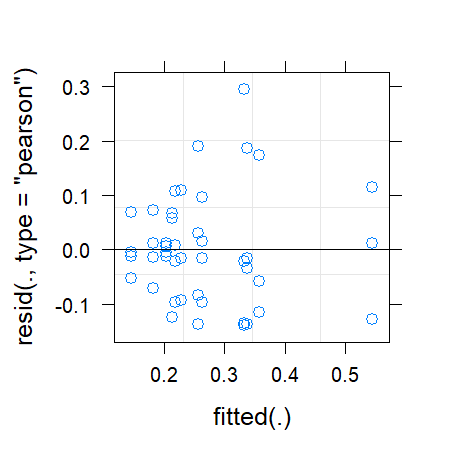
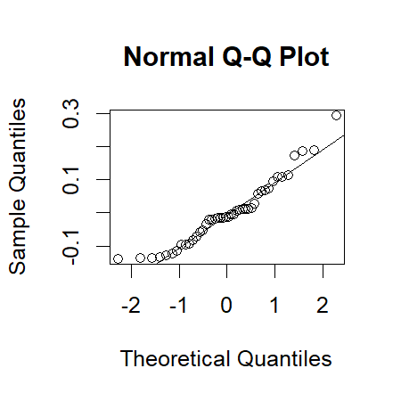
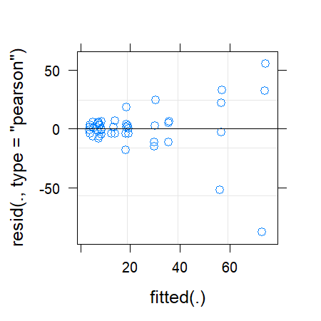
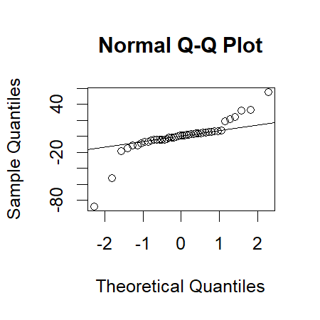
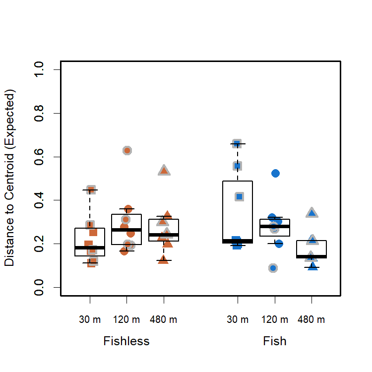
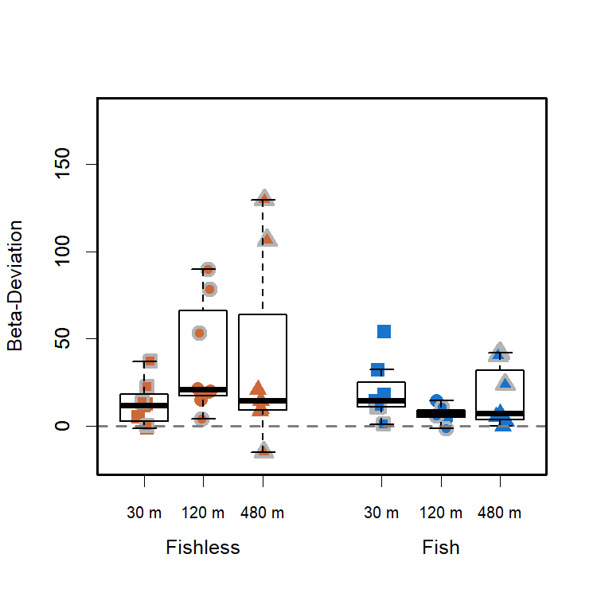

Community Variability - Siqueira et al 2020
================
Rodolfo Pelinson
20/10/2020

This is the same community variability analyses presented in the main
paper, but using a different null model. The same one as used in
[Siqueira et al. 2020](https://doi.org/10.1002/ecy.3014)

If you haven’t, install the package:

``` r
install.packages("devtools") 
devtools::install_github("RodolfoPelinson/Pelinson.et.al.2020B")
```

These are the packages you will need to run this code:

``` r
library(Pelinson.et.al.2020B)
library(lme4) # Version 1.1-23
library(car) # Version 3.0-7
library(emmeans) # Version 1.4.8
library(vegan) # Version 2.5-6
```

## Community Variability

### Whole community for the last two surveys.

First loading data

``` r
data(com_SS2_SS3, All, fish_SS2_SS3, isolation_SS2_SS3, SS_SS2_SS3, ID_SS2_SS3)
```

Computing observed and expected distances to centroid, and
beta-deviation.

``` r
beta_deviation_SS2_SS3 <- beta_deviation_siqueira_et_al_2019(com_SS2_SS3, times = 10000,
                                                          transform = NULL, dist = "bray", seed = 2, group = All, keep.gamma = T) 
```

Looking at residual plots for observed, expected distances to centroids
and deviations.

``` r
fit_expected_SS2_SS3_G <- lmer(beta_deviation_SS2_SS3$expected_distances~fish_SS2_SS3*isolation_SS2_SS3*SS_SS2_SS3 + (1|ID_SS2_SS3))
```

    ## boundary (singular) fit: see ?isSingular

``` r
plot(fit_expected_SS2_SS3_G)
```

<!-- -->

``` r
qqnorm(resid(fit_expected_SS2_SS3_G, type = "pearson"))
qqline(resid(fit_expected_SS2_SS3_G, type = "pearson"))
```

<!-- -->

``` r
fit_deviation_SS2_SS3_G <- lmer(beta_deviation_SS2_SS3$deviation_distances~fish_SS2_SS3*isolation_SS2_SS3*SS_SS2_SS3 + (1|ID_SS2_SS3))
plot(fit_deviation_SS2_SS3_G)
```

<!-- -->

``` r
qqnorm(resid(fit_deviation_SS2_SS3_G, type = "pearson"))
qqline(resid(fit_deviation_SS2_SS3_G, type = "pearson"))
```

<!-- -->

The fit of the model for beta deviation here is pretty bad. If we were
to make inferences based on these results, we would have to look for a
better statistical model, maybe considering a different statistical
distribution, which is hard given that we have overdispersion and
negative values (i.e. excludes some distributions and data
transformations). But, since we are not interpreting results based on
this model, we will still use it.

#### Expected Community Variability

Running ANOVA table for expected distances to group centroids, or
expected beta-diversity/community variability in each treatment.

``` r
fit_expected_SS2_SS3 <- lmer(beta_deviation_SS2_SS3$expected_distances~fish_SS2_SS3*isolation_SS2_SS3*SS_SS2_SS3 + (1|ID_SS2_SS3), control = lmerControl(optimizer = "nlminbwrap"))
round(Anova(fit_expected_SS2_SS3, test.statistic = "Chisq"),3)
```

    ## Analysis of Deviance Table (Type II Wald chisquare tests)
    ## 
    ## Response: beta_deviation_SS2_SS3$expected_distances
    ##                                           Chisq Df Pr(>Chisq)   
    ## fish_SS2_SS3                              0.138  1      0.710   
    ## isolation_SS2_SS3                         2.120  2      0.347   
    ## SS_SS2_SS3                                7.535  1      0.006 **
    ## fish_SS2_SS3:isolation_SS2_SS3            8.287  2      0.016 * 
    ## fish_SS2_SS3:SS_SS2_SS3                   0.010  1      0.921   
    ## isolation_SS2_SS3:SS_SS2_SS3              6.744  2      0.034 * 
    ## fish_SS2_SS3:isolation_SS2_SS3:SS_SS2_SS3 7.793  2      0.020 * 
    ## ---
    ## Signif. codes:  0 '***' 0.001 '**' 0.01 '*' 0.05 '.' 0.1 ' ' 1

``` r
emmeans(fit_expected_SS2_SS3, list(pairwise ~ SS_SS2_SS3), adjust = "sidak")
```

    ## $`emmeans of SS_SS2_SS3`
    ##  SS_SS2_SS3 emmean     SE df lower.CL upper.CL
    ##  2           0.225 0.0235 32     0.17    0.280
    ##  3           0.322 0.0263 32     0.26    0.384
    ## 
    ## Results are averaged over the levels of: fish_SS2_SS3, isolation_SS2_SS3 
    ## Degrees-of-freedom method: kenward-roger 
    ## Confidence level used: 0.95 
    ## Conf-level adjustment: sidak method for 2 estimates 
    ## 
    ## $`pairwise differences of SS_SS2_SS3`
    ##  contrast estimate     SE   df t.ratio p.value
    ##  2 - 3     -0.0971 0.0352 16.6 -2.756  0.0137 
    ## 
    ## Results are averaged over the levels of: fish_SS2_SS3, isolation_SS2_SS3 
    ## Degrees-of-freedom method: kenward-roger

``` r
emmeans(fit_expected_SS2_SS3, list(pairwise ~ isolation_SS2_SS3|fish_SS2_SS3), adjust = "sidak")
```

    ## $`emmeans of isolation_SS2_SS3 | fish_SS2_SS3`
    ## fish_SS2_SS3 = absent:
    ##  isolation_SS2_SS3 emmean     SE   df lower.CL upper.CL
    ##  30                 0.219 0.0406 14.9   0.1098    0.328
    ##  120                0.298 0.0406 14.9   0.1887    0.407
    ##  480                0.288 0.0443 17.4   0.1709    0.405
    ## 
    ## fish_SS2_SS3 = present:
    ##  isolation_SS2_SS3 emmean     SE   df lower.CL upper.CL
    ##  30                 0.374 0.0443 17.4   0.2568    0.491
    ##  120                0.275 0.0443 17.4   0.1581    0.392
    ##  480                0.187 0.0443 17.4   0.0699    0.304
    ## 
    ## Results are averaged over the levels of: SS_SS2_SS3 
    ## Degrees-of-freedom method: kenward-roger 
    ## Confidence level used: 0.95 
    ## Conf-level adjustment: sidak method for 3 estimates 
    ## 
    ## $`pairwise differences of isolation_SS2_SS3 | fish_SS2_SS3`
    ## fish_SS2_SS3 = absent:
    ##  contrast  estimate     SE   df t.ratio p.value
    ##  30 - 120  -0.07894 0.0575 14.9 -1.374  0.4682 
    ##  30 - 480  -0.06902 0.0601 16.2 -1.148  0.6074 
    ##  120 - 480  0.00992 0.0601 16.2  0.165  0.9979 
    ## 
    ## fish_SS2_SS3 = present:
    ##  contrast  estimate     SE   df t.ratio p.value
    ##  30 - 120   0.09868 0.0627 17.4  1.574  0.3495 
    ##  30 - 480   0.18686 0.0627 17.4  2.980  0.0245 
    ##  120 - 480  0.08818 0.0627 17.4  1.406  0.4430 
    ## 
    ## Results are averaged over the levels of: SS_SS2_SS3 
    ## Degrees-of-freedom method: kenward-roger 
    ## P value adjustment: sidak method for 3 tests

``` r
emmeans(fit_expected_SS2_SS3, list(pairwise ~ isolation_SS2_SS3|SS_SS2_SS3), adjust = "sidak")
```

    ## $`emmeans of isolation_SS2_SS3 | SS_SS2_SS3`
    ## SS_SS2_SS3 = 2:
    ##  isolation_SS2_SS3 emmean     SE df lower.CL upper.CL
    ##  30                 0.193 0.0406 32   0.0903    0.295
    ##  120                0.300 0.0406 32   0.1980    0.403
    ##  480                0.182 0.0406 32   0.0794    0.284
    ## 
    ## SS_SS2_SS3 = 3:
    ##  isolation_SS2_SS3 emmean     SE df lower.CL upper.CL
    ##  30                 0.400 0.0443 32   0.2884    0.512
    ##  120                0.273 0.0443 32   0.1610    0.384
    ##  480                0.293 0.0478 32   0.1729    0.414
    ## 
    ## Results are averaged over the levels of: fish_SS2_SS3 
    ## Degrees-of-freedom method: kenward-roger 
    ## Confidence level used: 0.95 
    ## Conf-level adjustment: sidak method for 3 estimates 
    ## 
    ## $`pairwise differences of isolation_SS2_SS3 | SS_SS2_SS3`
    ## SS_SS2_SS3 = 2:
    ##  contrast  estimate     SE df t.ratio p.value
    ##  30 - 120   -0.1077 0.0575 32 -1.875  0.1955 
    ##  30 - 480    0.0110 0.0575 32  0.191  0.9966 
    ##  120 - 480   0.1187 0.0575 32  2.066  0.1346 
    ## 
    ## SS_SS2_SS3 = 3:
    ##  contrast  estimate     SE df t.ratio p.value
    ##  30 - 120    0.1275 0.0627 32  2.033  0.1436 
    ##  30 - 480    0.1069 0.0652 32  1.641  0.2967 
    ##  120 - 480  -0.0206 0.0652 32 -0.316  0.9851 
    ## 
    ## Results are averaged over the levels of: fish_SS2_SS3 
    ## Degrees-of-freedom method: kenward-roger 
    ## P value adjustment: sidak method for 3 tests

``` r
emmeans(fit_expected_SS2_SS3, list(pairwise ~ isolation_SS2_SS3|fish_SS2_SS3|SS_SS2_SS3), adjust = "sidak")
```

    ## $`emmeans of isolation_SS2_SS3 | fish_SS2_SS3, SS_SS2_SS3`
    ## fish_SS2_SS3 = absent, SS_SS2_SS3 = 2:
    ##  isolation_SS2_SS3 emmean     SE df lower.CL upper.CL
    ##  30                 0.182 0.0575 32 0.037047    0.327
    ##  120                0.263 0.0575 32 0.118382    0.408
    ##  480                0.218 0.0575 32 0.073533    0.363
    ## 
    ## fish_SS2_SS3 = present, SS_SS2_SS3 = 2:
    ##  isolation_SS2_SS3 emmean     SE df lower.CL upper.CL
    ##  30                 0.204 0.0575 32 0.058754    0.348
    ##  120                0.338 0.0575 32 0.192908    0.482
    ##  480                0.145 0.0575 32 0.000365    0.290
    ## 
    ## fish_SS2_SS3 = absent, SS_SS2_SS3 = 3:
    ##  isolation_SS2_SS3 emmean     SE df lower.CL upper.CL
    ##  30                 0.256 0.0575 32 0.111312    0.401
    ##  120                0.333 0.0575 32 0.187847    0.477
    ##  480                0.358 0.0675 32 0.187503    0.528
    ## 
    ## fish_SS2_SS3 = present, SS_SS2_SS3 = 3:
    ##  isolation_SS2_SS3 emmean     SE df lower.CL upper.CL
    ##  30                 0.544 0.0675 32 0.374068    0.714
    ##  120                0.213 0.0675 32 0.042544    0.383
    ##  480                0.229 0.0675 32 0.058732    0.399
    ## 
    ## Degrees-of-freedom method: kenward-roger 
    ## Confidence level used: 0.95 
    ## Conf-level adjustment: sidak method for 3 estimates 
    ## 
    ## $`pairwise differences of isolation_SS2_SS3 | fish_SS2_SS3, SS_SS2_SS3`
    ## fish_SS2_SS3 = absent, SS_SS2_SS3 = 2:
    ##  contrast  estimate     SE df t.ratio p.value
    ##  30 - 120   -0.0813 0.0813 32 -1.001  0.6917 
    ##  30 - 480   -0.0365 0.0813 32 -0.449  0.9595 
    ##  120 - 480   0.0448 0.0813 32  0.552  0.9285 
    ## 
    ## fish_SS2_SS3 = present, SS_SS2_SS3 = 2:
    ##  contrast  estimate     SE df t.ratio p.value
    ##  30 - 120   -0.1342 0.0813 32 -1.651  0.2916 
    ##  30 - 480    0.0584 0.0813 32  0.718  0.8575 
    ##  120 - 480   0.1925 0.0813 32  2.369  0.0704 
    ## 
    ## fish_SS2_SS3 = absent, SS_SS2_SS3 = 3:
    ##  contrast  estimate     SE df t.ratio p.value
    ##  30 - 120   -0.0765 0.0813 32 -0.942  0.7296 
    ##  30 - 480   -0.1015 0.0887 32 -1.145  0.5958 
    ##  120 - 480  -0.0250 0.0887 32 -0.282  0.9893 
    ## 
    ## fish_SS2_SS3 = present, SS_SS2_SS3 = 3:
    ##  contrast  estimate     SE df t.ratio p.value
    ##  30 - 120    0.3315 0.0955 32  3.471  0.0045 
    ##  30 - 480    0.3153 0.0955 32  3.302  0.0071 
    ##  120 - 480  -0.0162 0.0955 32 -0.170  0.9976 
    ## 
    ## Degrees-of-freedom method: kenward-roger 
    ## P value adjustment: sidak method for 3 tests

Patterns are similar to those observed for the observed distances using
the other null model.

Plotting it:

``` r
boxplot(beta_deviation_SS2_SS3$expected_distances~isolation_SS2_SS3*fish_SS2_SS3, outline = F, ylab = "Distance to Centroid (Expected)", xlab = "", at = c(1,2,3,5,6,7),ylim = c(0,1), lwd = 1.5, col = "transparent", xaxt="n")
mylevels <- levels(All)
levelProportions <- summary(All)/length(beta_deviation_SS2_SS3$expected_distances)
col <- c(rep("sienna3",3), rep("dodgerblue3",3), rep("grey70",6))
bg <- c(rep("sienna3",3), rep("dodgerblue3",3),rep("sienna3",3), rep("dodgerblue3",3))
pch <- c(15,16,17,15,16,17,22,21,24,22,21,24)
for(i in 1:length(mylevels)){
  
  x<- c(1,2,3,5,6,7,1,2,3,5,6,7)[i]
  thislevel <- mylevels[i]
  thisvalues <- beta_deviation_SS2_SS3$expected_distances[All==thislevel]
  
  # take the x-axis indices and add a jitter, proportional to the N in each level
  myjitter <- jitter(rep(x, length(thisvalues)), amount=levelProportions[i]/0.8)
  points(myjitter, thisvalues, pch=pch[i], col=col[i], bg = bg[i] , cex = 1.5, lwd = 3) 
  
}
boxplot(beta_deviation_SS2_SS3$expected_distances~isolation_SS2_SS3*fish_SS2_SS3, add = T, col = "transparent", outline = F,at = c(1,2,3,5,6,7), lwd = 1.5, xaxt="n")
axis(1,labels = c("30 m","120 m", "480 m","30 m","120 m", "480 m"), cex.axis = 0.8, at =c(1,2,3,5,6,7))
axis(1,labels = c("Fishless","Fish"), cex.axis = 1, at =c(2,6), line = 1.5, tick = F )
box(lwd = 2.5)
```

<!-- -->

#### Beta-Deviation

Running ANOVA table for the deviations of expected distances to group
centroids from observed distances.

``` r
fit_deviation_SS2_SS3 <- lmer(beta_deviation_SS2_SS3$deviation_distances~fish_SS2_SS3*isolation_SS2_SS3*SS_SS2_SS3 + (1|ID_SS2_SS3), control = lmerControl(optimizer = "nlminbwrap"))
round(Anova(fit_deviation_SS2_SS3, test.statistic = "Chisq"),3)
```

    ## Analysis of Deviance Table (Type II Wald chisquare tests)
    ## 
    ## Response: beta_deviation_SS2_SS3$deviation_distances
    ##                                           Chisq Df Pr(>Chisq)   
    ## fish_SS2_SS3                              3.939  1      0.047 * 
    ## isolation_SS2_SS3                         2.342  2      0.310   
    ## SS_SS2_SS3                                7.029  1      0.008 **
    ## fish_SS2_SS3:isolation_SS2_SS3            4.876  2      0.087 . 
    ## fish_SS2_SS3:SS_SS2_SS3                   5.435  1      0.020 * 
    ## isolation_SS2_SS3:SS_SS2_SS3              8.039  2      0.018 * 
    ## fish_SS2_SS3:isolation_SS2_SS3:SS_SS2_SS3 0.111  2      0.946   
    ## ---
    ## Signif. codes:  0 '***' 0.001 '**' 0.01 '*' 0.05 '.' 0.1 ' ' 1

``` r
emmeans(fit_deviation_SS2_SS3, list(pairwise ~ SS_SS2_SS3), adjust = "sidak")
```

    ## $`emmeans of SS_SS2_SS3`
    ##  SS_SS2_SS3 emmean   SE df lower.CL upper.CL
    ##  2            13.6 4.94 32     1.97     25.2
    ##  3            32.8 5.53 32    19.79     45.8
    ## 
    ## Results are averaged over the levels of: fish_SS2_SS3, isolation_SS2_SS3 
    ## Degrees-of-freedom method: kenward-roger 
    ## Confidence level used: 0.95 
    ## Conf-level adjustment: sidak method for 2 estimates 
    ## 
    ## $`pairwise differences of SS_SS2_SS3`
    ##  contrast estimate   SE   df t.ratio p.value
    ##  2 - 3       -19.2 7.42 16.6 -2.589  0.0193 
    ## 
    ## Results are averaged over the levels of: fish_SS2_SS3, isolation_SS2_SS3 
    ## Degrees-of-freedom method: kenward-roger

``` r
emmeans(fit_deviation_SS2_SS3, list(pairwise ~ fish_SS2_SS3|SS_SS2_SS3), adjust = "sidak")
```

    ## $`emmeans of fish_SS2_SS3 | SS_SS2_SS3`
    ## SS_SS2_SS3 = 2:
    ##  fish_SS2_SS3 emmean   SE df lower.CL upper.CL
    ##  absent         13.2 6.99 32    -3.23     29.6
    ##  present        14.0 6.99 32    -2.44     30.4
    ## 
    ## SS_SS2_SS3 = 3:
    ##  fish_SS2_SS3 emmean   SE df lower.CL upper.CL
    ##  absent         49.5 7.42 32    32.07     66.9
    ##  present        16.1 8.21 32    -3.20     35.3
    ## 
    ## Results are averaged over the levels of: isolation_SS2_SS3 
    ## Degrees-of-freedom method: kenward-roger 
    ## Confidence level used: 0.95 
    ## Conf-level adjustment: sidak method for 2 estimates 
    ## 
    ## $`pairwise differences of fish_SS2_SS3 | SS_SS2_SS3`
    ## SS_SS2_SS3 = 2:
    ##  contrast         estimate    SE df t.ratio p.value
    ##  absent - present   -0.789  9.88 32 -0.080  0.9369 
    ## 
    ## SS_SS2_SS3 = 3:
    ##  contrast         estimate    SE df t.ratio p.value
    ##  absent - present   33.400 11.07 32  3.018  0.0050 
    ## 
    ## Results are averaged over the levels of: isolation_SS2_SS3 
    ## Degrees-of-freedom method: kenward-roger

``` r
emmeans(fit_deviation_SS2_SS3, list(pairwise ~ isolation_SS2_SS3|SS_SS2_SS3), adjust = "sidak")
```

    ## $`emmeans of isolation_SS2_SS3 | SS_SS2_SS3`
    ## SS_SS2_SS3 = 2:
    ##  isolation_SS2_SS3 emmean    SE df lower.CL upper.CL
    ##  30                 18.41  8.56 32    -3.15     40.0
    ##  120                13.71  8.56 32    -7.85     35.3
    ##  480                 8.56  8.56 32   -13.00     30.1
    ## 
    ## SS_SS2_SS3 = 3:
    ##  isolation_SS2_SS3 emmean    SE df lower.CL upper.CL
    ##  30                 13.04  9.34 32   -10.49     36.6
    ##  120                30.75  9.34 32     7.22     54.3
    ##  480                54.53 10.06 32    29.20     79.9
    ## 
    ## Results are averaged over the levels of: fish_SS2_SS3 
    ## Degrees-of-freedom method: kenward-roger 
    ## Confidence level used: 0.95 
    ## Conf-level adjustment: sidak method for 3 estimates 
    ## 
    ## $`pairwise differences of isolation_SS2_SS3 | SS_SS2_SS3`
    ## SS_SS2_SS3 = 2:
    ##  contrast  estimate   SE df t.ratio p.value
    ##  30 - 120      4.70 12.1 32  0.388  0.9731 
    ##  30 - 480      9.85 12.1 32  0.813  0.8069 
    ##  120 - 480     5.15 12.1 32  0.425  0.9652 
    ## 
    ## SS_SS2_SS3 = 3:
    ##  contrast  estimate   SE df t.ratio p.value
    ##  30 - 120    -17.71 13.2 32 -1.341  0.4673 
    ##  30 - 480    -41.50 13.7 32 -3.024  0.0146 
    ##  120 - 480   -23.79 13.7 32 -1.733  0.2531 
    ## 
    ## Results are averaged over the levels of: fish_SS2_SS3 
    ## Degrees-of-freedom method: kenward-roger 
    ## P value adjustment: sidak method for 3 tests

Beta-deviation seems to be greater in fishless ponds, and in the higher
isolation treatment. **But, as we know by inspecting the residuals, this
model have a very poor fit.**

Plotting it:

``` r
boxplot(beta_deviation_SS2_SS3$deviation_distances~isolation_SS2_SS3*fish_SS2_SS3, outline = F, ylab = "Beta-Deviation", xlab = "", at = c(1,2,3,5,6,7),ylim = c(-20,180), lwd = 1.5, col = "transparent", xaxt="n")
mylevels <- levels(All)
levelProportions <- summary(All)/length(beta_deviation_SS2_SS3$deviation_distances)
col <- c(rep("sienna3",3), rep("dodgerblue3",3), rep("grey70",6))
bg <- c(rep("sienna3",3), rep("dodgerblue3",3),rep("sienna3",3), rep("dodgerblue3",3))
pch <- c(15,16,17,15,16,17,22,21,24,22,21,24)
for(i in 1:length(mylevels)){
  
  x<- c(1,2,3,5,6,7,1,2,3,5,6,7)[i]
  thislevel <- mylevels[i]
  thisvalues <- beta_deviation_SS2_SS3$deviation_distances[All==thislevel]
  
  # take the x-axis indices and add a jitter, proportional to the N in each level
  myjitter <- jitter(rep(x, length(thisvalues)), amount=levelProportions[i]/0.8)
  points(myjitter, thisvalues, pch=pch[i], col=col[i], bg = bg[i] , cex = 1.5, lwd = 3) 
  
}
boxplot(beta_deviation_SS2_SS3$deviation_distances~isolation_SS2_SS3*fish_SS2_SS3, add = T, col = "transparent", outline = F,at = c(1,2,3,5,6,7), lwd = 1.5, xaxt="n")
axis(1,labels = c("30 m","120 m", "480 m","30 m","120 m", "480 m"), cex.axis = 0.8, at =c(1,2,3,5,6,7))
axis(1,labels = c("Fishless","Fish"), cex.axis = 1, at =c(2,6), line = 1.5, tick = F )
abline(h = 0, lty = 2, lwd = 2, col = "grey50")
box(lwd = 2.5)
```

<!-- -->
