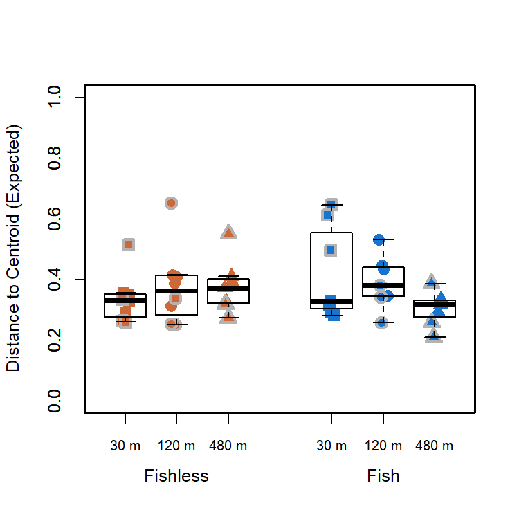
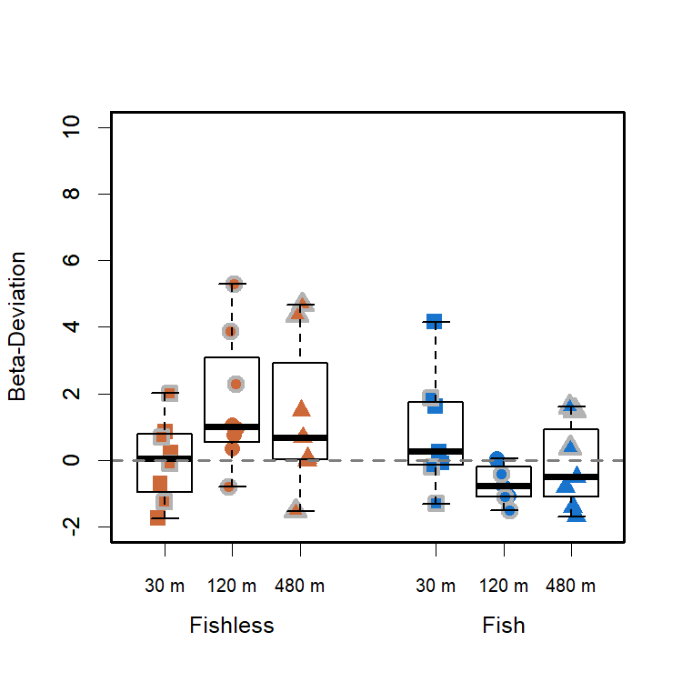

Community Variability - Varying Gamma
================
Rodolfo Pelinson
20/10/2020

This is the same community variability analyses presented in the main
paper, but here we are not keeping gamma diversity constant for each
treatment. This is to show that Gamma diversity had little impact in the
main patterns.

If you haven’t, install the package:

``` r
install.packages("devtools")
devtools::install_github("RodolfoPelinson/Pelinson.et.al.2020B")
```

These are the packages you will need to run this code:

``` r
library(Pelinson.et.al.2020B)
library(lme4) # Version 1.1-23
library(car) # Version 3.0-7
library(emmeans) # Version 1.4.8
library(vegan) # Version 2.5-6
```

## Community Variability Varying Gamma

### Whole community for the last two surveys.

First loading data

``` r
data(com_SS2_SS3, All, fish_SS2_SS3, isolation_SS2_SS3, SS_SS2_SS3, ID_SS2_SS3, fish_isolation_SS2_SS3)
```

    ## Warning in data(com_SS2_SS3, All, fish_SS2_SS3, isolation_SS2_SS3, SS_SS2_SS3, :
    ## data set 'fish_isolation_SS2_SS3' not found

Computing observed and expected distances to centroid, and
beta-deviation.

``` r
beta_deviation_SS2_SS3 <- beta_deviation(com_SS2_SS3, strata = NULL, times = 10000,
                                      transform = NULL, dist = "bray", fixedmar="both",
                                      shuffle = "both", method = "quasiswap", seed = 2, group = All) 
```

#### Expected Community Variability

Running ANOVA table for expected distances to group centroids, or
expected beta-diversity/community variability in each treatment.

``` r
fit_expected_SS2_SS3 <- lmer(beta_deviation_SS2_SS3$expected_distances~fish_SS2_SS3*isolation_SS2_SS3*SS_SS2_SS3 + (1|ID_SS2_SS3), control = lmerControl(optimizer = "nlminbwrap"))
round(Anova(fit_expected_SS2_SS3, test.statistic = "F"),3)
```

    ## Analysis of Deviance Table (Type II Wald F tests with Kenward-Roger df)
    ## 
    ## Response: beta_deviation_SS2_SS3$expected_distances
    ##                                               F Df Df.res Pr(>F)  
    ## fish_SS2_SS3                              0.219  1 16.626  0.646  
    ## isolation_SS2_SS3                         0.921  2 16.546  0.418  
    ## SS_SS2_SS3                                0.689  1 16.421  0.418  
    ## fish_SS2_SS3:isolation_SS2_SS3            3.025  2 16.651  0.076 .
    ## fish_SS2_SS3:SS_SS2_SS3                   0.612  1 16.574  0.445  
    ## isolation_SS2_SS3:SS_SS2_SS3              4.482  2 16.483  0.028 *
    ## fish_SS2_SS3:isolation_SS2_SS3:SS_SS2_SS3 4.327  2 16.604  0.031 *
    ## ---
    ## Signif. codes:  0 '***' 0.001 '**' 0.01 '*' 0.05 '.' 0.1 ' ' 1

``` r
emmeans(fit_expected_SS2_SS3, list(pairwise ~ isolation_SS2_SS3|fish_SS2_SS3|SS_SS2_SS3), adjust = "tukey")
```

    ## $`emmeans of isolation_SS2_SS3 | fish_SS2_SS3, SS_SS2_SS3`
    ## fish_SS2_SS3 = absent, SS_SS2_SS3 = 2:
    ##  isolation_SS2_SS3 emmean     SE df lower.CL upper.CL
    ##  30                 0.329 0.0455 32    0.215    0.444
    ##  120                0.381 0.0455 32    0.266    0.495
    ##  480                0.374 0.0455 32    0.260    0.489
    ## 
    ## fish_SS2_SS3 = present, SS_SS2_SS3 = 2:
    ##  isolation_SS2_SS3 emmean     SE df lower.CL upper.CL
    ##  30                 0.303 0.0455 32    0.188    0.418
    ##  120                0.439 0.0455 32    0.324    0.554
    ##  480                0.318 0.0455 32    0.203    0.432
    ## 
    ## fish_SS2_SS3 = absent, SS_SS2_SS3 = 3:
    ##  isolation_SS2_SS3 emmean     SE df lower.CL upper.CL
    ##  30                 0.342 0.0455 32    0.228    0.457
    ##  120                0.372 0.0455 32    0.258    0.487
    ##  480                0.380 0.0535 32    0.246    0.515
    ## 
    ## fish_SS2_SS3 = present, SS_SS2_SS3 = 3:
    ##  isolation_SS2_SS3 emmean     SE df lower.CL upper.CL
    ##  30                 0.584 0.0535 32    0.449    0.719
    ##  120                0.327 0.0535 32    0.192    0.461
    ##  480                0.284 0.0535 32    0.149    0.419
    ## 
    ## Degrees-of-freedom method: kenward-roger 
    ## Confidence level used: 0.95 
    ## Conf-level adjustment: sidak method for 3 estimates 
    ## 
    ## $`pairwise differences of isolation_SS2_SS3 | fish_SS2_SS3, SS_SS2_SS3`
    ## fish_SS2_SS3 = absent, SS_SS2_SS3 = 2:
    ##  contrast  estimate     SE df t.ratio p.value
    ##  30 - 120  -0.05137 0.0644 32 -0.798  0.7069 
    ##  30 - 480  -0.04512 0.0644 32 -0.701  0.7647 
    ##  120 - 480  0.00625 0.0644 32  0.097  0.9948 
    ## 
    ## fish_SS2_SS3 = present, SS_SS2_SS3 = 2:
    ##  contrast  estimate     SE df t.ratio p.value
    ##  30 - 120  -0.13608 0.0644 32 -2.114  0.1029 
    ##  30 - 480  -0.01454 0.0644 32 -0.226  0.9723 
    ##  120 - 480  0.12155 0.0644 32  1.888  0.1586 
    ## 
    ## fish_SS2_SS3 = absent, SS_SS2_SS3 = 3:
    ##  contrast  estimate     SE df t.ratio p.value
    ##  30 - 120  -0.03015 0.0644 32 -0.468  0.8866 
    ##  30 - 480  -0.03813 0.0702 32 -0.543  0.8508 
    ##  120 - 480 -0.00799 0.0702 32 -0.114  0.9929 
    ## 
    ## fish_SS2_SS3 = present, SS_SS2_SS3 = 3:
    ##  contrast  estimate     SE df t.ratio p.value
    ##  30 - 120   0.25747 0.0757 32  3.403  0.0050 
    ##  30 - 480   0.29978 0.0757 32  3.963  0.0011 
    ##  120 - 480  0.04231 0.0757 32  0.559  0.8425 
    ## 
    ## Degrees-of-freedom method: kenward-roger 
    ## P value adjustment: tukey method for comparing a family of 3 estimates

Here the increase in expected distance to centroid increases with
isolation only in ponds with fish, in the last survey.

Plotting it:

``` r
boxplot(beta_deviation_SS2_SS3$expected_distances~isolation_SS2_SS3*fish_SS2_SS3, outline = F, ylab = "Distance to Centroid (Expected)", xlab = "", at = c(1,2,3,5,6,7),ylim = c(0,1), lwd = 1.5, col = "transparent", xaxt="n")
mylevels <- levels(All)
levelProportions <- summary(All)/length(beta_deviation_SS2_SS3$expected_distances)
col <- c(rep("sienna3",3), rep("dodgerblue3",3), rep("grey70",6))
bg <- c(rep("sienna3",3), rep("dodgerblue3",3),rep("sienna3",3), rep("dodgerblue3",3))
pch <- c(15,16,17,15,16,17,22,21,24,22,21,24)
for(i in 1:length(mylevels)){
  
  x<- c(1,2,3,5,6,7,1,2,3,5,6,7)[i]
  thislevel <- mylevels[i]
  thisvalues <- beta_deviation_SS2_SS3$expected_distances[All==thislevel]
  
  # take the x-axis indices and add a jitter, proportional to the N in each level
  myjitter <- jitter(rep(x, length(thisvalues)), amount=levelProportions[i]/0.8)
  points(myjitter, thisvalues, pch=pch[i], col=col[i], bg = bg[i] , cex = 1.5, lwd = 3) 
  
}
boxplot(beta_deviation_SS2_SS3$expected_distances~isolation_SS2_SS3*fish_SS2_SS3, add = T, col = "transparent", outline = F,at = c(1,2,3,5,6,7), lwd = 1.5, xaxt="n")
axis(1,labels = c("30 m","120 m", "480 m","30 m","120 m", "480 m"), cex.axis = 0.8, at =c(1,2,3,5,6,7))
axis(1,labels = c("Fishless","Fish"), cex.axis = 1, at =c(2,6), line = 1.5, tick = F )
box(lwd = 2.5)
```

<!-- -->

#### Beta-Deviation

Running ANOVA table for the deviations of expected distances to group
centroids from observed distances.

``` r
fit_deviation_SS2_SS3 <- lmer(beta_deviation_SS2_SS3$deviation_distances~fish_SS2_SS3*isolation_SS2_SS3*SS_SS2_SS3 + (1|ID_SS2_SS3), control = lmerControl(optimizer = "nlminbwrap"))
round(Anova(fit_deviation_SS2_SS3, test.statistic = "F"),3)
```

    ## Analysis of Deviance Table (Type II Wald F tests with Kenward-Roger df)
    ## 
    ## Response: beta_deviation_SS2_SS3$deviation_distances
    ##                                               F Df Df.res Pr(>F)  
    ## fish_SS2_SS3                              4.105  1 16.798  0.059 .
    ## isolation_SS2_SS3                         0.114  2 16.717  0.893  
    ## SS_SS2_SS3                                3.376  1 16.196  0.085 .
    ## fish_SS2_SS3:isolation_SS2_SS3            4.029  2 16.821  0.037 *
    ## fish_SS2_SS3:SS_SS2_SS3                   2.601  1 16.357  0.126  
    ## isolation_SS2_SS3:SS_SS2_SS3              2.423  2 16.261  0.120  
    ## fish_SS2_SS3:isolation_SS2_SS3:SS_SS2_SS3 0.890  2 16.388  0.430  
    ## ---
    ## Signif. codes:  0 '***' 0.001 '**' 0.01 '*' 0.05 '.' 0.1 ' ' 1

``` r
emmeans(fit_deviation_SS2_SS3, list(pairwise ~ isolation_SS2_SS3|fish_SS2_SS3), adjust = "tukey")
```

    ## $`emmeans of isolation_SS2_SS3 | fish_SS2_SS3`
    ## fish_SS2_SS3 = absent:
    ##  isolation_SS2_SS3   emmean    SE   df lower.CL upper.CL
    ##  30                -0.00175 0.568 15.1  -1.5253    1.522
    ##  120                1.71806 0.568 15.1   0.1945    3.242
    ##  480                1.53239 0.615 17.6  -0.0898    3.155
    ## 
    ## fish_SS2_SS3 = present:
    ##  isolation_SS2_SS3   emmean    SE   df lower.CL upper.CL
    ##  30                 0.77421 0.615 17.6  -0.8480    2.396
    ##  120               -0.72849 0.615 17.6  -2.3507    0.894
    ##  480                0.03071 0.615 17.6  -1.5915    1.653
    ## 
    ## Results are averaged over the levels of: SS_SS2_SS3 
    ## Degrees-of-freedom method: kenward-roger 
    ## Confidence level used: 0.95 
    ## Conf-level adjustment: sidak method for 3 estimates 
    ## 
    ## $`pairwise differences of isolation_SS2_SS3 | fish_SS2_SS3`
    ## fish_SS2_SS3 = absent:
    ##  contrast  estimate    SE   df t.ratio p.value
    ##  30 - 120    -1.720 0.803 15.1 -2.141  0.1146 
    ##  30 - 480    -1.534 0.837 16.4 -1.832  0.1902 
    ##  120 - 480    0.186 0.837 16.4  0.222  0.9733 
    ## 
    ## fish_SS2_SS3 = present:
    ##  contrast  estimate    SE   df t.ratio p.value
    ##  30 - 120     1.503 0.870 17.6  1.727  0.2231 
    ##  30 - 480     0.743 0.870 17.6  0.855  0.6750 
    ##  120 - 480   -0.759 0.870 17.6 -0.873  0.6640 
    ## 
    ## Results are averaged over the levels of: SS_SS2_SS3 
    ## Degrees-of-freedom method: kenward-roger 
    ## P value adjustment: tukey method for comparing a family of 3 estimates

No significant patterns.

Plotting it:

``` r
boxplot(beta_deviation_SS2_SS3$deviation_distances~isolation_SS2_SS3*fish_SS2_SS3, outline = F, ylab = "Beta-Deviation", xlab = "", at = c(1,2,3,5,6,7),ylim = c(-2,10), lwd = 1.5, col = "transparent", xaxt="n")
mylevels <- levels(All)
levelProportions <- summary(All)/length(beta_deviation_SS2_SS3$deviation_distances)
col <- c(rep("sienna3",3), rep("dodgerblue3",3), rep("grey70",6))
bg <- c(rep("sienna3",3), rep("dodgerblue3",3),rep("sienna3",3), rep("dodgerblue3",3))
pch <- c(15,16,17,15,16,17,22,21,24,22,21,24)
for(i in 1:length(mylevels)){
  
  x<- c(1,2,3,5,6,7,1,2,3,5,6,7)[i]
  thislevel <- mylevels[i]
  thisvalues <- beta_deviation_SS2_SS3$deviation_distances[All==thislevel]
  
  # take the x-axis indices and add a jitter, proportional to the N in each level
  myjitter <- jitter(rep(x, length(thisvalues)), amount=levelProportions[i]/0.8)
  points(myjitter, thisvalues, pch=pch[i], col=col[i], bg = bg[i] , cex = 1.5, lwd = 3) 
  
}
boxplot(beta_deviation_SS2_SS3$deviation_distances~isolation_SS2_SS3*fish_SS2_SS3, add = T, col = "transparent", outline = F,at = c(1,2,3,5,6,7), lwd = 1.5, xaxt="n")
axis(1,labels = c("30 m","120 m", "480 m","30 m","120 m", "480 m"), cex.axis = 0.8, at =c(1,2,3,5,6,7))
axis(1,labels = c("Fishless","Fish"), cex.axis = 1, at =c(2,6), line = 1.5, tick = F )
abline(h = 0, lty = 2, lwd = 2, col = "grey50")
box(lwd = 2.5)
```

<!-- -->
