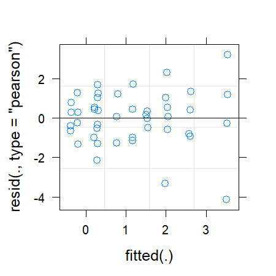
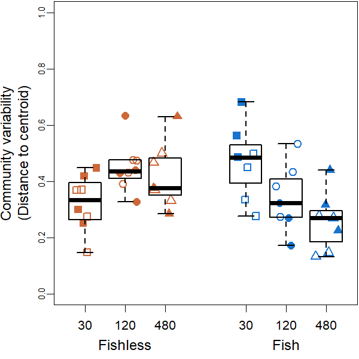
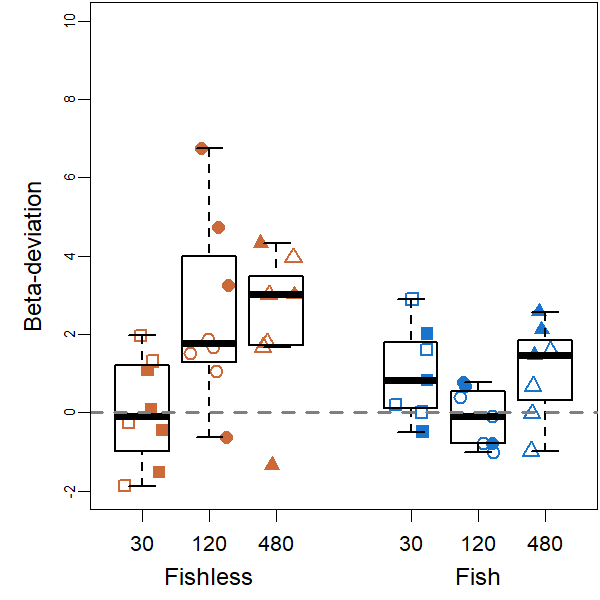

Community Variability Analyses
================
Rodolfo Pelinson
20/10/2020

``` r
install.packages("devtools")
devtools::install_github("RodolfoPelinson/Pelinson.et.al.2020B")
```

``` r
library(Pelinson.et.al.2020B)
```

``` r
library(lme4)
```

    ## Loading required package: Matrix

``` r
library(car)
```

    ## Loading required package: carData

    ## Registered S3 methods overwritten by 'car':
    ##   method                          from
    ##   influence.merMod                lme4
    ##   cooks.distance.influence.merMod lme4
    ##   dfbeta.influence.merMod         lme4
    ##   dfbetas.influence.merMod        lme4

``` r
library(emmeans)
```

## Community Variability

### Whole community for the last two surveys.

First loading data

``` r
data(com_SS2_SS3, All, fish_SS2_SS3, isolation_SS2_SS3, SS_SS2_SS3, ID_SS2_SS3, fish_isolation_SS2_SS3)
```

    ## Warning in data(com_SS2_SS3, All, fish_SS2_SS3, isolation_SS2_SS3, SS_SS2_SS3, :
    ## data set 'fish_isolation_SS2_SS3' not found

Computing observed and expected distances to centroid, and
beta-deviation.

``` r
beta_deviation_SS2_SS3 <- beta_deviation(com_SS2_SS3, strata = All, times = 1000,
                                      transform = NULL, dist = "bray", fixedmar="both",
                                      shuffle = "both", method = "quasiswap", seed = 2, group = All) 
```

    ## Loading required package: vegan

    ## Loading required package: permute

    ## Loading required package: lattice

    ## This is vegan 2.5-6

    ## Warning in betadisper(null_dissim, group = group, type = "centroid", bias.adjust
    ## = T): some squared distances are negative and changed to zero
    
    ## Warning in betadisper(null_dissim, group = group, type = "centroid", bias.adjust
    ## = T): some squared distances are negative and changed to zero
    
    ## Warning in betadisper(null_dissim, group = group, type = "centroid", bias.adjust
    ## = T): some squared distances are negative and changed to zero

Looking at residual plots for observed, expected distances to centroids
and deviations.

``` r
fit_observed_SS2_SS3_G <- lmer(beta_deviation_SS2_SS3$observed_distances~fish_SS2_SS3*isolation_SS2_SS3*SS_SS2_SS3 + (1|ID_SS2_SS3))
plot(fit_observed_SS2_SS3_G)
```

<!-- -->

``` r
qqnorm(resid(fit_observed_SS2_SS3_G, type = "pearson"))
qqline(resid(fit_observed_SS2_SS3_G, type = "pearson"))
```

<!-- -->

``` r
fit_expected_SS2_SS3_G <- lmer(beta_deviation_SS2_SS3$expected_distances~fish_SS2_SS3*isolation_SS2_SS3*SS_SS2_SS3 + (1|ID_SS2_SS3), REML = F)
```

    ## boundary (singular) fit: see ?isSingular

``` r
plot(fit_expected_SS2_SS3_G)
```

<!-- -->

``` r
qqnorm(resid(fit_expected_SS2_SS3_G, type = "pearson"))
qqline(resid(fit_expected_SS2_SS3_G, type = "pearson"))
```

<!-- -->

``` r
fit_deviation_SS2_SS3_G <- lmer(beta_deviation_SS2_SS3$deviation_distances~fish_SS2_SS3*isolation_SS2_SS3*SS_SS2_SS3 + (1|ID_SS2_SS3), REML = F)
```

    ## boundary (singular) fit: see ?isSingular

``` r
plot(fit_deviation_SS2_SS3_G)
```

<!-- -->

``` r
qqnorm(resid(fit_deviation_SS2_SS3_G, type = "pearson"))
qqline(resid(fit_deviation_SS2_SS3_G, type = "pearson"))
```

<!-- -->
Residual plots are not perfect, but they also does not seem too bad.

#### Observed Community Variability

Running ANOVA table for observed distances to group centroids, or
observed beta-diversity/community variability in each treatment.

``` r
fit_observed_SS2_SS3 <- lmer(beta_deviation_SS2_SS3$observed_distances~fish_SS2_SS3*isolation_SS2_SS3*SS_SS2_SS3 + (1|ID_SS2_SS3))
round(Anova(fit_observed_SS2_SS3, test.statistic = "F"),3)
```

    ## Analysis of Deviance Table (Type II Wald F tests with Kenward-Roger df)
    ## 
    ## Response: beta_deviation_SS2_SS3$observed_distances
    ##                                               F Df Df.res Pr(>F)   
    ## fish_SS2_SS3                              1.434  1 16.982  0.248   
    ## isolation_SS2_SS3                         1.051  2 16.904  0.371   
    ## SS_SS2_SS3                                2.105  1 15.935  0.166   
    ## fish_SS2_SS3:isolation_SS2_SS3            8.515  2 17.003  0.003 **
    ## fish_SS2_SS3:SS_SS2_SS3                   0.082  1 16.098  0.778   
    ## isolation_SS2_SS3:SS_SS2_SS3              3.558  2 16.002  0.053 . 
    ## fish_SS2_SS3:isolation_SS2_SS3:SS_SS2_SS3 2.694  2 16.130  0.098 . 
    ## ---
    ## Signif. codes:  0 '***' 0.001 '**' 0.01 '*' 0.05 '.' 0.1 ' ' 1

``` r
emmeans(fit_observed_SS2_SS3, list(pairwise ~ isolation_SS2_SS3|fish_SS2_SS3), adjust = "tukey")
```

    ## NOTE: Results may be misleading due to involvement in interactions

    ## $`emmeans of isolation_SS2_SS3 | fish_SS2_SS3`
    ## fish_SS2_SS3 = absent:
    ##  isolation_SS2_SS3 emmean     SE   df lower.CL upper.CL
    ##  30                 0.322 0.0395 15.3    0.216    0.428
    ##  120                0.450 0.0395 15.3    0.344    0.556
    ##  480                0.425 0.0424 17.9    0.313    0.537
    ## 
    ## fish_SS2_SS3 = present:
    ##  isolation_SS2_SS3 emmean     SE   df lower.CL upper.CL
    ##  30                 0.479 0.0424 17.9    0.367    0.591
    ##  120                0.329 0.0424 17.9    0.217    0.441
    ##  480                0.269 0.0424 17.9    0.157    0.380
    ## 
    ## Results are averaged over the levels of: SS_SS2_SS3 
    ## Degrees-of-freedom method: kenward-roger 
    ## Confidence level used: 0.95 
    ## Conf-level adjustment: sidak method for 3 estimates 
    ## 
    ## $`pairwise differences of isolation_SS2_SS3 | fish_SS2_SS3`
    ## fish_SS2_SS3 = absent:
    ##  contrast  estimate     SE   df t.ratio p.value
    ##  30 - 120   -0.1280 0.0559 15.3 -2.291  0.0874 
    ##  30 - 480   -0.1029 0.0580 16.6 -1.776  0.2080 
    ##  120 - 480   0.0250 0.0580 16.6  0.432  0.9029 
    ## 
    ## fish_SS2_SS3 = present:
    ##  contrast  estimate     SE   df t.ratio p.value
    ##  30 - 120    0.1499 0.0600 17.9  2.499  0.0558 
    ##  30 - 480    0.2105 0.0600 17.9  3.509  0.0068 
    ##  120 - 480   0.0606 0.0600 17.9  1.010  0.5803 
    ## 
    ## Results are averaged over the levels of: SS_SS2_SS3 
    ## Degrees-of-freedom method: kenward-roger 
    ## P value adjustment: tukey method for comparing a family of 3 estimates

It seems that the effect of isolation is dependent on the presence or
absence of fish. When fish is absent, there is no effect of isolation.
When it is present, there is a negative effect of isolation.

Plotting it:

``` r
boxplot(beta_deviation_SS2_SS3$observed_distances~isolation_SS2_SS3*fish_SS2_SS3, outline = F, ylab = "Distance to Centroid (Observed)", xlab = "", at = c(1,2,3,5,6,7),ylim = c(0,1), lwd = 1.5, col = "transparent", xaxt="n")
mylevels <- levels(All)
levelProportions <- summary(All)/length(beta_deviation_SS2_SS3$observed_distances)
col <- c(rep("sienna3",3), rep("dodgerblue3",3), rep("grey70",6))
bg <- c(rep("sienna3",3), rep("dodgerblue3",3),rep("sienna3",3), rep("dodgerblue3",3))
pch <- c(15,16,17,15,16,17,22,21,24,22,21,24)
for(i in 1:length(mylevels)){
  
  x<- c(1,2,3,5,6,7,1,2,3,5,6,7)[i]
  thislevel <- mylevels[i]
  thisvalues <- beta_deviation_SS2_SS3$observed_distances[All==thislevel]
  
  # take the x-axis indices and add a jitter, proportional to the N in each level
  myjitter <- jitter(rep(x, length(thisvalues)), amount=levelProportions[i]/0.8)
  points(myjitter, thisvalues, pch=pch[i], col=col[i], bg = bg[i] , cex = 1.5, lwd = 3) 
  
}
boxplot(beta_deviation_SS2_SS3$observed_distances~isolation_SS2_SS3*fish_SS2_SS3, add = T, col = "transparent", outline = F,at = c(1,2,3,5,6,7), lwd = 1.5, xaxt="n")
axis(1,labels = c("30 m","120 m", "480 m","30 m","120 m", "480 m"), cex.axis = 0.8, at =c(1,2,3,5,6,7))
axis(1,labels = c("Fishless","Fish"), cex.axis = 1, at =c(2,6), line = 1.5, tick = F )
box(lwd = 2.5)
```

<!-- -->

#### Expected Community Variability

Running ANOVA table for expected distances to group centroids, or
expected beta-diversity/community variability in each treatment.

``` r
fit_expected_SS2_SS3 <- lmer(beta_deviation_SS2_SS3$expected_distances~fish_SS2_SS3*isolation_SS2_SS3*SS_SS2_SS3 + (1|ID_SS2_SS3), control = lmerControl(optimizer = "nlminbwrap"))
round(Anova(fit_expected_SS2_SS3, test.statistic = "F"),3)
```

    ## Analysis of Deviance Table (Type II Wald F tests with Kenward-Roger df)
    ## 
    ## Response: beta_deviation_SS2_SS3$expected_distances
    ##                                               F Df Df.res Pr(>F)  
    ## fish_SS2_SS3                              0.011  1 16.626  0.918  
    ## isolation_SS2_SS3                         3.608  2 16.546  0.050 *
    ## SS_SS2_SS3                                3.509  1 16.421  0.079 .
    ## fish_SS2_SS3:isolation_SS2_SS3            4.120  2 16.651  0.035 *
    ## fish_SS2_SS3:SS_SS2_SS3                   0.156  1 16.574  0.698  
    ## isolation_SS2_SS3:SS_SS2_SS3              6.073  2 16.483  0.011 *
    ## fish_SS2_SS3:isolation_SS2_SS3:SS_SS2_SS3 3.325  2 16.604  0.061 .
    ## ---
    ## Signif. codes:  0 '***' 0.001 '**' 0.01 '*' 0.05 '.' 0.1 ' ' 1

``` r
emmeans(fit_expected_SS2_SS3, list(pairwise ~ isolation_SS2_SS3|fish_SS2_SS3|SS_SS2_SS3), adjust = "tukey")
```

    ## $`emmeans of isolation_SS2_SS3 | fish_SS2_SS3, SS_SS2_SS3`
    ## fish_SS2_SS3 = absent, SS_SS2_SS3 = 2:
    ##  isolation_SS2_SS3 emmean     SE df lower.CL upper.CL
    ##  30                 0.273 0.0488 32   0.1502    0.396
    ##  120                0.348 0.0488 32   0.2248    0.470
    ##  480                0.278 0.0488 32   0.1552    0.401
    ## 
    ## fish_SS2_SS3 = present, SS_SS2_SS3 = 2:
    ##  isolation_SS2_SS3 emmean     SE df lower.CL upper.CL
    ##  30                 0.304 0.0488 32   0.1815    0.427
    ##  120                0.437 0.0488 32   0.3141    0.560
    ##  480                0.192 0.0488 32   0.0688    0.314
    ## 
    ## fish_SS2_SS3 = absent, SS_SS2_SS3 = 3:
    ##  isolation_SS2_SS3 emmean     SE df lower.CL upper.CL
    ##  30                 0.362 0.0488 32   0.2392    0.485
    ##  120                0.360 0.0488 32   0.2377    0.483
    ##  480                0.380 0.0573 32   0.2360    0.525
    ## 
    ## fish_SS2_SS3 = present, SS_SS2_SS3 = 3:
    ##  isolation_SS2_SS3 emmean     SE df lower.CL upper.CL
    ##  30                 0.561 0.0573 32   0.4164    0.705
    ##  120                0.246 0.0573 32   0.1012    0.390
    ##  480                0.259 0.0573 32   0.1148    0.403
    ## 
    ## Degrees-of-freedom method: kenward-roger 
    ## Confidence level used: 0.95 
    ## Conf-level adjustment: sidak method for 3 estimates 
    ## 
    ## $`pairwise differences of isolation_SS2_SS3 | fish_SS2_SS3, SS_SS2_SS3`
    ## fish_SS2_SS3 = absent, SS_SS2_SS3 = 2:
    ##  contrast  estimate     SE df t.ratio p.value
    ##  30 - 120  -0.07455 0.0690 32 -1.081  0.5324 
    ##  30 - 480  -0.00495 0.0690 32 -0.072  0.9972 
    ##  120 - 480  0.06960 0.0690 32  1.009  0.5765 
    ## 
    ## fish_SS2_SS3 = present, SS_SS2_SS3 = 2:
    ##  contrast  estimate     SE df t.ratio p.value
    ##  30 - 120  -0.13265 0.0690 32 -1.924  0.1484 
    ##  30 - 480   0.11266 0.0690 32  1.634  0.2464 
    ##  120 - 480  0.24531 0.0690 32  3.558  0.0033 
    ## 
    ## fish_SS2_SS3 = absent, SS_SS2_SS3 = 3:
    ##  contrast  estimate     SE df t.ratio p.value
    ##  30 - 120   0.00156 0.0690 32  0.023  0.9997 
    ##  30 - 480  -0.01827 0.0752 32 -0.243  0.9681 
    ##  120 - 480 -0.01983 0.0752 32 -0.264  0.9625 
    ## 
    ## fish_SS2_SS3 = present, SS_SS2_SS3 = 3:
    ##  contrast  estimate     SE df t.ratio p.value
    ##  30 - 120   0.31516 0.0810 32  3.890  0.0014 
    ##  30 - 480   0.30162 0.0810 32  3.722  0.0021 
    ##  120 - 480 -0.01355 0.0810 32 -0.167  0.9847 
    ## 
    ## Degrees-of-freedom method: kenward-roger 
    ## P value adjustment: tukey method for comparing a family of 3 estimates

Patterns are similar to those observed for the observed distances to
centroid.

Plotting it:

``` r
boxplot(beta_deviation_SS2_SS3$expected_distances~isolation_SS2_SS3*fish_SS2_SS3, outline = F, ylab = "Distance to Centroid (Expected)", xlab = "", at = c(1,2,3,5,6,7),ylim = c(0,1), lwd = 1.5, col = "transparent", xaxt="n")
mylevels <- levels(All)
levelProportions <- summary(All)/length(beta_deviation_SS2_SS3$expected_distances)
col <- c(rep("sienna3",3), rep("dodgerblue3",3), rep("grey70",6))
bg <- c(rep("sienna3",3), rep("dodgerblue3",3),rep("sienna3",3), rep("dodgerblue3",3))
pch <- c(15,16,17,15,16,17,22,21,24,22,21,24)
for(i in 1:length(mylevels)){
  
  x<- c(1,2,3,5,6,7,1,2,3,5,6,7)[i]
  thislevel <- mylevels[i]
  thisvalues <- beta_deviation_SS2_SS3$expected_distances[All==thislevel]
  
  # take the x-axis indices and add a jitter, proportional to the N in each level
  myjitter <- jitter(rep(x, length(thisvalues)), amount=levelProportions[i]/0.8)
  points(myjitter, thisvalues, pch=pch[i], col=col[i], bg = bg[i] , cex = 1.5, lwd = 3) 
  
}
boxplot(beta_deviation_SS2_SS3$expected_distances~isolation_SS2_SS3*fish_SS2_SS3, add = T, col = "transparent", outline = F,at = c(1,2,3,5,6,7), lwd = 1.5, xaxt="n")
axis(1,labels = c("30 m","120 m", "480 m","30 m","120 m", "480 m"), cex.axis = 0.8, at =c(1,2,3,5,6,7))
axis(1,labels = c("Fishless","Fish"), cex.axis = 1, at =c(2,6), line = 1.5, tick = F )
box(lwd = 2.5)
```

<!-- -->

#### Beta-Deviation

Running ANOVA table for the deviations of expected distances to group
centroids from observed distances.

``` r
fit_deviation_SS2_SS3 <- lmer(beta_deviation_SS2_SS3$deviation_distances~fish_SS2_SS3*isolation_SS2_SS3*SS_SS2_SS3 + (1|ID_SS2_SS3), control = lmerControl(optimizer = "nlminbwrap"))
round(Anova(fit_deviation_SS2_SS3, test.statistic = "F"),3)
```

    ## Analysis of Deviance Table (Type II Wald F tests with Kenward-Roger df)
    ## 
    ## Response: beta_deviation_SS2_SS3$deviation_distances
    ##                                               F Df Df.res Pr(>F)  
    ## fish_SS2_SS3                              4.147  1 16.626  0.058 .
    ## isolation_SS2_SS3                         2.687  2 16.546  0.098 .
    ## SS_SS2_SS3                                1.183  1 16.421  0.292  
    ## fish_SS2_SS3:isolation_SS2_SS3            4.454  2 16.651  0.028 *
    ## fish_SS2_SS3:SS_SS2_SS3                   0.082  1 16.574  0.778  
    ## isolation_SS2_SS3:SS_SS2_SS3              1.148  2 16.483  0.341  
    ## fish_SS2_SS3:isolation_SS2_SS3:SS_SS2_SS3 1.239  2 16.604  0.315  
    ## ---
    ## Signif. codes:  0 '***' 0.001 '**' 0.01 '*' 0.05 '.' 0.1 ' ' 1

``` r
emmeans(fit_deviation_SS2_SS3, list(pairwise ~ isolation_SS2_SS3|fish_SS2_SS3), adjust = "tukey")
```

    ## $`emmeans of isolation_SS2_SS3 | fish_SS2_SS3`
    ## fish_SS2_SS3 = absent:
    ##  isolation_SS2_SS3  emmean    SE   df lower.CL upper.CL
    ##  30                 0.0307 0.552 14.9   -1.452     1.51
    ##  120                2.4530 0.552 14.9    0.970     3.94
    ##  480                2.3710 0.602 17.4    0.781     3.96
    ## 
    ## fish_SS2_SS3 = present:
    ##  isolation_SS2_SS3  emmean    SE   df lower.CL upper.CL
    ##  30                 0.9238 0.602 17.4   -0.666     2.51
    ##  120               -0.1080 0.602 17.4   -1.698     1.48
    ##  480                1.2432 0.602 17.4   -0.347     2.83
    ## 
    ## Results are averaged over the levels of: SS_SS2_SS3 
    ## Degrees-of-freedom method: kenward-roger 
    ## Confidence level used: 0.95 
    ## Conf-level adjustment: sidak method for 3 estimates 
    ## 
    ## $`pairwise differences of isolation_SS2_SS3 | fish_SS2_SS3`
    ## fish_SS2_SS3 = absent:
    ##  contrast  estimate    SE   df t.ratio p.value
    ##  30 - 120    -2.422 0.780 14.9 -3.103  0.0188 
    ##  30 - 480    -2.340 0.817 16.2 -2.865  0.0284 
    ##  120 - 480    0.082 0.817 16.2  0.100  0.9945 
    ## 
    ## fish_SS2_SS3 = present:
    ##  contrast  estimate    SE   df t.ratio p.value
    ##  30 - 120     1.032 0.852 17.4  1.212  0.4623 
    ##  30 - 480    -0.319 0.852 17.4 -0.375  0.9257 
    ##  120 - 480   -1.351 0.852 17.4 -1.587  0.2775 
    ## 
    ## Results are averaged over the levels of: SS_SS2_SS3 
    ## Degrees-of-freedom method: kenward-roger 
    ## P value adjustment: tukey method for comparing a family of 3 estimates

Beta deviation seems to increase with isolation, but only in fishless
ponds.

Plotting it:

``` r
boxplot(beta_deviation_SS2_SS3$deviation_distances~isolation_SS2_SS3*fish_SS2_SS3, outline = F, ylab = "Beta-Deviation", xlab = "", at = c(1,2,3,5,6,7),ylim = c(-2,10), lwd = 1.5, col = "transparent", xaxt="n")
mylevels <- levels(All)
levelProportions <- summary(All)/length(beta_deviation_SS2_SS3$deviation_distances)
col <- c(rep("sienna3",3), rep("dodgerblue3",3), rep("grey70",6))
bg <- c(rep("sienna3",3), rep("dodgerblue3",3),rep("sienna3",3), rep("dodgerblue3",3))
pch <- c(15,16,17,15,16,17,22,21,24,22,21,24)
for(i in 1:length(mylevels)){
  
  x<- c(1,2,3,5,6,7,1,2,3,5,6,7)[i]
  thislevel <- mylevels[i]
  thisvalues <- beta_deviation_SS2_SS3$deviation_distances[All==thislevel]
  
  # take the x-axis indices and add a jitter, proportional to the N in each level
  myjitter <- jitter(rep(x, length(thisvalues)), amount=levelProportions[i]/0.8)
  points(myjitter, thisvalues, pch=pch[i], col=col[i], bg = bg[i] , cex = 1.5, lwd = 3) 
  
}
boxplot(beta_deviation_SS2_SS3$deviation_distances~isolation_SS2_SS3*fish_SS2_SS3, add = T, col = "transparent", outline = F,at = c(1,2,3,5,6,7), lwd = 1.5, xaxt="n")
axis(1,labels = c("30 m","120 m", "480 m","30 m","120 m", "480 m"), cex.axis = 0.8, at =c(1,2,3,5,6,7))
axis(1,labels = c("Fishless","Fish"), cex.axis = 1, at =c(2,6), line = 1.5, tick = F )
abline(h = 0, lty = 2, lwd = 2, col = "grey50")
box(lwd = 2.5)
```

<!-- -->
