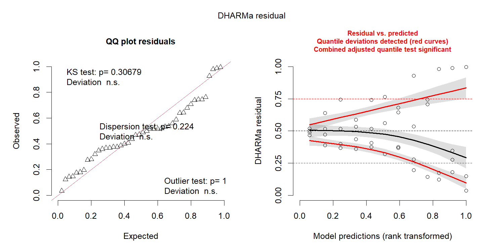
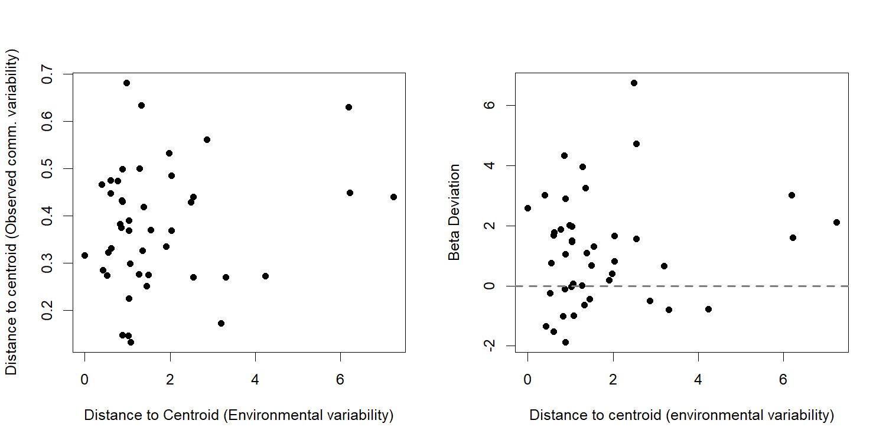

Community Variability Analyses
================
Rodolfo Pelinson
20/10/2020

This is the community variability analyses presented in the main paper.

These are the packages you will need to run this code:

``` r
library(PredatorIsolationStochasticity)
library(lme4) # Version 1.1-23
library(car) # Version 3.0-7
library(emmeans) # Version 1.4.8
library(vegan) # Version 2.5-6
library(DHARMa) # Version 0.3.3.0
```

## Community Variability

### First Survey

Computing observed and expected distances to centroid, and
beta-deviation.

``` r
beta_deviation_SS1 <- beta_deviation(com_SS1, strata = fish_isolation_SS1, times = 10000,
                                      transform = NULL, dist = "bray", fixedmar="both",
                                      shuffle = "both", method = "quasiswap", seed = 2, group = fish_isolation_SS1) 
```

#### Observed Community Variability

Looking at residual plots for observed, expected distances to centroids
and deviations.

``` r
fit_observed_SS1_G <- lm(beta_deviation_SS1$observed_distances~fish_SS1*isolation_SS1)

resid_observed <- simulateResiduals(fit_observed_SS1_G)
plot(resid_observed)
```


``` r
fit_expected_SS1_G <- lm(beta_deviation_SS1$expected_distances~fish_SS1*isolation_SS1)

resid_expected <- simulateResiduals(fit_expected_SS1_G)
plot(resid_expected)
```


``` r
fit_deviation_SS1_G <- lm(beta_deviation_SS1$deviation_distances~fish_SS1*isolation_SS1)

resid_deviation <- simulateResiduals(fit_deviation_SS1_G)
plot(resid_deviation)
```


Everything seems ok.

Running ANOVA table for observed distances to group centroids, or
observed beta-diversity/community variability in each treatment.

``` r
fit_observed_SS1 <- lm(beta_deviation_SS1$observed_distances~fish_SS1*isolation_SS1)
round(Anova(fit_observed_SS1, test.statistic = "F"),3)
```

    ## Anova Table (Type II tests)
    ## 
    ## Response: beta_deviation_SS1$observed_distances
    ##                        Sum Sq Df F value Pr(>F)
    ## fish_SS1                0.034  1   2.611  0.124
    ## isolation_SS1           0.009  2   0.338  0.717
    ## fish_SS1:isolation_SS1  0.031  2   1.190  0.327
    ## Residuals               0.231 18

No effect of treatments.

Plotting it:

``` r
par(cex = 0.75, mar = c(4,4,0.1,0.1))

boxplot(beta_deviation_SS1$observed_distances~isolation_SS1*fish_SS1, outline = F, ylab = "", xlab = "", at = c(1,2,3,5,6,7),ylim = c(0,1), lwd = 1.5, col = "transparent", xaxt="n", yaxt="n")
mylevels <- levels(interaction(isolation_SS1, fish_SS1))
#levelProportions <- summary(fish_isolation_SS1)/length(beta_deviation_SS1$observed_distances)
col <- c(rep("sienna3",3), rep("dodgerblue3",3))
#bg <- c(rep("sienna3",3), rep("dodgerblue3",3),rep("sienna3",3), rep("dodgerblue3",3))
pch <- c(15,16,17,15,16,17)
for(i in 1:length(mylevels)){

  x<- c(1,2,3,5,6,7)[i]
  thislevel <- mylevels[i]
  thisvalues <- beta_deviation_SS1$observed_distances[interaction(isolation_SS1, fish_SS1)==thislevel]

  # take the x-axis indices and add a jitter, proportional to the N in each level
  myjitter <- jitter(rep(x, length(thisvalues)), amount=0.3)
  points(myjitter, thisvalues, pch=pch[i], col=col[i], cex = 1.5, lwd = 3)

}
boxplot(beta_deviation_SS1$observed_distances~isolation_SS1*fish_SS1, add = T, col = "transparent", outline = F,at = c(1,2,3,5,6,7), lwd = 1.5, xaxt="n", yaxt="n")

axis(1,labels = c("30","120", "480","30","120", "480"), cex.axis = 1.1,
     at =c(1,2,3,5,6,7), gap.axis = -10)
axis(1,labels = c("Fishless","Fish"), cex.axis = 1.3, at =c(2,6), line = 1.5, tick = F )
axis(2, cex.axis = 0.8, gap.axis = 0, line = -0.5, tick = FALSE)
axis(2, cex.axis = 0.8, gap.axis = 0, line = 0, tick = TRUE, labels = FALSE)

title(ylab = "Community Variability", cex.lab = 1.3, line = 3)
title(ylab = "(Distance to Centroid)", cex.lab = 1.3, line = 1.75)
```


#### Expected Community Variability

Running ANOVA table for observed distances to group centroids, or
observed beta-diversity/community variability in each treatment.

``` r
fit_expected_SS1 <- lm(beta_deviation_SS1$expected_distances~fish_SS1*isolation_SS1)
round(Anova(fit_expected_SS1, test.statistic = "F"),3)
```

    ## Anova Table (Type II tests)
    ## 
    ## Response: beta_deviation_SS1$expected_distances
    ##                        Sum Sq Df F value Pr(>F)  
    ## fish_SS1                0.004  1   0.663  0.426  
    ## isolation_SS1           0.049  2   4.572  0.025 *
    ## fish_SS1:isolation_SS1  0.024  2   2.193  0.140  
    ## Residuals               0.097 18                 
    ## ---
    ## Signif. codes:  0 '***' 0.001 '**' 0.01 '*' 0.05 '.' 0.1 ' ' 1

``` r
emmeans(fit_expected_SS1, list(pairwise ~ isolation_SS1), adjust = "sidak")
```

    ## NOTE: Results may be misleading due to involvement in interactions

    ## $`emmeans of isolation_SS1`
    ##  isolation_SS1 emmean     SE df lower.CL upper.CL
    ##  030            0.361 0.0259 18    0.293    0.429
    ##  120            0.287 0.0259 18    0.219    0.355
    ##  480            0.395 0.0259 18    0.327    0.464
    ## 
    ## Results are averaged over the levels of: fish_SS1 
    ## Confidence level used: 0.95 
    ## Conf-level adjustment: sidak method for 3 estimates 
    ## 
    ## $`pairwise differences of isolation_SS1`
    ##  contrast  estimate     SE df t.ratio p.value
    ##  030 - 120   0.0740 0.0367 18  2.018  0.1661 
    ##  030 - 480  -0.0345 0.0367 18 -0.941  0.7367 
    ##  120 - 480  -0.1085 0.0367 18 -2.959  0.0250 
    ## 
    ## Results are averaged over the levels of: fish_SS1 
    ## P value adjustment: sidak method for 3 tests

There is an increase in expected distance to centroid from intermediate
to high isolation.

Plotting it:

``` r
par(cex = 0.75, mar = c(4,4,0.1,0.1))

boxplot(beta_deviation_SS1$expected_distances~isolation_SS1*fish_SS1, outline = F, ylab = "", xlab = "", at = c(1,2,3,5,6,7),ylim = c(0,1), lwd = 1.5, col = "transparent", xaxt="n", yaxt="n")
mylevels <- levels(interaction(isolation_SS1, fish_SS1))
#levelProportions <- summary(fish_isolation_SS1)/length(beta_deviation_SS1$expected_distances)
col <- c(rep("sienna3",3), rep("dodgerblue3",3))
#bg <- c(rep("sienna3",3), rep("dodgerblue3",3),rep("sienna3",3), rep("dodgerblue3",3))
pch <- c(15,16,17,15,16,17)
for(i in 1:length(mylevels)){

  x<- c(1,2,3,5,6,7)[i]
  thislevel <- mylevels[i]
  thisvalues <- beta_deviation_SS1$expected_distances[interaction(isolation_SS1, fish_SS1)==thislevel]

  # take the x-axis indices and add a jitter, proportional to the N in each level
  myjitter <- jitter(rep(x, length(thisvalues)), amount=0.3)
  points(myjitter, thisvalues, pch=pch[i], col=col[i], cex = 1.5, lwd = 3)

}
boxplot(beta_deviation_SS1$expected_distances~isolation_SS1*fish_SS1, add = T, col = "transparent", outline = F,at = c(1,2,3,5,6,7), lwd = 1.5, xaxt="n", yaxt="n")

axis(1,labels = c("30","120", "480","30","120", "480"), cex.axis = 1.1,
     at =c(1,2,3,5,6,7), gap.axis = -10)
axis(1,labels = c("Fishless","Fish"), cex.axis = 1.3, at =c(2,6), line = 1.5, tick = F )
axis(2, cex.axis = 0.8, gap.axis = 0, line = -0.5, tick = FALSE)
axis(2, cex.axis = 0.8, gap.axis = 0, line = 0, tick = TRUE, labels = FALSE)

title(ylab = "Expected Community Variability", cex.lab = 1.3, line = 3)
title(ylab = "(Distance to Centroid)", cex.lab = 1.3, line = 1.75)
```


#### Beta-Deviation

Running ANOVA table for observed distances to group centroids, or
observed beta-diversity/community variability in each treatment.

``` r
fit_deviation_SS1 <- lm(beta_deviation_SS1$deviation_distances~fish_SS1*isolation_SS1)
round(Anova(fit_deviation_SS1, test.statistic = "F"),3)
```

    ## Anova Table (Type II tests)
    ## 
    ## Response: beta_deviation_SS1$deviation_distances
    ##                        Sum Sq Df F value Pr(>F)  
    ## fish_SS1                8.784  1   2.535  0.129  
    ## isolation_SS1          20.422  2   2.946  0.078 .
    ## fish_SS1:isolation_SS1  0.344  2   0.050  0.952  
    ## Residuals              62.381 18                 
    ## ---
    ## Signif. codes:  0 '***' 0.001 '**' 0.01 '*' 0.05 '.' 0.1 ' ' 1

No significant effect of treatments.

Plotting it:

``` r
par(cex = 0.75, mar = c(4,4,0.1,0.1))

boxplot(beta_deviation_SS1$deviation_distances~isolation_SS1*fish_SS1, outline = F, ylab = "", xlab = "", at = c(1,2,3,5,6,7), lwd = 1.5, col = "transparent", xaxt="n", yaxt="n")
mylevels <- levels(interaction(isolation_SS1, fish_SS1))
#levelProportions <- summary(fish_isolation_SS1)/length(beta_deviation_SS1$deviation_distances)
col <- c(rep("sienna3",3), rep("dodgerblue3",3))
#bg <- c(rep("sienna3",3), rep("dodgerblue3",3),rep("sienna3",3), rep("dodgerblue3",3))
pch <- c(15,16,17,15,16,17)
for(i in 1:length(mylevels)){

  x<- c(1,2,3,5,6,7)[i]
  thislevel <- mylevels[i]
  thisvalues <- beta_deviation_SS1$deviation_distances[interaction(isolation_SS1, fish_SS1)==thislevel]

  # take the x-axis indices and add a jitter, proportional to the N in each level
  myjitter <- jitter(rep(x, length(thisvalues)), amount=0.3)
  points(myjitter, thisvalues, pch=pch[i], col=col[i], cex = 1.5, lwd = 3)

}
boxplot(beta_deviation_SS1$deviation_distances~isolation_SS1*fish_SS1, add = T, col = "transparent", outline = F,at = c(1,2,3,5,6,7), lwd = 1.5, xaxt="n", yaxt="n")

abline(h = 0, lty = 2, lwd = 2, col = "grey50")


axis(1,labels = c("30","120", "480","30","120", "480"), cex.axis = 1.1,
     at =c(1,2,3,5,6,7), gap.axis = -10)
axis(1,labels = c("Fishless","Fish"), cex.axis = 1.3, at =c(2,6), line = 1.5, tick = F )
axis(2, cex.axis = 0.8, gap.axis = 0, line = -0.5, tick = FALSE)
axis(2, cex.axis = 0.8, gap.axis = 0, line = 0, tick = TRUE, labels = FALSE)

title(ylab = "Beta-Deviation", cex.lab = 1.3, line = 2)
```


### Whole community for the last two surveys.

First loading data

``` r
#data(com_SS2_SS3, All, fish_SS2_SS3, isolation_SS2_SS3, SS_SS2_SS3, ID_SS2_SS3,
#     fish_isolation_SS2_SS3)
```

Computing observed and expected distances to centroid, and
beta-deviation.

``` r
beta_deviation_SS2_SS3 <- beta_deviation(com_SS2_SS3, strata = All, times = 10000,
                                      transform = NULL, dist = "bray", fixedmar="both",
                                      shuffle = "both", method = "quasiswap", seed = 2,
                                      group = All) 
```

Looking at residual plots for observed, expected distances to centroids
and deviations.

``` r
fit_observed_SS2_SS3_G <- lmer(beta_deviation_SS2_SS3$observed_distances~fish_SS2_SS3*
                                 isolation_SS2_SS3*SS_SS2_SS3 + (1|ID_SS2_SS3))

resid_observed <- simulateResiduals(fit_observed_SS2_SS3_G)
plot(resid_observed)
```


``` r
fit_expected_SS2_SS3_G <- lmer(beta_deviation_SS2_SS3$expected_distances~fish_SS2_SS3*
                                 isolation_SS2_SS3*SS_SS2_SS3 + (1|ID_SS2_SS3), 
                               control = lmerControl(optimizer = c("bobyqa"), restart_edge = TRUE, boundary.tol = 1e-10))
```

    ## boundary (singular) fit: see ?isSingular

``` r
resid_expected <- simulateResiduals(fit_expected_SS2_SS3_G)
plot(resid_expected)
```


``` r
fit_deviation_SS2_SS3_G <- lmer(beta_deviation_SS2_SS3$deviation_distances~fish_SS2_SS3*
                                  isolation_SS2_SS3*SS_SS2_SS3 + (1|ID_SS2_SS3))

resid_deviation <- simulateResiduals(fit_deviation_SS2_SS3_G)
plot(resid_deviation)
```


Residual plots are not perfect, but they also don’t seem too bad.

#### Observed Community Variability

Running ANOVA table for observed distances to group centroids, or
observed beta-diversity/community variability in each treatment.

``` r
fit_observed_SS2_SS3 <- lmer(beta_deviation_SS2_SS3$observed_distances~fish_SS2_SS3*
                               isolation_SS2_SS3*SS_SS2_SS3 + (1|ID_SS2_SS3))

round(Anova(fit_observed_SS2_SS3, test.statistic = "Chisq"),3)
```

    ## Analysis of Deviance Table (Type II Wald chisquare tests)
    ## 
    ## Response: beta_deviation_SS2_SS3$observed_distances
    ##                                            Chisq Df Pr(>Chisq)    
    ## fish_SS2_SS3                               1.442  1      0.230    
    ## isolation_SS2_SS3                          2.071  2      0.355    
    ## SS_SS2_SS3                                 2.136  1      0.144    
    ## fish_SS2_SS3:isolation_SS2_SS3            17.217  2     <2e-16 ***
    ## fish_SS2_SS3:SS_SS2_SS3                    0.086  1      0.769    
    ## isolation_SS2_SS3:SS_SS2_SS3               7.317  2      0.026 *  
    ## fish_SS2_SS3:isolation_SS2_SS3:SS_SS2_SS3  5.463  2      0.065 .  
    ## ---
    ## Signif. codes:  0 '***' 0.001 '**' 0.01 '*' 0.05 '.' 0.1 ' ' 1

``` r
emmeans(fit_observed_SS2_SS3, list(pairwise ~ isolation_SS2_SS3|fish_SS2_SS3),
        adjust = "sidak")
```

    ## NOTE: Results may be misleading due to involvement in interactions

    ## $`emmeans of isolation_SS2_SS3 | fish_SS2_SS3`
    ## fish_SS2_SS3 = absent:
    ##  isolation_SS2_SS3 emmean     SE   df lower.CL upper.CL
    ##  30                 0.322 0.0395 15.3    0.216    0.428
    ##  120                0.450 0.0395 15.3    0.344    0.556
    ##  480                0.425 0.0424 17.9    0.313    0.537
    ## 
    ## fish_SS2_SS3 = present:
    ##  isolation_SS2_SS3 emmean     SE   df lower.CL upper.CL
    ##  30                 0.479 0.0424 17.9    0.367    0.591
    ##  120                0.329 0.0424 17.9    0.217    0.441
    ##  480                0.269 0.0424 17.9    0.157    0.380
    ## 
    ## Results are averaged over the levels of: SS_SS2_SS3 
    ## Degrees-of-freedom method: kenward-roger 
    ## Confidence level used: 0.95 
    ## Conf-level adjustment: sidak method for 3 estimates 
    ## 
    ## $`pairwise differences of isolation_SS2_SS3 | fish_SS2_SS3`
    ## fish_SS2_SS3 = absent:
    ##  contrast  estimate     SE   df t.ratio p.value
    ##  30 - 120   -0.1280 0.0559 15.3 -2.291  0.1056 
    ##  30 - 480   -0.1029 0.0580 16.6 -1.776  0.2565 
    ##  120 - 480   0.0250 0.0580 16.6  0.432  0.9645 
    ## 
    ## fish_SS2_SS3 = present:
    ##  contrast  estimate     SE   df t.ratio p.value
    ##  30 - 120    0.1499 0.0600 17.9  2.499  0.0659 
    ##  30 - 480    0.2105 0.0600 17.9  3.509  0.0076 
    ##  120 - 480   0.0606 0.0600 17.9  1.010  0.6938 
    ## 
    ## Results are averaged over the levels of: SS_SS2_SS3 
    ## Degrees-of-freedom method: kenward-roger 
    ## P value adjustment: sidak method for 3 tests

``` r
emmeans(fit_observed_SS2_SS3, list(pairwise ~ isolation_SS2_SS3|SS_SS2_SS3),
        adjust = "sidak")
```

    ## NOTE: Results may be misleading due to involvement in interactions

    ## $`emmeans of isolation_SS2_SS3 | SS_SS2_SS3`
    ## SS_SS2_SS3 = 2:
    ##  isolation_SS2_SS3 emmean     SE   df lower.CL upper.CL
    ##  30                 0.340 0.0362 31.0    0.248    0.431
    ##  120                0.424 0.0362 31.0    0.333    0.515
    ##  480                0.311 0.0362 31.0    0.220    0.403
    ## 
    ## SS_SS2_SS3 = 3:
    ##  isolation_SS2_SS3 emmean     SE   df lower.CL upper.CL
    ##  30                 0.461 0.0394 31.5    0.362    0.561
    ##  120                0.355 0.0394 31.5    0.256    0.454
    ##  480                0.382 0.0423 31.8    0.276    0.489
    ## 
    ## Results are averaged over the levels of: fish_SS2_SS3 
    ## Degrees-of-freedom method: kenward-roger 
    ## Confidence level used: 0.95 
    ## Conf-level adjustment: sidak method for 3 estimates 
    ## 
    ## $`pairwise differences of isolation_SS2_SS3 | SS_SS2_SS3`
    ## SS_SS2_SS3 = 2:
    ##  contrast  estimate     SE   df t.ratio p.value
    ##  30 - 120   -0.0843 0.0512 31.0 -1.646  0.2948 
    ##  30 - 480    0.0284 0.0512 31.0  0.554  0.9277 
    ##  120 - 480   0.1127 0.0512 31.0  2.200  0.1024 
    ## 
    ## SS_SS2_SS3 = 3:
    ##  contrast  estimate     SE   df t.ratio p.value
    ##  30 - 120    0.1062 0.0557 31.5  1.908  0.1841 
    ##  30 - 480    0.0792 0.0578 31.7  1.370  0.4490 
    ##  120 - 480  -0.0270 0.0578 31.7 -0.468  0.9546 
    ## 
    ## Results are averaged over the levels of: fish_SS2_SS3 
    ## Degrees-of-freedom method: kenward-roger 
    ## P value adjustment: sidak method for 3 tests

``` r
emmeans(fit_observed_SS2_SS3, list(pairwise ~ SS_SS2_SS3|isolation_SS2_SS3),
        adjust = "sidak")
```

    ## NOTE: Results may be misleading due to involvement in interactions

    ## $`emmeans of SS_SS2_SS3 | isolation_SS2_SS3`
    ## isolation_SS2_SS3 = 30:
    ##  SS_SS2_SS3 emmean     SE   df lower.CL upper.CL
    ##  2           0.340 0.0362 31.0    0.255    0.425
    ##  3           0.461 0.0394 31.5    0.369    0.554
    ## 
    ## isolation_SS2_SS3 = 120:
    ##  SS_SS2_SS3 emmean     SE   df lower.CL upper.CL
    ##  2           0.424 0.0362 31.0    0.339    0.509
    ##  3           0.355 0.0394 31.5    0.263    0.448
    ## 
    ## isolation_SS2_SS3 = 480:
    ##  SS_SS2_SS3 emmean     SE   df lower.CL upper.CL
    ##  2           0.311 0.0362 31.0    0.226    0.396
    ##  3           0.382 0.0423 31.8    0.283    0.482
    ## 
    ## Results are averaged over the levels of: fish_SS2_SS3 
    ## Degrees-of-freedom method: kenward-roger 
    ## Confidence level used: 0.95 
    ## Conf-level adjustment: sidak method for 2 estimates 
    ## 
    ## $`pairwise differences of SS_SS2_SS3 | isolation_SS2_SS3`
    ## isolation_SS2_SS3 = 30:
    ##  contrast estimate     SE   df t.ratio p.value
    ##  2 - 3     -0.1218 0.0486 15.8 -2.505  0.0236 
    ## 
    ## isolation_SS2_SS3 = 120:
    ##  contrast estimate     SE   df t.ratio p.value
    ##  2 - 3      0.0687 0.0486 15.8  1.414  0.1769 
    ## 
    ## isolation_SS2_SS3 = 480:
    ##  contrast estimate     SE   df t.ratio p.value
    ##  2 - 3     -0.0710 0.0510 16.8 -1.391  0.1823 
    ## 
    ## Results are averaged over the levels of: fish_SS2_SS3 
    ## Degrees-of-freedom method: kenward-roger

It seems that the effect of isolation is dependent on the presence or
absence of fish. When fish is absent, there is no effect of isolation.
When it is present, there is a negative effect of isolation.

Plotting it:

``` r
par(cex = 0.75, mar = c(4,4,0.1,0.1))

boxplot(beta_deviation_SS2_SS3$observed_distances~isolation_SS2_SS3*fish_SS2_SS3,
        outline = F, xlab = "", ylab = "",
        at = c(1,2,3,5,6,7),ylim = c(0,1), lwd = 1.5, col = "transparent", xaxt="n", yaxt="n")
mylevels <- levels(All)
#levelProportions <- summary(All)/length(beta_deviation_SS2_SS3$observed_distances)
col <- c(rep("sienna3",3), rep("dodgerblue3",3),rep("sienna3",3), rep("dodgerblue3",3))
bg <- c(rep("transparent",3), rep("transparent",3),rep("sienna3",3), rep("dodgerblue3",3))
pch <- c(22,21,24,22,21,24,15,16,17,15,16,17)
for(i in 1:length(mylevels)){

  x<- c(1,2,3,5,6,7,1,2,3,5,6,7)[i]
  thislevel <- mylevels[i]
  thisvalues <- beta_deviation_SS2_SS3$observed_distances[All==thislevel]

  # take the x-axis indices and add a jitter, proportional to the N in each level
  myjitter <- jitter(rep(x, length(thisvalues)), amount=0.3)
  points(myjitter, thisvalues, pch=pch[i], col=col[i], bg = bg[i] , cex = 1.5, lwd = 1.5)

}

boxplot(beta_deviation_SS2_SS3$observed_distances~isolation_SS2_SS3*fish_SS2_SS3,
        add = T, col = "transparent", outline = F,at = c(1,2,3,5,6,7),
        lwd = 1.5, xaxt="n", yaxt="n")


axis(1,labels = c("30","120", "480","30","120", "480"), cex.axis = 1.1,
     at =c(1,2,3,5,6,7), gap.axis = -10)
axis(1,labels = c("Fishless","Fish"), cex.axis = 1.3, at =c(2,6), line = 1.5, tick = F )
axis(2, cex.axis = 0.8, gap.axis = 0, line = -0.5, tick = FALSE)
axis(2, cex.axis = 0.8, gap.axis = 0, line = 0, tick = TRUE, labels = FALSE)


title(ylab = "Community Variability", cex.lab = 1.3, line = 3)
title(ylab = "(Distance to Centroid)", cex.lab = 1.3, line = 1.75)
```


#### Expected Community Variability

Running ANOVA table for expected distances to group centroids, or
expected beta-diversity/community variability in each treatment.

``` r
fit_expected_SS2_SS3 <- lmer(beta_deviation_SS2_SS3$expected_distances~fish_SS2_SS3*isolation_SS2_SS3*SS_SS2_SS3 + (1|ID_SS2_SS3), control = lmerControl(optimizer = "nlminbwrap"))


round(Anova(fit_expected_SS2_SS3, test.statistic = "Chisq"),3)
```

    ## Analysis of Deviance Table (Type II Wald chisquare tests)
    ## 
    ## Response: beta_deviation_SS2_SS3$expected_distances
    ##                                            Chisq Df Pr(>Chisq)   
    ## fish_SS2_SS3                               0.011  1      0.916   
    ## isolation_SS2_SS3                          7.063  2      0.029 * 
    ## SS_SS2_SS3                                 3.639  1      0.056 . 
    ## fish_SS2_SS3:isolation_SS2_SS3             8.425  2      0.015 * 
    ## fish_SS2_SS3:SS_SS2_SS3                    0.170  1      0.680   
    ## isolation_SS2_SS3:SS_SS2_SS3              12.700  2      0.002 **
    ## fish_SS2_SS3:isolation_SS2_SS3:SS_SS2_SS3  6.840  2      0.033 * 
    ## ---
    ## Signif. codes:  0 '***' 0.001 '**' 0.01 '*' 0.05 '.' 0.1 ' ' 1

``` r
emmeans(fit_expected_SS2_SS3, list(pairwise ~ isolation_SS2_SS3),
        adjust = "sidak")
```

    ## $`emmeans of isolation_SS2_SS3`
    ##  isolation_SS2_SS3 emmean     SE   df lower.CL upper.CL
    ##  30                 0.374 0.0255 16.2    0.306    0.442
    ##  120                0.347 0.0255 16.2    0.279    0.415
    ##  480                0.278 0.0266 17.4    0.208    0.348
    ## 
    ## Results are averaged over the levels of: fish_SS2_SS3, SS_SS2_SS3 
    ## Degrees-of-freedom method: kenward-roger 
    ## Confidence level used: 0.95 
    ## Conf-level adjustment: sidak method for 3 estimates 
    ## 
    ## $`pairwise differences of isolation_SS2_SS3`
    ##  contrast  estimate     SE   df t.ratio p.value
    ##  30 - 120    0.0272 0.0361 16.2 0.755   0.8434 
    ##  30 - 480    0.0962 0.0369 16.8 2.611   0.0541 
    ##  120 - 480   0.0690 0.0369 16.8 1.872   0.2181 
    ## 
    ## Results are averaged over the levels of: fish_SS2_SS3, SS_SS2_SS3 
    ## Degrees-of-freedom method: kenward-roger 
    ## P value adjustment: sidak method for 3 tests

``` r
emmeans(fit_expected_SS2_SS3, list(pairwise ~ isolation_SS2_SS3|fish_SS2_SS3),
        adjust = "sidak")
```

    ## $`emmeans of isolation_SS2_SS3 | fish_SS2_SS3`
    ## fish_SS2_SS3 = absent:
    ##  isolation_SS2_SS3 emmean     SE   df lower.CL upper.CL
    ##  30                 0.316 0.0345 14.9    0.224    0.409
    ##  120                0.353 0.0345 14.9    0.260    0.446
    ##  480                0.329 0.0376 17.4    0.230    0.429
    ## 
    ## fish_SS2_SS3 = present:
    ##  isolation_SS2_SS3 emmean     SE   df lower.CL upper.CL
    ##  30                 0.432 0.0376 17.4    0.332    0.531
    ##  120                0.340 0.0376 17.4    0.241    0.440
    ##  480                0.226 0.0376 17.4    0.127    0.325
    ## 
    ## Results are averaged over the levels of: SS_SS2_SS3 
    ## Degrees-of-freedom method: kenward-roger 
    ## Confidence level used: 0.95 
    ## Conf-level adjustment: sidak method for 3 estimates 
    ## 
    ## $`pairwise differences of isolation_SS2_SS3 | fish_SS2_SS3`
    ## fish_SS2_SS3 = absent:
    ##  contrast  estimate     SE   df t.ratio p.value
    ##  30 - 120   -0.0368 0.0488 14.9 -0.755  0.8444 
    ##  30 - 480   -0.0130 0.0510 16.2 -0.256  0.9922 
    ##  120 - 480   0.0238 0.0510 16.2  0.465  0.9563 
    ## 
    ## fish_SS2_SS3 = present:
    ##  contrast  estimate     SE   df t.ratio p.value
    ##  30 - 120    0.0913 0.0532 17.4  1.716  0.2805 
    ##  30 - 480    0.2055 0.0532 17.4  3.863  0.0036 
    ##  120 - 480   0.1142 0.0532 17.4  2.147  0.1322 
    ## 
    ## Results are averaged over the levels of: SS_SS2_SS3 
    ## Degrees-of-freedom method: kenward-roger 
    ## P value adjustment: sidak method for 3 tests

``` r
emmeans(fit_expected_SS2_SS3, list(pairwise ~ isolation_SS2_SS3|SS_SS2_SS3),
        adjust = "sidak")
```

    ## $`emmeans of isolation_SS2_SS3 | SS_SS2_SS3`
    ## SS_SS2_SS3 = 2:
    ##  isolation_SS2_SS3 emmean     SE df lower.CL upper.CL
    ##  30                 0.287 0.0345 32    0.200    0.374
    ##  120                0.392 0.0345 32    0.305    0.479
    ##  480                0.235 0.0345 32    0.148    0.322
    ## 
    ## SS_SS2_SS3 = 3:
    ##  isolation_SS2_SS3 emmean     SE df lower.CL upper.CL
    ##  30                 0.461 0.0376 32    0.366    0.556
    ##  120                0.302 0.0376 32    0.207    0.396
    ##  480                0.321 0.0405 32    0.219    0.423
    ## 
    ## Results are averaged over the levels of: fish_SS2_SS3 
    ## Degrees-of-freedom method: kenward-roger 
    ## Confidence level used: 0.95 
    ## Conf-level adjustment: sidak method for 3 estimates 
    ## 
    ## $`pairwise differences of isolation_SS2_SS3 | SS_SS2_SS3`
    ## SS_SS2_SS3 = 2:
    ##  contrast  estimate     SE df t.ratio p.value
    ##  30 - 120   -0.1051 0.0488 32 -2.155  0.1120 
    ##  30 - 480    0.0520 0.0488 32  1.067  0.6482 
    ##  120 - 480   0.1571 0.0488 32  3.221  0.0088 
    ## 
    ## SS_SS2_SS3 = 3:
    ##  contrast  estimate     SE df t.ratio p.value
    ##  30 - 120    0.1595 0.0532 32  2.999  0.0155 
    ##  30 - 480    0.1405 0.0553 32  2.541  0.0476 
    ##  120 - 480  -0.0191 0.0553 32 -0.345  0.9808 
    ## 
    ## Results are averaged over the levels of: fish_SS2_SS3 
    ## Degrees-of-freedom method: kenward-roger 
    ## P value adjustment: sidak method for 3 tests

``` r
emmeans(fit_expected_SS2_SS3, list(pairwise ~ isolation_SS2_SS3|fish_SS2_SS3|SS_SS2_SS3),
        adjust = "sidak")
```

    ## $`emmeans of isolation_SS2_SS3 | fish_SS2_SS3, SS_SS2_SS3`
    ## fish_SS2_SS3 = absent, SS_SS2_SS3 = 2:
    ##  isolation_SS2_SS3 emmean     SE df lower.CL upper.CL
    ##  30                 0.271 0.0488 32   0.1482    0.394
    ##  120                0.346 0.0488 32   0.2235    0.469
    ##  480                0.278 0.0488 32   0.1551    0.401
    ## 
    ## fish_SS2_SS3 = present, SS_SS2_SS3 = 2:
    ##  isolation_SS2_SS3 emmean     SE df lower.CL upper.CL
    ##  30                 0.303 0.0488 32   0.1797    0.425
    ##  120                0.437 0.0488 32   0.3145    0.560
    ##  480                0.192 0.0488 32   0.0688    0.315
    ## 
    ## fish_SS2_SS3 = absent, SS_SS2_SS3 = 3:
    ##  isolation_SS2_SS3 emmean     SE df lower.CL upper.CL
    ##  30                 0.362 0.0488 32   0.2388    0.484
    ##  120                0.360 0.0488 32   0.2371    0.483
    ##  480                0.381 0.0573 32   0.2365    0.525
    ## 
    ## fish_SS2_SS3 = present, SS_SS2_SS3 = 3:
    ##  isolation_SS2_SS3 emmean     SE df lower.CL upper.CL
    ##  30                 0.561 0.0573 32   0.4164    0.705
    ##  120                0.243 0.0573 32   0.0990    0.388
    ##  480                0.261 0.0573 32   0.1162    0.405
    ## 
    ## Degrees-of-freedom method: kenward-roger 
    ## Confidence level used: 0.95 
    ## Conf-level adjustment: sidak method for 3 estimates 
    ## 
    ## $`pairwise differences of isolation_SS2_SS3 | fish_SS2_SS3, SS_SS2_SS3`
    ## fish_SS2_SS3 = absent, SS_SS2_SS3 = 2:
    ##  contrast  estimate     SE df t.ratio p.value
    ##  30 - 120  -0.07533 0.0690 32 -1.092  0.6311 
    ##  30 - 480  -0.00687 0.0690 32 -0.100  0.9995 
    ##  120 - 480  0.06846 0.0690 32  0.993  0.6968 
    ## 
    ## fish_SS2_SS3 = present, SS_SS2_SS3 = 2:
    ##  contrast  estimate     SE df t.ratio p.value
    ##  30 - 120  -0.13478 0.0690 32 -1.955  0.1679 
    ##  30 - 480   0.11089 0.0690 32  1.608  0.3130 
    ##  120 - 480  0.24566 0.0690 32  3.563  0.0035 
    ## 
    ## fish_SS2_SS3 = absent, SS_SS2_SS3 = 3:
    ##  contrast  estimate     SE df t.ratio p.value
    ##  30 - 120   0.00173 0.0690 32  0.025  1.0000 
    ##  30 - 480  -0.01923 0.0752 32 -0.256  0.9920 
    ##  120 - 480 -0.02096 0.0752 32 -0.279  0.9897 
    ## 
    ## fish_SS2_SS3 = present, SS_SS2_SS3 = 3:
    ##  contrast  estimate     SE df t.ratio p.value
    ##  30 - 120   0.31735 0.0810 32  3.916  0.0013 
    ##  30 - 480   0.30015 0.0810 32  3.704  0.0024 
    ##  120 - 480 -0.01720 0.0810 32 -0.212  0.9954 
    ## 
    ## Degrees-of-freedom method: kenward-roger 
    ## P value adjustment: sidak method for 3 tests

Patterns are similar to those observed for the observed distances to
centroid.

Plotting it:

``` r
par(cex = 0.75, mar = c(4,4,0.1,0.1))

boxplot(beta_deviation_SS2_SS3$expected_distances~isolation_SS2_SS3*fish_SS2_SS3,
        outline = F, xlab = "", ylab = "",
        at = c(1,2,3,5,6,7),ylim = c(0,1), lwd = 1.5, col = "transparent", xaxt="n", yaxt="n")
mylevels <- levels(All)
#levelProportions <- summary(All)/length(beta_deviation_SS2_SS3$expected_distances)
col <- c(rep("sienna3",3), rep("dodgerblue3",3),rep("sienna3",3), rep("dodgerblue3",3))
bg <- c(rep("transparent",3), rep("transparent",3),rep("sienna3",3), rep("dodgerblue3",3))
pch <- c(22,21,24,22,21,24,15,16,17,15,16,17)
for(i in 1:length(mylevels)){

  x<- c(1,2,3,5,6,7,1,2,3,5,6,7)[i]
  thislevel <- mylevels[i]
  thisvalues <- beta_deviation_SS2_SS3$expected_distances[All==thislevel]

  # take the x-axis indices and add a jitter, proportional to the N in each level
  myjitter <- jitter(rep(x, length(thisvalues)), amount=0.3)
  points(myjitter, thisvalues, pch=pch[i], col=col[i], bg = bg[i] , cex = 1.5, lwd = 1.5)

}

boxplot(beta_deviation_SS2_SS3$expected_distances~isolation_SS2_SS3*fish_SS2_SS3,
        add = T, col = "transparent", outline = F,at = c(1,2,3,5,6,7),
        lwd = 1.5, xaxt="n", yaxt="n")


axis(1,labels = c("30","120", "480","30","120", "480"), cex.axis = 1.1,
     at =c(1,2,3,5,6,7), gap.axis = -10)
axis(1,labels = c("Fishless","Fish"), cex.axis = 1.3, at =c(2,6), line = 1.5, tick = F )
axis(2, cex.axis = 0.8, gap.axis = 0, line = -0.5, tick = FALSE)
axis(2, cex.axis = 0.8, gap.axis = 0, line = 0, tick = TRUE, labels = FALSE)


title(ylab = "Expected Community Variability", cex.lab = 1.3, line = 3)
title(ylab = "(Distance to Centroid)", cex.lab = 1.3, line = 1.75)
```


#### Beta-Deviation

Running ANOVA table for the deviations of expected distances to group
centroids from observed distances.

``` r
fit_deviation_SS2_SS3 <- lmer(beta_deviation_SS2_SS3$deviation_distances~fish_SS2_SS3*
                                isolation_SS2_SS3*SS_SS2_SS3 + (1|ID_SS2_SS3),
                              control = lmerControl(optimizer = "nlminbwrap"))
round(Anova(fit_deviation_SS2_SS3, test.statistic = "Chisq"),3)
```

    ## Analysis of Deviance Table (Type II Wald chisquare tests)
    ## 
    ## Response: beta_deviation_SS2_SS3$deviation_distances
    ##                                           Chisq Df Pr(>Chisq)   
    ## fish_SS2_SS3                              4.129  1      0.042 * 
    ## isolation_SS2_SS3                         4.739  2      0.094 . 
    ## SS_SS2_SS3                                1.048  1      0.306   
    ## fish_SS2_SS3:isolation_SS2_SS3            9.345  2      0.009 **
    ## fish_SS2_SS3:SS_SS2_SS3                   0.096  1      0.757   
    ## isolation_SS2_SS3:SS_SS2_SS3              2.445  2      0.295   
    ## fish_SS2_SS3:isolation_SS2_SS3:SS_SS2_SS3 2.595  2      0.273   
    ## ---
    ## Signif. codes:  0 '***' 0.001 '**' 0.01 '*' 0.05 '.' 0.1 ' ' 1

``` r
emmeans(fit_deviation_SS2_SS3, list(pairwise ~ isolation_SS2_SS3|fish_SS2_SS3),
        adjust = "sidak")
```

    ## $`emmeans of isolation_SS2_SS3 | fish_SS2_SS3`
    ## fish_SS2_SS3 = absent:
    ##  isolation_SS2_SS3  emmean    SE   df lower.CL upper.CL
    ##  30                 0.0434 0.556 14.9   -1.449     1.54
    ##  120                2.5286 0.556 14.9    1.036     4.02
    ##  480                2.3009 0.606 17.4    0.701     3.90
    ## 
    ## fish_SS2_SS3 = present:
    ##  isolation_SS2_SS3  emmean    SE   df lower.CL upper.CL
    ##  30                 0.9768 0.606 17.4   -0.623     2.58
    ##  120               -0.0801 0.606 17.4   -1.680     1.52
    ##  480                1.1787 0.606 17.4   -0.421     2.78
    ## 
    ## Results are averaged over the levels of: SS_SS2_SS3 
    ## Degrees-of-freedom method: kenward-roger 
    ## Confidence level used: 0.95 
    ## Conf-level adjustment: sidak method for 3 estimates 
    ## 
    ## $`pairwise differences of isolation_SS2_SS3 | fish_SS2_SS3`
    ## fish_SS2_SS3 = absent:
    ##  contrast  estimate    SE   df t.ratio p.value
    ##  30 - 120    -2.485 0.786 14.9 -3.163  0.0192 
    ##  30 - 480    -2.257 0.822 16.2 -2.746  0.0420 
    ##  120 - 480    0.228 0.822 16.2  0.277  0.9901 
    ## 
    ## fish_SS2_SS3 = present:
    ##  contrast  estimate    SE   df t.ratio p.value
    ##  30 - 120     1.057 0.857 17.4  1.234  0.5502 
    ##  30 - 480    -0.202 0.857 17.4 -0.236  0.9938 
    ##  120 - 480   -1.259 0.857 17.4 -1.469  0.4066 
    ## 
    ## Results are averaged over the levels of: SS_SS2_SS3 
    ## Degrees-of-freedom method: kenward-roger 
    ## P value adjustment: sidak method for 3 tests

Beta deviation seems to increase with isolation, but only in fishless
ponds.

Plotting it:

``` r
par(cex = 0.75, mar = c(4,4,0.1,0.1))

boxplot(beta_deviation_SS2_SS3$deviation_distances~isolation_SS2_SS3*fish_SS2_SS3,
        outline = F, ylab = "", xlab = "", at = c(1,2,3,5,6,7),
        ylim = c(-2,10), lwd = 1.5, col = "transparent", xaxt="n", yaxt="n")
mylevels <- levels(All)
#levelProportions <- summary(All)/length(beta_deviation_SS2_SS3$deviation_distances)
col <- c(rep("sienna3",3), rep("dodgerblue3",3),rep("sienna3",3), rep("dodgerblue3",3))
bg <- c(rep("transparent",3), rep("transparent",3),rep("sienna3",3), rep("dodgerblue3",3))
pch <- c(22,21,24,22,21,24,15,16,17,15,16,17)
for(i in 1:length(mylevels)){

  x<- c(1,2,3,5,6,7,1,2,3,5,6,7)[i]
  thislevel <- mylevels[i]
  thisvalues <- beta_deviation_SS2_SS3$deviation_distances[All==thislevel]

  # take the x-axis indices and add a jitter, proportional to the N in each level
  myjitter <- jitter(rep(x, length(thisvalues)), amount=0.3)
  points(myjitter, thisvalues, pch=pch[i], col=col[i], bg = bg[i] , cex = 1.5, lwd = 1.5)

}
boxplot(beta_deviation_SS2_SS3$deviation_distances~isolation_SS2_SS3*fish_SS2_SS3,
        add = T, col = "transparent", outline = F,at = c(1,2,3,5,6,7),
        lwd = 1.5, xaxt="n", yaxt="n")

abline(h = 0, lty = 2, lwd = 2, col = "grey50")


axis(1,labels = c("30","120", "480","30","120", "480"), cex.axis = 1.1,
     at =c(1,2,3,5,6,7), gap.axis = -10)
axis(1,labels = c("Fishless","Fish"), cex.axis = 1.3, at =c(2,6), line = 1.5, tick = F )
axis(2, cex.axis = 0.8, gap.axis = 0, line = -0.5, tick = FALSE)
axis(2, cex.axis = 0.8, gap.axis = 0, line = 0, tick = TRUE, labels = FALSE)

title(ylab = "Beta-Deviation", cex.lab = 1.3, line = 2)
```


     

### Observed Environmental Variability

##### Multivariate effect of Environmental Variability

Getting the distances

``` r
env_data_SS2_SS3_st <- decostand(env_data_SS2_SS3, method = "stand", na.rm = TRUE)

env_data_SS2_SS3_dist <- vegdist(env_data_SS2_SS3_st, method = "euclidean", na.rm = TRUE)

betadisper_SS2_SS3 <- betadisper(env_data_SS2_SS3_dist, group = All)
```

Checking model fit

Environmental Variability as a function of treatments

``` r
fit_env_SS2_SS3 <- lmer(betadisper_SS2_SS3$distances~fish_SS2_SS3*
                               isolation_SS2_SS3*SS_SS2_SS3 + (1|ID_SS2_SS3))

resid_env <- simulateResiduals(fit_env_SS2_SS3)
plot(resid_env)
```


There seem to be some patterns in the residuals that are not being
accounted for by this model. Anyway Even if there is something causing
some pattern in community variability, it seem to not be related to our
treatments.

Observed community variability as a function of environmental
variability

``` r
fit_observed_SS2_SS3_env <- lmer(beta_deviation_SS2_SS3$observed_distances ~ betadisper_SS2_SS3$distances + (1|ID_SS2_SS3))

resid_observed_env <- simulateResiduals(fit_observed_SS2_SS3_env)
plot(resid_observed_env)
```


everything seems ok.

Beta deviation a function of environmental variability

``` r
fit_deviation_SS2_SS3_env <- lmer(beta_deviation_SS2_SS3$deviation_distances ~ betadisper_SS2_SS3$distances + (1|ID_SS2_SS3))

resid_deviation_env <- simulateResiduals(fit_deviation_SS2_SS3_env)
plot(resid_deviation_env)
```


everything seems ok.

running anovas for each of those models

``` r
anova_env <- round(Anova(fit_env_SS2_SS3, test.statistic = "Chisq"),3)
anova_env
```

    ## Analysis of Deviance Table (Type II Wald chisquare tests)
    ## 
    ## Response: betadisper_SS2_SS3$distances
    ##                                           Chisq Df Pr(>Chisq)
    ## fish_SS2_SS3                              1.823  1      0.177
    ## isolation_SS2_SS3                         0.091  2      0.956
    ## SS_SS2_SS3                                1.812  1      0.178
    ## fish_SS2_SS3:isolation_SS2_SS3            0.306  2      0.858
    ## fish_SS2_SS3:SS_SS2_SS3                   0.618  1      0.432
    ## isolation_SS2_SS3:SS_SS2_SS3              2.555  2      0.279
    ## fish_SS2_SS3:isolation_SS2_SS3:SS_SS2_SS3 0.203  2      0.904

``` r
anova_observed_env <- round(Anova(fit_observed_SS2_SS3_env, test.statistic = "Chisq"),3)
anova_observed_env
```

    ## Analysis of Deviance Table (Type II Wald chisquare tests)
    ## 
    ## Response: beta_deviation_SS2_SS3$observed_distances
    ##                              Chisq Df Pr(>Chisq)
    ## betadisper_SS2_SS3$distances 1.621  1      0.203

``` r
anova_deviation_env <- round(Anova(fit_deviation_SS2_SS3_env, test.statistic = "Chisq"),3)
anova_deviation_env
```

    ## Analysis of Deviance Table (Type II Wald chisquare tests)
    ## 
    ## Response: beta_deviation_SS2_SS3$deviation_distances
    ##                              Chisq Df Pr(>Chisq)
    ## betadisper_SS2_SS3$distances 1.319  1      0.251

It seems that there is no evidence of any kind of effect of treatments
on environmental variabiliy or of environmental variability on community
variability or beta deviation

Ploting it:

``` r
par(cex = 0.75, mar = c(4,4,0.1,0.1))

boxplot(betadisper_SS2_SS3$distances~isolation_SS2_SS3*fish_SS2_SS3,
        outline = F, ylab = "", xlab = "",
        at = c(1,2,3,5,6,7),ylim = c(0,5), lwd = 1.5, col = "transparent", xaxt="n", yaxt="n")
mylevels <- levels(All)
levelProportions <- summary(All)/length(betadisper_SS2_SS3$distances)
col <- c(rep("sienna3",3), rep("dodgerblue3",3),rep("sienna3",3), rep("dodgerblue3",3))
bg <- c(rep("transparent",3), rep("transparent",3),rep("sienna3",3), rep("dodgerblue3",3))
pch <- c(22,21,24,22,21,24,15,16,17,15,16,17)
for(i in 1:length(mylevels)){

  x<- c(1,2,3,5,6,7,1,2,3,5,6,7)[i]
  thislevel <- mylevels[i]
  thisvalues <- betadisper_SS2_SS3$distances[All==thislevel]

  # take the x-axis indices and add a jitter, proportional to the N in each level
  myjitter <- jitter(rep(x, length(thisvalues)), amount=0.3)
  points(myjitter, thisvalues, pch=pch[i], col=col[i], bg = bg[i] , cex = 1.5, lwd = 1.5)

}
boxplot(betadisper_SS2_SS3$distances~isolation_SS2_SS3*fish_SS2_SS3,
        add = T, col = "transparent", outline = F,at = c(1,2,3,5,6,7),
        lwd = 1.5, xaxt="n", yaxt="n")

axis(1,labels = c("30","120", "480","30","120", "480"), cex.axis = 1.1,
     at =c(1,2,3,5,6,7), gap.axis = -10)
axis(1,labels = c("Fishless","Fish"), cex.axis = 1.3, at =c(2,6), line = 1.5, tick = F )
axis(2, cex.axis = 0.8, gap.axis = 0, line = -0.5, tick = FALSE)
axis(2, cex.axis = 0.8, gap.axis = 0, line = 0, tick = TRUE, labels = FALSE)


title(ylab = "Environmental Variability", cex.lab = 1.3, line = 3)
title(ylab = "(Distance to Centroid)", cex.lab = 1.3, line = 1.75)
```


``` r
par(mfrow = c(1,2))
plot(beta_deviation_SS2_SS3$observed_distances ~ betadisper_SS2_SS3$distances, pch = 16, ylab = "Distance to Centroid (Observed Comm. Variability)", xlab = "Distance to Centroid (Environmental Variability)")

plot(beta_deviation_SS2_SS3$deviation_distances ~ betadisper_SS2_SS3$distances, pch = 16, ylab = "Beta Deviation", xlab = "Distance to Centroid (Environmental Variability)")
abline(h = 0, lty = 2, col = "grey50", lwd = 2)
```



##### Univariate effect of Environmental Variability

First, we have to built a matrix with all univariate distances, that is,
how much each observation of each variable differs from its treatment
mean.

``` r
distances_env_uni <- data.frame(matrix(NA, ncol = ncol(env_data_SS2_SS3_st), nrow = nrow(env_data_SS2_SS3_st)))
for(i in 1:ncol(env_data_SS2_SS3_st)){
  if(anyNA(env_data_SS2_SS3_st[,i])){
     na_position <- match(NA, env_data_SS2_SS3_st[,i]) 
     distances_env_uni_dist <- vegdist(env_data_SS2_SS3_st[-na_position,i], method = "euclidean", na.rm = FALSE)
     betadisper_env_uni <- betadisper(distances_env_uni_dist, group = All[-na_position])
     distances <- betadisper_env_uni$distances
     distances <- append(distances, NA, after=na_position)
     distances_env_uni[,i] <- distances
  }else{
    distances_env_uni_dist <- vegdist(env_data_SS2_SS3_st[,i], method = "euclidean", na.rm = FALSE)
    betadisper_env_uni <- betadisper(distances_env_uni_dist, group = All)
    distances_env_uni[,i] <- betadisper_env_uni$distances
  }
}
colnames(distances_env_uni) <- colnames(env_data_SS2_SS3_st)
```

Now we can run ANOVAS for each environmental variable

``` r
uni_anova_env <- data.frame(matrix(NA, ncol = ncol(distances_env_uni), nrow = 7))
for(i in 1:ncol(distances_env_uni)){
  fit <- lmer(distances_env_uni[,i]~fish_SS2_SS3*isolation_SS2_SS3*SS_SS2_SS3 + (1|ID_SS2_SS3))
  uni_anova_env[,i] <- round(Anova(fit, test.statistic = "Chisq"),3)$`Pr(>Chisq)`
}
```

    ## boundary (singular) fit: see ?isSingular
    ## boundary (singular) fit: see ?isSingular
    ## boundary (singular) fit: see ?isSingular

``` r
rownames(uni_anova_env) <- c("fish", "isolation", "survey", "fish:isolation", "fish:survey", "isolation:survey","fish:isolation:survey")
colnames(uni_anova_env) <- colnames(distances_env_uni)
uni_anova_env
```

    ##                       depth conductivity    ph    do turbidity clorophylla_a
    ## fish                  0.723        0.393 0.129 0.221     0.054         0.915
    ## isolation             0.389        0.381 0.125 0.447     0.262         0.267
    ## survey                0.179        0.313 0.020 0.609     0.303         0.075
    ## fish:isolation        0.857        0.434 0.011 0.978     0.800         0.875
    ## fish:survey           0.484        0.333 0.523 0.180     0.242         0.552
    ## isolation:survey      0.349        0.426 0.058 0.923     0.678         0.280
    ## fish:isolation:survey 0.615        0.492 0.519 0.040     0.787         0.659
    ##                       phycocyanin canopy
    ## fish                        0.235  0.435
    ## isolation                   0.265  0.206
    ## survey                      0.134  0.458
    ## fish:isolation              0.940  0.060
    ## fish:survey                 0.974  0.831
    ## isolation:survey            0.518  0.935
    ## fish:isolation:survey       0.845  0.681

Because we are blindly looking for an effect without previous hypothesis
for specific variables, it is important to correct p values of each main
and interactive effect for multiple comparisons.

``` r
uni_anova_env_adjusted_p <- uni_anova_env
for(i in 1:nrow(uni_anova_env)){
  uni_anova_env_adjusted_p[i,] <- p.adjust(uni_anova_env_adjusted_p[i,], method = "fdr") 
}
uni_anova_env_adjusted_p <- round(uni_anova_env_adjusted_p, 3)
uni_anova_env_adjusted_p
```

    ##                       depth conductivity    ph    do turbidity clorophylla_a
    ## fish                  0.826        0.580 0.470 0.470     0.432         0.915
    ## isolation             0.445        0.445 0.427 0.447     0.427         0.427
    ## survey                0.358        0.417 0.160 0.609     0.417         0.300
    ## fish:isolation        0.978        0.978 0.088 0.978     0.978         0.978
    ## fish:survey           0.736        0.736 0.736 0.736     0.736         0.736
    ## isolation:survey      0.829        0.829 0.464 0.935     0.904         0.829
    ## fish:isolation:survey 0.845        0.845 0.845 0.320     0.845         0.845
    ##                       phycocyanin canopy
    ## fish                        0.470  0.580
    ## isolation                   0.427  0.427
    ## survey                      0.357  0.523
    ## fish:isolation              0.978  0.240
    ## fish:survey                 0.974  0.950
    ## isolation:survey            0.829  0.935
    ## fish:isolation:survey       0.845  0.845

It seems like there is no important clear effects.

Plotting it.

``` r
par(mfrow = c(4,2))
for(j in 1:ncol(distances_env_uni)){
  boxplot(distances_env_uni[,j]~isolation_SS2_SS3*fish_SS2_SS3,
          outline = F, ylab = "Variability", xlab = "",
          at = c(1,2,3,5,6,7), ylim = c(0,max(na.omit(distances_env_uni[,j]))*1.1), lwd = 1, col = "transparent", xaxt="n", main = paste(colnames(distances_env_uni)[j]))
  mylevels <- levels(All)
  levelProportions <- summary(All)/length(distances_env_uni[,j])
  col <- c(rep("sienna3",3), rep("dodgerblue3",3),rep("sienna3",3), rep("dodgerblue3",3))
  bg <- c(rep("transparent",3), rep("transparent",3),rep("sienna3",3), rep("dodgerblue3",3))
  c(22,21,24,22,21,24,15,16,17,15,16,17)
  for(i in 1:length(mylevels)){

    x<- c(1,2,3,5,6,7,1,2,3,5,6,7)[i]
    thislevel <- mylevels[i]
    thisvalues <- distances_env_uni[,j][All==thislevel]

    # take the x-axis indices and add a jitter, proportional to the N in each level
    myjitter <- jitter(rep(x, length(thisvalues)), amount=levelProportions[i]/0.3)
    points(myjitter, thisvalues, pch=pch[i], col=col[i], bg = bg[i] , cex = 1.5, lwd = 1.5)

  }
  boxplot(distances_env_uni[,j]~isolation_SS2_SS3*fish_SS2_SS3,
          add = T, col = "transparent", outline = F,at = c(1,2,3,5,6,7),
          lwd = 1, xaxt="n")
  axis(1,labels = c("30 m","120 m", "480 m","30 m","120 m", "480 m"), cex.axis = 0.8,
       at =c(1,2,3,5,6,7), gap.axis = 0)
  axis(1,labels = c("Fishless","Fish"), cex.axis = 1, at =c(2,6), line = 1.5, tick = F )
}
```


Lets also check if any if the variability in any of those variables have
an effect on observed community variability…

``` r
uni_anova_env_com <- data.frame(matrix(NA, nrow = ncol(distances_env_uni), ncol = 3))
for(i in 1:ncol(distances_env_uni)){
  fit <- lmer(beta_deviation_SS2_SS3$observed_distances ~ distances_env_uni[,i] + (1|ID_SS2_SS3))
  uni_anova_env_com[i,1] <- fit@beta[2]
  uni_anova_env_com[i,2] <- round(Anova(fit, test.statistic = "Chisq"),3)$`Pr(>Chisq)`
}
uni_anova_env_com[,3] <- p.adjust(uni_anova_env_com[,2], method = "fdr") 
rownames(uni_anova_env_com) <- colnames(env_data_SS2_SS3_st)
colnames(uni_anova_env_com) <- c("estimate","p","adjust.p")
uni_anova_env_com <- round(uni_anova_env_com, 3)
uni_anova_env_com
```

    ##               estimate     p adjust.p
    ## depth            0.062 0.015    0.120
    ## conductivity     0.002 0.935    0.935
    ## ph               0.022 0.598    0.683
    ## do               0.023 0.519    0.683
    ## turbidity        0.023 0.432    0.683
    ## clorophylla_a    0.024 0.273    0.683
    ## phycocyanin      0.032 0.215    0.683
    ## canopy          -0.017 0.574    0.683

and beta deviation

``` r
uni_anova_env_dev <- data.frame(matrix(NA, nrow = ncol(distances_env_uni), ncol = 3))
for(i in 1:ncol(distances_env_uni)){
  fit <- lmer(beta_deviation_SS2_SS3$deviation_distances ~ distances_env_uni[,i] + (1|ID_SS2_SS3))
  uni_anova_env_dev[i,1] <- fit@beta[2]
  uni_anova_env_dev[i,2] <- round(Anova(fit, test.statistic = "Chisq"),3)$`Pr(>Chisq)`
}
uni_anova_env_dev[,3] <- p.adjust(uni_anova_env_dev[,2], method = "fdr") 
rownames(uni_anova_env_dev) <- colnames(env_data_SS2_SS3_st)
colnames(uni_anova_env_dev) <- c("estimate","p","adjust.p")
uni_anova_env_dev <-round(uni_anova_env_dev, 3)
uni_anova_env_dev
```

    ##               estimate     p adjust.p
    ## depth            0.358 0.358    0.716
    ## conductivity     0.122 0.672    0.768
    ## ph               0.337 0.577    0.768
    ## do               0.965 0.057    0.296
    ## turbidity       -0.050 0.905    0.905
    ## clorophylla_a    0.552 0.074    0.296
    ## phycocyanin      0.254 0.498    0.768
    ## canopy          -0.587 0.130    0.347

Again. It seems like there is no important clear effects.

We can plot it.

``` r
par(mfrow = c(4,2))
for(i in 1:ncol(distances_env_uni)){
  plot(beta_deviation_SS2_SS3$observed_distances ~ distances_env_uni[,i],
       pch = 16, ylab = "Observed Comm. Variability",
       xlab = "Environmental Variability", main = paste(colnames(distances_env_uni)[i]))
  
}
```


``` r
par(mfrow = c(4,2))
for(i in 1:ncol(distances_env_uni)){
  plot(beta_deviation_SS2_SS3$deviation_distances ~ distances_env_uni[,i],
       pch = 16, ylab = "Beta Deviation",
       xlab = "Environmental Variability", main = paste(colnames(distances_env_uni)[i]))
  
}
```


