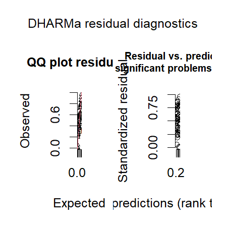
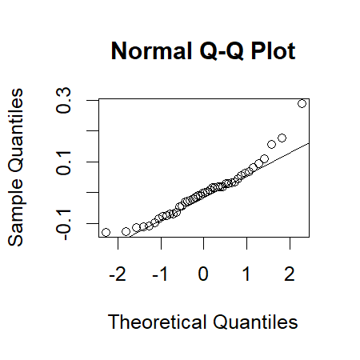
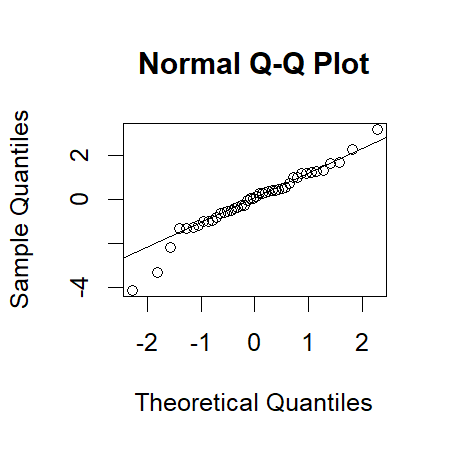
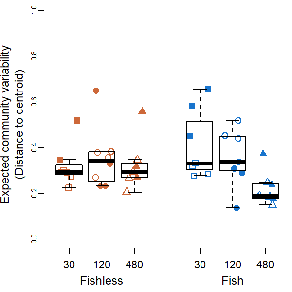

Community Variability Analyses
================
Rodolfo Pelinson
20/10/2020

This is the community variability analyses presented in the main paper.

If you haven’t, install the package:

``` r
install.packages("devtools")
devtools::install_github("RodolfoPelinson/Pelinson.et.al.2020B")
```

These are the packages you will need to run this code:

``` r
library(Pelinson.et.al.2020B)
library(lme4) # Version 1.1-23
library(car) # Version 3.0-7
library(emmeans) # Version 1.4.8
library(vegan) # Version 2.5-6
```

## Community Variability

### Whole community for the last two surveys.

First loading data

``` r
data(com_SS2_SS3, All, fish_SS2_SS3, isolation_SS2_SS3, SS_SS2_SS3, ID_SS2_SS3, fish_isolation_SS2_SS3)
```

    ## Warning in data(com_SS2_SS3, All, fish_SS2_SS3, isolation_SS2_SS3, SS_SS2_SS3, :
    ## data set 'fish_isolation_SS2_SS3' not found

Computing observed and expected distances to centroid, and
beta-deviation.

``` r
beta_deviation_SS2_SS3 <- beta_deviation(com_SS2_SS3, strata = All, times = 10000,
                                      transform = NULL, dist = "bray", fixedmar="both",
                                      shuffle = "both", method = "quasiswap", seed = 2, group = All) 
```

Looking at residual plots for observed, expected distances to centroids
and deviations.

``` r
fit_observed_SS2_SS3_G <- lmer(beta_deviation_SS2_SS3$observed_distances~fish_SS2_SS3*isolation_SS2_SS3*SS_SS2_SS3 + (1|ID_SS2_SS3))
plot(fit_observed_SS2_SS3_G)
```

<!-- -->

``` r
qqnorm(resid(fit_observed_SS2_SS3_G, type = "pearson"))
qqline(resid(fit_observed_SS2_SS3_G, type = "pearson"))
```

<!-- -->

``` r
fit_expected_SS2_SS3_G <- lmer(beta_deviation_SS2_SS3$expected_distances~fish_SS2_SS3*isolation_SS2_SS3*SS_SS2_SS3 + (1|ID_SS2_SS3), REML = F)
```

    ## boundary (singular) fit: see ?isSingular

``` r
plot(fit_expected_SS2_SS3_G)
```

<!-- -->

``` r
qqnorm(resid(fit_expected_SS2_SS3_G, type = "pearson"))
qqline(resid(fit_expected_SS2_SS3_G, type = "pearson"))
```

<!-- -->

``` r
fit_deviation_SS2_SS3_G <- lmer(beta_deviation_SS2_SS3$deviation_distances~fish_SS2_SS3*isolation_SS2_SS3*SS_SS2_SS3 + (1|ID_SS2_SS3), REML = F)
plot(fit_deviation_SS2_SS3_G)
```

<!-- -->

``` r
qqnorm(resid(fit_deviation_SS2_SS3_G, type = "pearson"))
qqline(resid(fit_deviation_SS2_SS3_G, type = "pearson"))
```

<!-- -->
Residual plots are not perfect, but they also does not seem too bad.

#### Observed Community Variability

Running ANOVA table for observed distances to group centroids, or
observed beta-diversity/community variability in each treatment.

``` r
fit_observed_SS2_SS3 <- lmer(beta_deviation_SS2_SS3$observed_distances~fish_SS2_SS3*isolation_SS2_SS3*SS_SS2_SS3 + (1|ID_SS2_SS3))
round(Anova(fit_observed_SS2_SS3, test.statistic = "Chisq"),3)
```

    ## Analysis of Deviance Table (Type II Wald chisquare tests)
    ## 
    ## Response: beta_deviation_SS2_SS3$observed_distances
    ##                                            Chisq Df Pr(>Chisq)    
    ## fish_SS2_SS3                               1.442  1      0.230    
    ## isolation_SS2_SS3                          2.071  2      0.355    
    ## SS_SS2_SS3                                 2.136  1      0.144    
    ## fish_SS2_SS3:isolation_SS2_SS3            17.217  2     <2e-16 ***
    ## fish_SS2_SS3:SS_SS2_SS3                    0.086  1      0.769    
    ## isolation_SS2_SS3:SS_SS2_SS3               7.317  2      0.026 *  
    ## fish_SS2_SS3:isolation_SS2_SS3:SS_SS2_SS3  5.463  2      0.065 .  
    ## ---
    ## Signif. codes:  0 '***' 0.001 '**' 0.01 '*' 0.05 '.' 0.1 ' ' 1

``` r
emmeans(fit_observed_SS2_SS3, list(pairwise ~ isolation_SS2_SS3|fish_SS2_SS3), adjust = "sidak")
```

    ## NOTE: Results may be misleading due to involvement in interactions

    ## $`emmeans of isolation_SS2_SS3 | fish_SS2_SS3`
    ## fish_SS2_SS3 = absent:
    ##  isolation_SS2_SS3 emmean     SE   df lower.CL upper.CL
    ##  30                 0.322 0.0395 15.3    0.216    0.428
    ##  120                0.450 0.0395 15.3    0.344    0.556
    ##  480                0.425 0.0424 17.9    0.313    0.537
    ## 
    ## fish_SS2_SS3 = present:
    ##  isolation_SS2_SS3 emmean     SE   df lower.CL upper.CL
    ##  30                 0.479 0.0424 17.9    0.367    0.591
    ##  120                0.329 0.0424 17.9    0.217    0.441
    ##  480                0.269 0.0424 17.9    0.157    0.380
    ## 
    ## Results are averaged over the levels of: SS_SS2_SS3 
    ## Degrees-of-freedom method: kenward-roger 
    ## Confidence level used: 0.95 
    ## Conf-level adjustment: sidak method for 3 estimates 
    ## 
    ## $`pairwise differences of isolation_SS2_SS3 | fish_SS2_SS3`
    ## fish_SS2_SS3 = absent:
    ##  contrast  estimate     SE   df t.ratio p.value
    ##  30 - 120   -0.1280 0.0559 15.3 -2.291  0.1056 
    ##  30 - 480   -0.1029 0.0580 16.6 -1.776  0.2565 
    ##  120 - 480   0.0250 0.0580 16.6  0.432  0.9645 
    ## 
    ## fish_SS2_SS3 = present:
    ##  contrast  estimate     SE   df t.ratio p.value
    ##  30 - 120    0.1499 0.0600 17.9  2.499  0.0659 
    ##  30 - 480    0.2105 0.0600 17.9  3.509  0.0076 
    ##  120 - 480   0.0606 0.0600 17.9  1.010  0.6938 
    ## 
    ## Results are averaged over the levels of: SS_SS2_SS3 
    ## Degrees-of-freedom method: kenward-roger 
    ## P value adjustment: sidak method for 3 tests

``` r
emmeans(fit_observed_SS2_SS3, list(pairwise ~ isolation_SS2_SS3|SS_SS2_SS3), adjust = "sidak")
```

    ## NOTE: Results may be misleading due to involvement in interactions

    ## $`emmeans of isolation_SS2_SS3 | SS_SS2_SS3`
    ## SS_SS2_SS3 = 2:
    ##  isolation_SS2_SS3 emmean     SE   df lower.CL upper.CL
    ##  30                 0.340 0.0362 31.0    0.248    0.431
    ##  120                0.424 0.0362 31.0    0.333    0.515
    ##  480                0.311 0.0362 31.0    0.220    0.403
    ## 
    ## SS_SS2_SS3 = 3:
    ##  isolation_SS2_SS3 emmean     SE   df lower.CL upper.CL
    ##  30                 0.461 0.0394 31.5    0.362    0.561
    ##  120                0.355 0.0394 31.5    0.256    0.454
    ##  480                0.382 0.0423 31.8    0.276    0.489
    ## 
    ## Results are averaged over the levels of: fish_SS2_SS3 
    ## Degrees-of-freedom method: kenward-roger 
    ## Confidence level used: 0.95 
    ## Conf-level adjustment: sidak method for 3 estimates 
    ## 
    ## $`pairwise differences of isolation_SS2_SS3 | SS_SS2_SS3`
    ## SS_SS2_SS3 = 2:
    ##  contrast  estimate     SE   df t.ratio p.value
    ##  30 - 120   -0.0843 0.0512 31.0 -1.646  0.2948 
    ##  30 - 480    0.0284 0.0512 31.0  0.554  0.9277 
    ##  120 - 480   0.1127 0.0512 31.0  2.200  0.1024 
    ## 
    ## SS_SS2_SS3 = 3:
    ##  contrast  estimate     SE   df t.ratio p.value
    ##  30 - 120    0.1062 0.0557 31.5  1.908  0.1841 
    ##  30 - 480    0.0792 0.0578 31.7  1.370  0.4490 
    ##  120 - 480  -0.0270 0.0578 31.7 -0.468  0.9546 
    ## 
    ## Results are averaged over the levels of: fish_SS2_SS3 
    ## Degrees-of-freedom method: kenward-roger 
    ## P value adjustment: sidak method for 3 tests

``` r
emmeans(fit_observed_SS2_SS3, list(pairwise ~ SS_SS2_SS3|isolation_SS2_SS3), adjust = "sidak")
```

    ## NOTE: Results may be misleading due to involvement in interactions

    ## $`emmeans of SS_SS2_SS3 | isolation_SS2_SS3`
    ## isolation_SS2_SS3 = 30:
    ##  SS_SS2_SS3 emmean     SE   df lower.CL upper.CL
    ##  2           0.340 0.0362 31.0    0.255    0.425
    ##  3           0.461 0.0394 31.5    0.369    0.554
    ## 
    ## isolation_SS2_SS3 = 120:
    ##  SS_SS2_SS3 emmean     SE   df lower.CL upper.CL
    ##  2           0.424 0.0362 31.0    0.339    0.509
    ##  3           0.355 0.0394 31.5    0.263    0.448
    ## 
    ## isolation_SS2_SS3 = 480:
    ##  SS_SS2_SS3 emmean     SE   df lower.CL upper.CL
    ##  2           0.311 0.0362 31.0    0.226    0.396
    ##  3           0.382 0.0423 31.8    0.283    0.482
    ## 
    ## Results are averaged over the levels of: fish_SS2_SS3 
    ## Degrees-of-freedom method: kenward-roger 
    ## Confidence level used: 0.95 
    ## Conf-level adjustment: sidak method for 2 estimates 
    ## 
    ## $`pairwise differences of SS_SS2_SS3 | isolation_SS2_SS3`
    ## isolation_SS2_SS3 = 30:
    ##  contrast estimate     SE   df t.ratio p.value
    ##  2 - 3     -0.1218 0.0486 15.8 -2.505  0.0236 
    ## 
    ## isolation_SS2_SS3 = 120:
    ##  contrast estimate     SE   df t.ratio p.value
    ##  2 - 3      0.0687 0.0486 15.8  1.414  0.1769 
    ## 
    ## isolation_SS2_SS3 = 480:
    ##  contrast estimate     SE   df t.ratio p.value
    ##  2 - 3     -0.0710 0.0510 16.8 -1.391  0.1823 
    ## 
    ## Results are averaged over the levels of: fish_SS2_SS3 
    ## Degrees-of-freedom method: kenward-roger

It seems that the effect of isolation is dependent on the presence or
absence of fish. When fish is absent, there is no effect of isolation.
When it is present, there is a negative effect of isolation.

Plotting it:

``` r
boxplot(beta_deviation_SS2_SS3$observed_distances~isolation_SS2_SS3*fish_SS2_SS3, outline = F, ylab = "Distance to Centroid (Observed)", xlab = "", at = c(1,2,3,5,6,7),ylim = c(0,1), lwd = 1.5, col = "transparent", xaxt="n")
mylevels <- levels(All)
levelProportions <- summary(All)/length(beta_deviation_SS2_SS3$observed_distances)
col <- c(rep("sienna3",3), rep("dodgerblue3",3), rep("grey70",6))
bg <- c(rep("sienna3",3), rep("dodgerblue3",3),rep("sienna3",3), rep("dodgerblue3",3))
pch <- c(15,16,17,15,16,17,22,21,24,22,21,24)
for(i in 1:length(mylevels)){
  
  x<- c(1,2,3,5,6,7,1,2,3,5,6,7)[i]
  thislevel <- mylevels[i]
  thisvalues <- beta_deviation_SS2_SS3$observed_distances[All==thislevel]
  
  # take the x-axis indices and add a jitter, proportional to the N in each level
  myjitter <- jitter(rep(x, length(thisvalues)), amount=levelProportions[i]/0.8)
  points(myjitter, thisvalues, pch=pch[i], col=col[i], bg = bg[i] , cex = 1.5, lwd = 3) 
  
}
boxplot(beta_deviation_SS2_SS3$observed_distances~isolation_SS2_SS3*fish_SS2_SS3, add = T, col = "transparent", outline = F,at = c(1,2,3,5,6,7), lwd = 1.5, xaxt="n")
axis(1,labels = c("30 m","120 m", "480 m","30 m","120 m", "480 m"), cex.axis = 0.8, at =c(1,2,3,5,6,7))
axis(1,labels = c("Fishless","Fish"), cex.axis = 1, at =c(2,6), line = 1.5, tick = F )
box(lwd = 2.5)
```

<!-- -->

#### Expected Community Variability

Running ANOVA table for expected distances to group centroids, or
expected beta-diversity/community variability in each treatment.

``` r
fit_expected_SS2_SS3 <- lmer(beta_deviation_SS2_SS3$expected_distances~fish_SS2_SS3*isolation_SS2_SS3*SS_SS2_SS3 + (1|ID_SS2_SS3), control = lmerControl(optimizer = "nlminbwrap"))
round(Anova(fit_expected_SS2_SS3, test.statistic = "Chisq"),3)
```

    ## Analysis of Deviance Table (Type II Wald chisquare tests)
    ## 
    ## Response: beta_deviation_SS2_SS3$expected_distances
    ##                                            Chisq Df Pr(>Chisq)   
    ## fish_SS2_SS3                               0.011  1      0.916   
    ## isolation_SS2_SS3                          7.063  2      0.029 * 
    ## SS_SS2_SS3                                 3.639  1      0.056 . 
    ## fish_SS2_SS3:isolation_SS2_SS3             8.425  2      0.015 * 
    ## fish_SS2_SS3:SS_SS2_SS3                    0.170  1      0.680   
    ## isolation_SS2_SS3:SS_SS2_SS3              12.700  2      0.002 **
    ## fish_SS2_SS3:isolation_SS2_SS3:SS_SS2_SS3  6.840  2      0.033 * 
    ## ---
    ## Signif. codes:  0 '***' 0.001 '**' 0.01 '*' 0.05 '.' 0.1 ' ' 1

``` r
emmeans(fit_expected_SS2_SS3, list(pairwise ~ isolation_SS2_SS3|fish_SS2_SS3|SS_SS2_SS3), adjust = "tukey")
```

    ## $`emmeans of isolation_SS2_SS3 | fish_SS2_SS3, SS_SS2_SS3`
    ## fish_SS2_SS3 = absent, SS_SS2_SS3 = 2:
    ##  isolation_SS2_SS3 emmean     SE df lower.CL upper.CL
    ##  30                 0.271 0.0488 32   0.1482    0.394
    ##  120                0.346 0.0488 32   0.2235    0.469
    ##  480                0.278 0.0488 32   0.1551    0.401
    ## 
    ## fish_SS2_SS3 = present, SS_SS2_SS3 = 2:
    ##  isolation_SS2_SS3 emmean     SE df lower.CL upper.CL
    ##  30                 0.303 0.0488 32   0.1797    0.425
    ##  120                0.437 0.0488 32   0.3145    0.560
    ##  480                0.192 0.0488 32   0.0688    0.315
    ## 
    ## fish_SS2_SS3 = absent, SS_SS2_SS3 = 3:
    ##  isolation_SS2_SS3 emmean     SE df lower.CL upper.CL
    ##  30                 0.362 0.0488 32   0.2388    0.484
    ##  120                0.360 0.0488 32   0.2371    0.483
    ##  480                0.381 0.0573 32   0.2365    0.525
    ## 
    ## fish_SS2_SS3 = present, SS_SS2_SS3 = 3:
    ##  isolation_SS2_SS3 emmean     SE df lower.CL upper.CL
    ##  30                 0.561 0.0573 32   0.4164    0.705
    ##  120                0.243 0.0573 32   0.0990    0.388
    ##  480                0.261 0.0573 32   0.1162    0.405
    ## 
    ## Degrees-of-freedom method: kenward-roger 
    ## Confidence level used: 0.95 
    ## Conf-level adjustment: sidak method for 3 estimates 
    ## 
    ## $`pairwise differences of isolation_SS2_SS3 | fish_SS2_SS3, SS_SS2_SS3`
    ## fish_SS2_SS3 = absent, SS_SS2_SS3 = 2:
    ##  contrast  estimate     SE df t.ratio p.value
    ##  30 - 120  -0.07533 0.0690 32 -1.092  0.5256 
    ##  30 - 480  -0.00687 0.0690 32 -0.100  0.9945 
    ##  120 - 480  0.06846 0.0690 32  0.993  0.5866 
    ## 
    ## fish_SS2_SS3 = present, SS_SS2_SS3 = 2:
    ##  contrast  estimate     SE df t.ratio p.value
    ##  30 - 120  -0.13478 0.0690 32 -1.955  0.1401 
    ##  30 - 480   0.11089 0.0690 32  1.608  0.2569 
    ##  120 - 480  0.24566 0.0690 32  3.563  0.0033 
    ## 
    ## fish_SS2_SS3 = absent, SS_SS2_SS3 = 3:
    ##  contrast  estimate     SE df t.ratio p.value
    ##  30 - 120   0.00173 0.0690 32  0.025  0.9997 
    ##  30 - 480  -0.01923 0.0752 32 -0.256  0.9647 
    ##  120 - 480 -0.02096 0.0752 32 -0.279  0.9582 
    ## 
    ## fish_SS2_SS3 = present, SS_SS2_SS3 = 3:
    ##  contrast  estimate     SE df t.ratio p.value
    ##  30 - 120   0.31735 0.0810 32  3.916  0.0013 
    ##  30 - 480   0.30015 0.0810 32  3.704  0.0022 
    ##  120 - 480 -0.01720 0.0810 32 -0.212  0.9755 
    ## 
    ## Degrees-of-freedom method: kenward-roger 
    ## P value adjustment: tukey method for comparing a family of 3 estimates

Patterns are similar to those observed for the observed distances to
centroid.

Plotting it:

``` r
boxplot(beta_deviation_SS2_SS3$expected_distances~isolation_SS2_SS3*fish_SS2_SS3, outline = F, ylab = "Distance to Centroid (Expected)", xlab = "", at = c(1,2,3,5,6,7),ylim = c(0,1), lwd = 1.5, col = "transparent", xaxt="n")
mylevels <- levels(All)
levelProportions <- summary(All)/length(beta_deviation_SS2_SS3$expected_distances)
col <- c(rep("sienna3",3), rep("dodgerblue3",3), rep("grey70",6))
bg <- c(rep("sienna3",3), rep("dodgerblue3",3),rep("sienna3",3), rep("dodgerblue3",3))
pch <- c(15,16,17,15,16,17,22,21,24,22,21,24)
for(i in 1:length(mylevels)){
  
  x<- c(1,2,3,5,6,7,1,2,3,5,6,7)[i]
  thislevel <- mylevels[i]
  thisvalues <- beta_deviation_SS2_SS3$expected_distances[All==thislevel]
  
  # take the x-axis indices and add a jitter, proportional to the N in each level
  myjitter <- jitter(rep(x, length(thisvalues)), amount=levelProportions[i]/0.8)
  points(myjitter, thisvalues, pch=pch[i], col=col[i], bg = bg[i] , cex = 1.5, lwd = 3) 
  
}
boxplot(beta_deviation_SS2_SS3$expected_distances~isolation_SS2_SS3*fish_SS2_SS3, add = T, col = "transparent", outline = F,at = c(1,2,3,5,6,7), lwd = 1.5, xaxt="n")
axis(1,labels = c("30 m","120 m", "480 m","30 m","120 m", "480 m"), cex.axis = 0.8, at =c(1,2,3,5,6,7))
axis(1,labels = c("Fishless","Fish"), cex.axis = 1, at =c(2,6), line = 1.5, tick = F )
box(lwd = 2.5)
```

<!-- -->

#### Beta-Deviation

Running ANOVA table for the deviations of expected distances to group
centroids from observed distances.

``` r
fit_deviation_SS2_SS3 <- lmer(beta_deviation_SS2_SS3$deviation_distances~fish_SS2_SS3*isolation_SS2_SS3*SS_SS2_SS3 + (1|ID_SS2_SS3), control = lmerControl(optimizer = "nlminbwrap"))
round(Anova(fit_deviation_SS2_SS3, test.statistic = "Chisq"),3)
```

    ## Analysis of Deviance Table (Type II Wald chisquare tests)
    ## 
    ## Response: beta_deviation_SS2_SS3$deviation_distances
    ##                                           Chisq Df Pr(>Chisq)   
    ## fish_SS2_SS3                              4.129  1      0.042 * 
    ## isolation_SS2_SS3                         4.739  2      0.094 . 
    ## SS_SS2_SS3                                1.048  1      0.306   
    ## fish_SS2_SS3:isolation_SS2_SS3            9.345  2      0.009 **
    ## fish_SS2_SS3:SS_SS2_SS3                   0.096  1      0.757   
    ## isolation_SS2_SS3:SS_SS2_SS3              2.445  2      0.295   
    ## fish_SS2_SS3:isolation_SS2_SS3:SS_SS2_SS3 2.595  2      0.273   
    ## ---
    ## Signif. codes:  0 '***' 0.001 '**' 0.01 '*' 0.05 '.' 0.1 ' ' 1

``` r
emmeans(fit_deviation_SS2_SS3, list(pairwise ~ isolation_SS2_SS3|fish_SS2_SS3), adjust = "tukey")
```

    ## $`emmeans of isolation_SS2_SS3 | fish_SS2_SS3`
    ## fish_SS2_SS3 = absent:
    ##  isolation_SS2_SS3  emmean    SE   df lower.CL upper.CL
    ##  30                 0.0434 0.556 14.9   -1.449     1.54
    ##  120                2.5286 0.556 14.9    1.036     4.02
    ##  480                2.3009 0.606 17.4    0.701     3.90
    ## 
    ## fish_SS2_SS3 = present:
    ##  isolation_SS2_SS3  emmean    SE   df lower.CL upper.CL
    ##  30                 0.9768 0.606 17.4   -0.623     2.58
    ##  120               -0.0801 0.606 17.4   -1.680     1.52
    ##  480                1.1787 0.606 17.4   -0.421     2.78
    ## 
    ## Results are averaged over the levels of: SS_SS2_SS3 
    ## Degrees-of-freedom method: kenward-roger 
    ## Confidence level used: 0.95 
    ## Conf-level adjustment: sidak method for 3 estimates 
    ## 
    ## $`pairwise differences of isolation_SS2_SS3 | fish_SS2_SS3`
    ## fish_SS2_SS3 = absent:
    ##  contrast  estimate    SE   df t.ratio p.value
    ##  30 - 120    -2.485 0.786 14.9 -3.163  0.0167 
    ##  30 - 480    -2.257 0.822 16.2 -2.746  0.0359 
    ##  120 - 480    0.228 0.822 16.2  0.277  0.9587 
    ## 
    ## fish_SS2_SS3 = present:
    ##  contrast  estimate    SE   df t.ratio p.value
    ##  30 - 120     1.057 0.857 17.4  1.234  0.4500 
    ##  30 - 480    -0.202 0.857 17.4 -0.236  0.9699 
    ##  120 - 480   -1.259 0.857 17.4 -1.469  0.3293 
    ## 
    ## Results are averaged over the levels of: SS_SS2_SS3 
    ## Degrees-of-freedom method: kenward-roger 
    ## P value adjustment: tukey method for comparing a family of 3 estimates

Beta deviation seems to increase with isolation, but only in fishless
ponds.

Plotting it:

``` r
boxplot(beta_deviation_SS2_SS3$deviation_distances~isolation_SS2_SS3*fish_SS2_SS3, outline = F, ylab = "Beta-Deviation", xlab = "", at = c(1,2,3,5,6,7),ylim = c(-2,10), lwd = 1.5, col = "transparent", xaxt="n")
mylevels <- levels(All)
levelProportions <- summary(All)/length(beta_deviation_SS2_SS3$deviation_distances)
col <- c(rep("sienna3",3), rep("dodgerblue3",3), rep("grey70",6))
bg <- c(rep("sienna3",3), rep("dodgerblue3",3),rep("sienna3",3), rep("dodgerblue3",3))
pch <- c(15,16,17,15,16,17,22,21,24,22,21,24)
for(i in 1:length(mylevels)){
  
  x<- c(1,2,3,5,6,7,1,2,3,5,6,7)[i]
  thislevel <- mylevels[i]
  thisvalues <- beta_deviation_SS2_SS3$deviation_distances[All==thislevel]
  
  # take the x-axis indices and add a jitter, proportional to the N in each level
  myjitter <- jitter(rep(x, length(thisvalues)), amount=levelProportions[i]/0.8)
  points(myjitter, thisvalues, pch=pch[i], col=col[i], bg = bg[i] , cex = 1.5, lwd = 3) 
  
}
boxplot(beta_deviation_SS2_SS3$deviation_distances~isolation_SS2_SS3*fish_SS2_SS3, add = T, col = "transparent", outline = F,at = c(1,2,3,5,6,7), lwd = 1.5, xaxt="n")
axis(1,labels = c("30 m","120 m", "480 m","30 m","120 m", "480 m"), cex.axis = 0.8, at =c(1,2,3,5,6,7))
axis(1,labels = c("Fishless","Fish"), cex.axis = 1, at =c(2,6), line = 1.5, tick = F )
abline(h = 0, lty = 2, lwd = 2, col = "grey50")
box(lwd = 2.5)
```

<!-- -->
