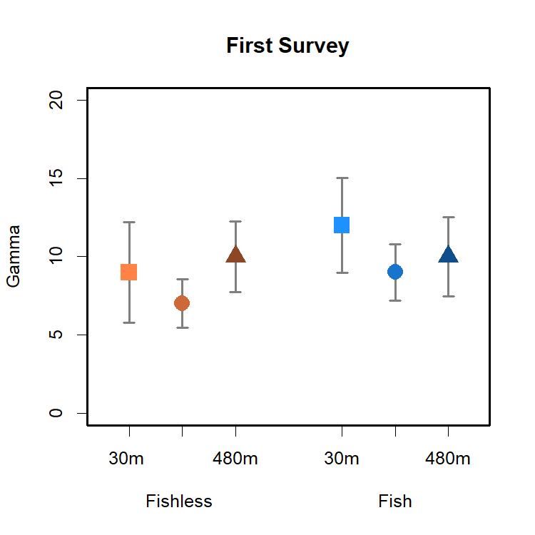
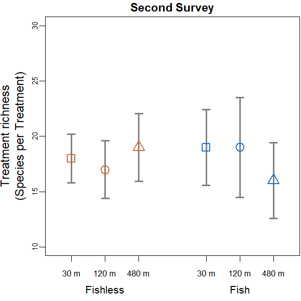
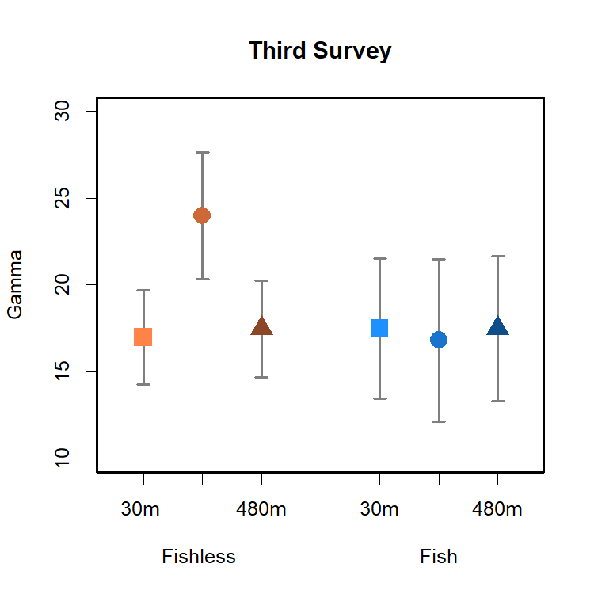

Gamma Diversity Analyses
================
Rodolfo Pelinson
19/10/2020

These are the analyses of gamma diversity for the whole communities
(shown in the main paper) and separately to predatory and non-predatory
insects.

These are the packages you will need to run this code:

``` r
library(iNEXT) # Version 2.0.20
library(vegan) # Version 2.5-6
```

#### First Survey

First we get the estimated gamma diversity for each treatment for a
sample size of four ponds.

First we computed the number of species in each treatment for a similar
number of sampled ponds and its respective 95% confidence interval
through sample-based rarefaction and extrapolation using the package
`iNEXT`. What we call gamma diversity here is the realized species pool
that is able to colonize ponds of a given treatment.

``` r
absent_30_SS1 <- as.incfreq(t(decostand(com_SS1[which(fish_isolation_SS1 
                                                == "030 absent"),], method = "pa")))
present_30_SS1 <- as.incfreq(t(decostand(com_SS1[which(fish_isolation_SS1 
                                                == "030 present"),], method = "pa")))
absent_120_SS1 <- as.incfreq(t(decostand(com_SS1[which(fish_isolation_SS1 
                                                == "120 absent"),], method = "pa")))
present_120_SS1 <- as.incfreq(t(decostand(com_SS1[which(fish_isolation_SS1 
                                                == "120 present"),], method = "pa")))
absent_480_SS1 <- as.incfreq(t(decostand(com_SS1[which(fish_isolation_SS1 
                                                == "480 absent"),], method = "pa")))
present_480_SS1 <- as.incfreq(t(decostand(com_SS1[which(fish_isolation_SS1 
                                                == "480 present"),], method = "pa")))

all <- list(absent_30=absent_30_SS1 ,absent_120 =absent_120_SS1,
            absent_480=absent_480_SS1, present_30=present_30_SS1,
            present_120=present_120_SS1,present_480=present_480_SS1)
SS1_iNEXT <- iNEXT(all, datatype = "incidence_freq", q = 0, knots = 40,se = T,
                   conf = 0.95, nboot =10000, size = c(1:4))
Gamma_SS1 <- rbind(absent_30 = SS1_iNEXT$iNextEst$absent_30[4,c(4,5,6)],
               absent_120 = SS1_iNEXT$iNextEst$absent_120[4,c(4,5,6)],
               absent_480 = SS1_iNEXT$iNextEst$absent_480[4,c(4,5,6)],
               present_30 = SS1_iNEXT$iNextEst$present_30[4,c(4,5,6)],
               present_120 = SS1_iNEXT$iNextEst$present_120[4,c(4,5,6)],
               present_480 = SS1_iNEXT$iNextEst$present_480[4,c(4,5,6)])
```

We can plot the estimates and respective confidence intervals.

``` r
par(cex = 0.75, mar = c(4,4,1.5,0.1))

plot(c(NA,NA,NA,NA,NA,NA),ylim = c(0,20), xlim = c(0.5,7.5),type = "p", xaxt = "n", yaxt = "n",
     ylab = "",xlab = "", cex.lab = 1, cex.axis = 1)
arrows(y0 = c(Gamma_SS1$qD.LCL[1], Gamma_SS1$qD.LCL[2], Gamma_SS1$qD.LCL[3],
              Gamma_SS1$qD.LCL[4], Gamma_SS1$qD.LCL[5], Gamma_SS1$qD.LCL[6]),
       y1 = c(Gamma_SS1$qD.UCL[1], Gamma_SS1$qD.UCL[2], Gamma_SS1$qD.UCL[3],
              Gamma_SS1$qD.UCL[4], Gamma_SS1$qD.UCL[5], Gamma_SS1$qD.UCL[6]),
       x1 = c(1,2,3,5,6,7), x0 = c(1,2,3,5,6,7),
       code = 3, angle = 90, length = 0.05, c("grey50"), lwd = 2)
points(y = c(Gamma_SS1$qD[1], Gamma_SS1$qD[2], Gamma_SS1$qD[3],Gamma_SS1$qD[4],
             Gamma_SS1$qD[5], Gamma_SS1$qD[6]), x = c(1,2,3,5,6,7), cex = 2, lwd = 3,
       pch = c(15,16,17), col = c("sienna3","sienna3","sienna3","dodgerblue3",
                                  "dodgerblue3", "dodgerblue3"))


axis(1,labels = c("30","120", "480","30","120", "480"), cex.axis = 1.1,
     at =c(1,2,3,5,6,7), gap.axis = -10)
axis(1,labels = c("Fishless","Fish"), cex.axis = 1.3, at =c(2,6), line = 1.5, tick = F )
axis(2, cex.axis = 0.8, gap.axis = 0, line = -0.5, tick = FALSE)
axis(2, cex.axis = 0.8, gap.axis = 0, line = 0, tick = TRUE, labels = FALSE)

title(ylab = "Treatment richness", cex.lab = 1.3, line = 3)
title(ylab = "(Species per Treatment)", cex.lab = 1.3, line = 1.75)
title(main = "First Survey", cex.lab = 1.3, line = 0.5)
```

<!-- -->

It does not seem to be any important differences among treatments.

#### Second Survey

First we get the estimated gamma diversity for each treatment for a
sample size of four ponds.

First we computed the number of species in each treatment for a similar
number of sampled ponds and its respective 95% confidence interval
through sample-based rarefaction and extrapolation using the package
`iNEXT`. What we call gamma diversity here is the realized species pool
that is able to colonize ponds of a given treatment.

``` r
absent_30_SS2 <- as.incfreq(t(decostand(com_SS2[which(fish_isolation_SS2 
                                             == "030 absent"),], method = "pa")))
present_30_SS2 <- as.incfreq(t(decostand(com_SS2[which(fish_isolation_SS2 
                                             == "030 present"),], method = "pa")))
absent_120_SS2 <- as.incfreq(t(decostand(com_SS2[which(fish_isolation_SS2 
                                             == "120 absent"),], method = "pa")))
present_120_SS2 <- as.incfreq(t(decostand(com_SS2[which(fish_isolation_SS2 
                                             == "120 present"),], method = "pa")))
absent_480_SS2 <- as.incfreq(t(decostand(com_SS2[which(fish_isolation_SS2 
                                             == "480 absent"),], method = "pa")))
present_480_SS2 <- as.incfreq(t(decostand(com_SS2[which(fish_isolation_SS2 
                                             == "480 present"),], method = "pa")))
all <- list(absent_30=absent_30_SS2 ,absent_120 =absent_120_SS2,
            absent_480=absent_480_SS2, present_30=present_30_SS2,
            present_120=present_120_SS2,present_480=present_480_SS2)
SS2_iNEXT <- iNEXT(all, datatype = "incidence_freq", q = 0, knots = 40,se = T,
                   conf = 0.95, nboot =10000, size = c(1:4))
Gamma_SS2 <- rbind(absent_30 = SS2_iNEXT$iNextEst$absent_30[4,c(4,5,6)],
               absent_120 = SS2_iNEXT$iNextEst$absent_120[4,c(4,5,6)],
               absent_480 = SS2_iNEXT$iNextEst$absent_480[4,c(4,5,6)],
               present_30 = SS2_iNEXT$iNextEst$present_30[4,c(4,5,6)],
               present_120 = SS2_iNEXT$iNextEst$present_120[4,c(4,5,6)],
               present_480 = SS2_iNEXT$iNextEst$present_480[4,c(4,5,6)])
```

We can plot the estimates and respective confidence intervals.

``` r
par(cex = 0.75, mar = c(4,4,1.5,0.1))

plot(c(NA,NA,NA,NA,NA,NA),ylim = c(10,30), xlim = c(0.5,7.5),type = "p", xaxt = "n", yaxt = "n",
     ylab = "",xlab = "", cex.lab = 1, cex.axis = 1)
arrows(y0 = c(Gamma_SS2$qD.LCL[1], Gamma_SS2$qD.LCL[2], Gamma_SS2$qD.LCL[3],
              Gamma_SS2$qD.LCL[4], Gamma_SS2$qD.LCL[5], Gamma_SS2$qD.LCL[6]),
       y1 = c(Gamma_SS2$qD.UCL[1], Gamma_SS2$qD.UCL[2], Gamma_SS2$qD.UCL[3],
              Gamma_SS2$qD.UCL[4], Gamma_SS2$qD.UCL[5], Gamma_SS2$qD.UCL[6]),
       x1 = c(1,2,3,5,6,7), x0 = c(1,2,3,5,6,7),
       code = 3, angle = 90, length = 0.05, c("grey50"), lwd = 2)
points(y = c(Gamma_SS2$qD[1], Gamma_SS2$qD[2], Gamma_SS2$qD[3],Gamma_SS2$qD[4],
             Gamma_SS2$qD[5], Gamma_SS2$qD[6]), x = c(1,2,3,5,6,7), cex = 2, lwd = 1.5,
       pch = c(22,21,24), bg = "transparent", col = c("sienna3","sienna3","sienna3","dodgerblue3",
                                  "dodgerblue3", "dodgerblue3"))
axis(1,labels = c("30 m","120 m", "480 m","30 m","120 m", "480 m"), cex.axis = 0.9,
     at =c(1,2,3,5,6,7), gap.axis = 0)
axis(1,labels = c("Fishless","Fish"), cex.axis = 1.1, at =c(2,6), line = 1.5, tick = F )
axis(2, cex.axis = 0.8, gap.axis = 0, line = -0.5, tick = FALSE)
axis(2, cex.axis = 0.8, gap.axis = 0, line = 0, tick = TRUE, labels = FALSE)

title(ylab = "Treatment richness", cex.lab = 1.3, line = 3)
title(ylab = "(Species per Treatment)", cex.lab = 1.3, line = 1.75)
title(main = "Second Survey", cex.lab = 1.3, line = 0.5)
```

<!-- -->

It does not seem to be any important differences among treatments.

#### Third Survey

First we get the estimated gamma diversity for each treatment for a
sample size of four ponds.

First we computed the number of species in each treatment for a similar
number of sampled ponds and its respective 95% confidence interval
through sample-based rarefaction and extrapolation using the package
`iNEXT`. What we call gamma diversity here is the realized species pool
that is able to colonize ponds of a given treatment.

``` r
absent_30_SS3 <- as.incfreq(t(decostand(com_SS3[which(fish_isolation_SS3 
                                            == "030 absent"),], method = "pa")))
present_30_SS3 <- as.incfreq(t(decostand(com_SS3[which(fish_isolation_SS3 
                                            == "030 present"),], method = "pa")))
absent_120_SS3 <- as.incfreq(t(decostand(com_SS3[which(fish_isolation_SS3 
                                            == "120 absent"),], method = "pa")))
present_120_SS3 <- as.incfreq(t(decostand(com_SS3[which(fish_isolation_SS3 
                                            == "120 present"),], method = "pa")))
absent_480_SS3 <- as.incfreq(t(decostand(com_SS3[which(fish_isolation_SS3 
                                            == "480 absent"),], method = "pa")))
present_480_SS3 <- as.incfreq(t(decostand(com_SS3[which(fish_isolation_SS3 
                                            == "480 present"),], method = "pa")))
all <- list(absent_30=absent_30_SS3 ,absent_120 =absent_120_SS3,
            absent_480=absent_480_SS3, present_30=present_30_SS3,
            present_120=present_120_SS3,present_480=present_480_SS3)
SS3_iNEXT <- iNEXT(all, datatype = "incidence_freq", q = 0, knots = 40,se = T,
                   conf = 0.95, nboot =10000, size = c(1:4))
Gamma_SS3 <- rbind(absent_30 = SS3_iNEXT$iNextEst$absent_30[4,c(4,5,6)],
               absent_120 = SS3_iNEXT$iNextEst$absent_120[4,c(4,5,6)],
               absent_480 = SS3_iNEXT$iNextEst$absent_480[4,c(4,5,6)],
               present_30 = SS3_iNEXT$iNextEst$present_30[4,c(4,5,6)],
               present_120 = SS3_iNEXT$iNextEst$present_120[4,c(4,5,6)],
               present_480 = SS3_iNEXT$iNextEst$present_480[4,c(4,5,6)])
```

We can plot the estimates and respective confidence intervals.

``` r
par(cex = 0.75, mar = c(4,4,1.5,0.1))

plot(c(NA,NA,NA,NA,NA,NA),ylim = c(10,30), xlim = c(0.5,7.5),type = "p", xaxt = "n", yaxt = "n",
     ylab = "",xlab = "", cex.lab = 1, cex.axis = 1)
arrows(y0 = c(Gamma_SS3$qD.LCL[1], Gamma_SS3$qD.LCL[2], Gamma_SS3$qD.LCL[3],
              Gamma_SS3$qD.LCL[4], Gamma_SS3$qD.LCL[5], Gamma_SS3$qD.LCL[6]),
       y1 = c(Gamma_SS3$qD.UCL[1], Gamma_SS3$qD.UCL[2], Gamma_SS3$qD.UCL[3],
              Gamma_SS3$qD.UCL[4], Gamma_SS3$qD.UCL[5], Gamma_SS3$qD.UCL[6]),
       x1 = c(1,2,3,5,6,7), x0 = c(1,2,3,5,6,7),
       code = 3, angle = 90, length = 0.05, c("grey50"), lwd = 2)
points(y = c(Gamma_SS3$qD[1], Gamma_SS3$qD[2], Gamma_SS3$qD[3],Gamma_SS3$qD[4],
             Gamma_SS3$qD[5], Gamma_SS3$qD[6]), x = c(1,2,3,5,6,7), cex = 2, lwd = 3,
       pch = c(15,16,17), col = c("sienna3","sienna3","sienna3","dodgerblue3",
                                                                         "dodgerblue3", "dodgerblue3"))

axis(1,labels = c("30 m","120 m", "480 m","30 m","120 m", "480 m"), cex.axis = 0.9,
     at =c(1,2,3,5,6,7), gap.axis = 0)
axis(1,labels = c("Fishless","Fish"), cex.axis = 1.1, at =c(2,6), line = 1.5, tick = F )
axis(2, cex.axis = 0.8, gap.axis = 0, line = -0.5, tick = FALSE)
axis(2, cex.axis = 0.8, gap.axis = 0, line = 0, tick = TRUE, labels = FALSE)

title(ylab = "Treatment richness", cex.lab = 1.3, line = 3)
title(ylab = "(Species per Treatment)", cex.lab = 1.3, line = 1.75)
title(main = "Third Survey", cex.lab = 1.3, line = 0.5)
```

<!-- -->

It seems that there is a higher gamma diversity in the intermediate
isolation treatment for fishless ponds.
